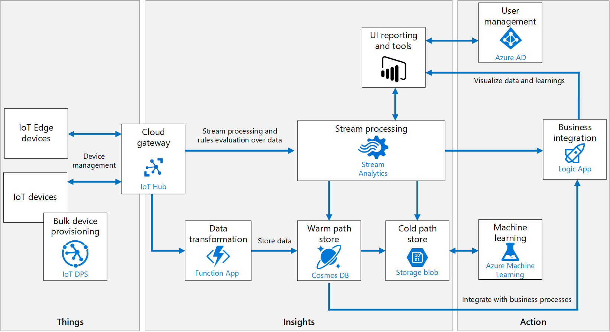

# Microsoft Azure の調査

 0x6797(mokumoku) 作『microsoft-azure-research』は<a rel="license" href="http://creativecommons.org/licenses/by-sa/4.0/">クリエイティブ・コモンズ 表示 - 継承 4.0 国際 ライセンス</a>で提供されています。

# なんだ、これは？

必要な情報は Microsoft Docs に書いてあります。しかし、世の中は多様性にあふれ、次のようにおっしゃる方々もいらっしゃいます。

- どこから読んでいいかわからない
- 読む時間がない
- （そもそも）このサービスが何をやるかわからない

そのような方々の一助になるために、自分の調査した範囲で Microsoft Docs をまとめ直しました。Azure のサービスの詳細よりも雰囲気がふんわり理解できる事を重視しています。

基本的には、初心者が思いつきそうな質問を起点として文書を記述していますが、やや無理くりに質問をひねり出した箇所もあります。平にご容赦下さい。

# 概要

以下のサービスを中心に Microsoft Azure を調査します。

# 各技術要素について

## よくありそうな質問

- IoT
    - [Azure IoT Hub](iot-hub/00-FAQ.md)
    - [Azure IoT Device Provisioning Service](iot-hub-device-provisioning-service/00-FAQ.md)
    - [Azure IoT Edge](iot-edge/00-FAQ.md)
- アプリケーションロジック
    - [Azure Functions](functions/00-FAQ.md)
    - [Azure App Service](app-service/00-FAQ.md)
    - [Azure Logic Apps](logic-apps/00-FAQ.md)
- ストレージ
    - [Azure Blob Storage](blob-storage/00-FAQ.md)
    - [Azure Cosmos DB](cosmos-db/00-FAQ.md)
- 分析
    - [Azure Stream Analytics](stream-analytics/00-FAQ.md)
    - [Azure Time Series Insights](time-series-insights/00-FAQ.md)
    - [Azure HDInsight](hd-insight/00-FAQ.md)
- 運用監視
    - [Azure Monitor](monitor/00-FAQ.md)
    - [Azure Log Analytics](log-analytics/00-FAQ.md)
    - [Azure Application Insights](application-insights/00-FAQ.md)
    - [Azure Automation](automation/00-FAQ.md)
- セキュリティ
    - [Azure Security Center](security-center/00-FAQ.md)
    - Azure Security Center for IoT
    - [Azure Sentinel](sentinel/00-FAQ.md)
- ID、ユーザーおよびロール管理
    - [Azure Active Directory](azure-ad/00-FAQ.md)
    - [Azure Role Based Access Control](rbac/00-FAQ.md)
- Azure リソースの管理
    - [Azure Policy](azure-policy/00-FAQ.md)
    - [Azure Resource Manager](resource-manager/00-FAQ.md)
- 開発
    - [Azure DevOps](devops/01-Documents.md)
    - [Azure DevTest Labs](devtest-labs/00-FAQ.md)

# Tips

- [課金](subscription/01-tips.md)
- [Azure Security Benchmark](https://docs.microsoft.com/en-us/azure/security/benchmarks/introduction)
    - 英語
    - Azure のセキュリティ評価基準
    - CIS Controls Version 7.1 の Azure 適用版？

# SLA 早見表

| SLA %	| 週あたりのダウンタイム | 月あたりのダウンタイム | 年あたりのダウンタイム |
| :----- | ------------: | ----------: | ------------: |
| 99 | 1.68 時間 | 7.2 時間 | 3.65 日 |
| 99.9 | 10.1 分 | 43.2 分 | 8.76 時間 |
| 99.95 | 5 分 | 21.6 分 | 4.38 時間 |
| 99.99 | 1.01 分 | 4.32 分 | 52.56 分 |
| 99.999 | 6 秒 | 25.9 秒 | 5.26 分 |

# Azure IoT Hub を中心とした参照アーキテクチャ

# Azure IoT Hub のコンセプトモデル

# Azure IoT Central、Azure IoT ソリューションアクセラレータ　および Azure IoT Hub の関係

- Azure IoT Central  IoT PnP 対応デバイスを用意すれば、すぐ使える Web アプリ
- Azure IoT ソリューションアクセラレータ 一般的な IoT シナリオを構築済みの IoT プラットフォーム
- Azure IoT Hub  PaaS 製品

# コード

## Azure IoT

- [クイックスタート(C#)](http://158.201.117.62/gitbucket/p0075317/azure-iot-samples-csharp-master)
- [デバイスシミュレータ](http://158.201.117.62/gitbucket/p0075317/device-simulation-dotnet)

## その他

- iPad あるいは iPhone アプリで Azure の状態を見ることができます。
- [Azure Stack Edge](https://azure.microsoft.com/ja-jp/services/databox/edge/) Edge 用ハードウェア。Commercial シリーズ（ブレード）と Rougged シリーズ（現場用）がある。Azure VM と Azure AKS(Kubernetes) クラスタもサポート

### Commercial シリーズ

### Rugged シリーズ

## シェア

調査会社Synergy Research Groupの最新データによると、クラウドインフラ市場は現在、約1000億ドル規模。AWSが約33.5％、Microsoftが約16.5％の市場シェアを握っている。

ただし、Microsoftは2019年10月、米国防総省（DoD）のクラウドプロジェクト「JEDI」（Joint Enterprise Defense Infrastructure）の契約を獲得…

これから、どうなる？