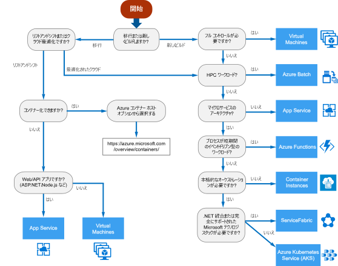
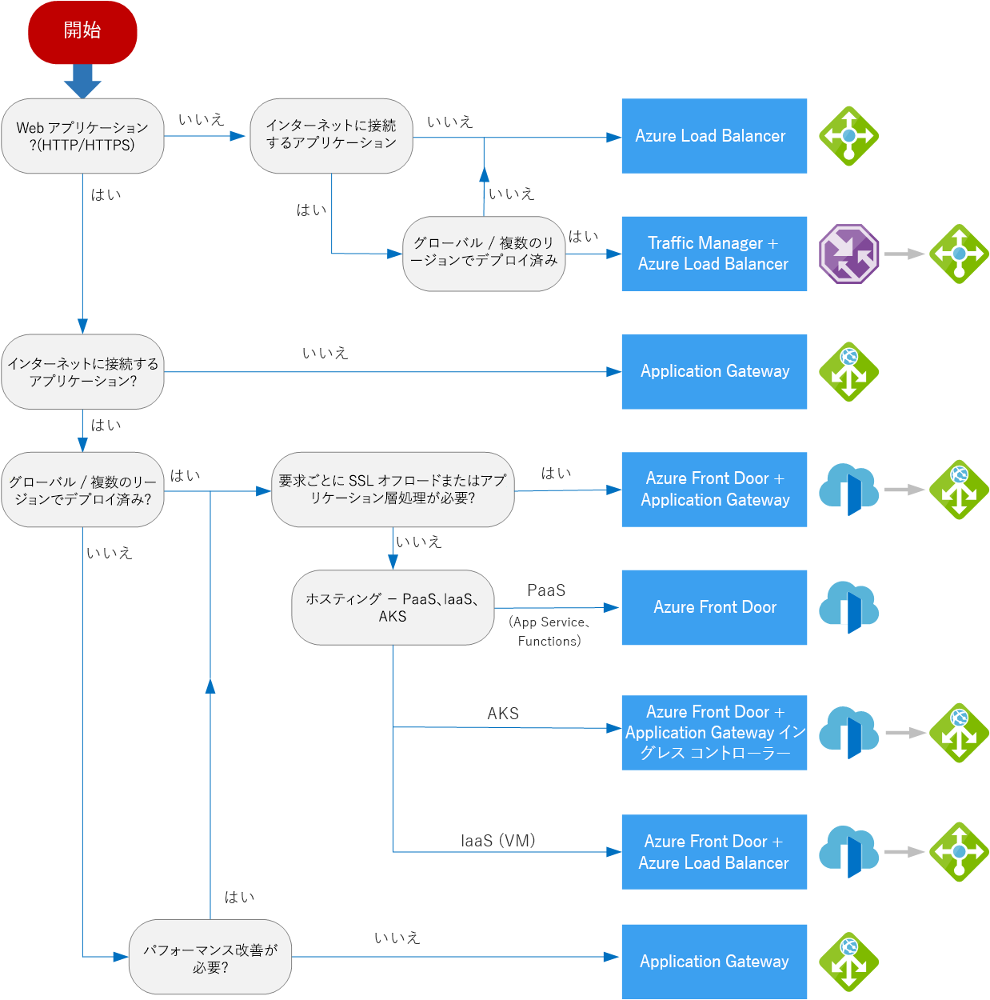

# Azure App Service に関するよくありそうな質問

## 目次

- [App Service とは何ですか？](#q-about)
- [Azure VM で作成する仮想マシン環境と何が違うのですか？](#q-about2)
- [どういう時に App Service の使用を検討するべきですか？](#q-about3)
- [よく似たサービスとの違いについて教えて下さい](#q-about4)
- [Linux で App Service を利用することはできますか？](#q-linux)
- [App Service でホスティングできるものは何ですか？](#q-hosting)
- [App Service でストレージにアクセスする方法はありますか？](#q-storage)
- [App Service での負荷分散はどのように行うのですか？](#q-loadbalancing)
- [各プランと App Service の制約について教えて下さい](#q-limits)

## <a id="q-about">App Service とは何ですか？</a>

App Service は HTTP ベースのサービスで、Web アプリケーション、REST API およびモバイルバックエンドのアプリケーションをホスティングするサービスです。

## <a id="q-about2">Azure VM で作成する仮想マシン環境と何が違うのですか？</a>

すべてを開発者が設定しなければならない仮想マシン環境と違って、App Service は以下の機能を提供します。

- セキュリティ
- 負荷分散
- 自動スケーリング
- 自動管理

また、Azure DevOps、GitHub、Docker Hub を利用した以下の機能を提供します。

- 継続的デプロイ
- パッケージ管理
- ステージング環境
- カスタムドメイン
- SSL 証明書

## <a id="q-about3">どういう時に App Service の使用を検討するべきですか？</a>

以下の条件に該当する場合は、App Service の使用を推奨します。

- HTTP ベースのアプリケーション
- 以下のプログラミング言語上での開発
  - ASP.NET
  - ASP.NET Core
  - Java
  - Ruby
  - Node.js
  - PHP
  - Python
- 継続的インテグレーションおよび継続的デプロイの使用
- 自動スケーリングの利用
- コネクタを使用した、他の SaaS サービスやオンプレミスとの接続
- ソーシャルログインまたは Azure Active Directory を使用したユーザー認証
- Azure Functions の利用

## <a id="q-about4">よく似たサービスとの違いについて教えて下さい</a>

アプリケーションをホスティングする Azure サービスは多くの種類があります。

- Virtual Machine
- App Service
- Azure Batch
- Azure Functions
- Container Instances
- ServiceFabric
- Azure Kubernetes Service

採用するサービスのざっくりとした方向性は以下のフローチャートで確認して下さい。

さらに細かい条件については、以下の参照して下さい。

[Azure コンピューティングサービスを選択するための条件](https://docs.microsoft.com/ja-jp/azure/architecture/guide/technology-choices/compute-comparison)

## <a id="q-linux">Linux で App Service を利用することはできますか？</a>

App Service on Linux を使用して、Linux 用の Web アプリケーションをホスティングできます。

ただし、以下の制限があります。

- Shared 課金プランが選択できない
- Linux 以外の Web アプリをすでにホストしている App Service プランで、Linux Web アプリを作成できない
- 同一リソースグループで、Windows アプリと Linux アプリを同一リージョンに混在させることはできない。

## <a id="q-hosting">App Service でホスティングできるものは何ですか？</a>

App Service Environment を利用することにより、以下の環境をホスティングすることができます。

- Windown Web アプリ
- Linux Web アプリ
- Docker コンテナ
- モバイルアプリ
- Azure Functions

## <a id="q-storage">App Service でストレージにアクセスする方法はありますか？</a>

App Service は以下のストレージにアクセスできます。

- ローカルドライブ
  - オペレーティングシステムドライブ(`D:\`)
  - App Service によって排他的に使用される Azure Package cspkg ファイルを含むアプリケーションドライブ
  - ユーザードライブ(`C:\`)
- ネットワークドライブ(UNC共有)
  - `D:\home\site` を利用したシンボリックリンク
- 複数のインスタンス間でのファイルアクセス
  - すべてのインスタンスで共有されるホームディレクトリを利用したファイルアクセス
- 一部のレジストリに対する読み取り専用アクセス
  - ローカルの Users グループで読み取り専用アクセスを許可するレジストリキー
  - HKEY_CURRENT_USER ハイブにはアクセスできません
- ネットワークアクセス
  - その他の Azure サービスへの接続

## <a id="q-loadbalancing">App Service での負荷分散はどのように行うのですか？</a>

Azure の負荷分散サービスは、以下の次元で分類できます。

- グローバルかリージョンか？
- HTTP(S) か 非 HTTP(S)か？

上記の分類から使用される負荷分散サービスが以下の表のように異なります。

| サービス | グローバル／リージョン | 推奨されるトラフィック |
| :------ | :---------: | :-------------: |
| Azure Front Door | グローバル | HTTP(S) |
| Traffic Manager | グローバル | 非 HTTP(S) |
| Application Gateway | リージョン | HTTP(S) |
| Azure Load Balancer | リージョン | 非 HTTP(S) |

使用するサービスについては以下のフローチャートを原案として使用することもできます。

## <a id="q-limits">各プランと App Service の制約について教えて下さい</a>

| リソース | Free | Shared | Basic | Standard | Premium(V2) | Isolated |
| :----- | :---- | :------- | :-------- | :-------- | :---------- | :-------------- |
| プランあたりのアプリ数 | 10 | 100 | 無制限 | 無制限 | 無制限 | 無制限 |
| プラン上限数 | 10件/リージョン | 10件/リソースグループ | 100件/リソースグループ | 100件/リソースグループ | 100件/リソースグループ | 100件/リソースグループ |
| コンピューティングインスタンスの種類 | 共有 | 共有 | 専用 | 専用 | 専用 | 専用 |
| スケールアウト（最大インスタンス） | 1 Shared インスタンス | 1 Shared インスタンス | 3 専用インスタンス | 10 専用インスタンス | 20 専用インスタンス | 100 専用インスタンス |
| ストレージ | 1 GB | 1 GB | 10 GB | 50 GB | 250 GB | 1 TB |
| 専有 CPU 時間（5分あたり） | 3 分 | 3 分 | 無制限（Standard の料金で課金） | 無制限（Standard の料金で課金） | 無制限（Standard の料金で課金） | 無制限（Standard の料金で課金） |
| 専有 CPU 時間（1日あたり） | 約 60 分 | 約 240 分 | 無制限（Standard の料金で課金） | 無制限（Standard の料金で課金） | 無制限（Standard の料金で課金） | 無制限（Standard の料金で課金） |
| メモリ（1時間あたり） | App Service プランごとに 1GB | アプリごとに 1GB | 該当なし | 該当なし | 該当なし | 該当なし | 該当なし |
| 帯域幅 | 165 MB | 無制限（データ転送料の料金で課金） | 無制限（データ転送料の料金で課金） | 無制限（データ転送料の料金で課金） | 無制限（データ転送料の料金で課金） | 無制限（データ転送料の料金で課金） |
| アーキテクチャ | 32ビット | 32ビット | 32/64ビット | 32/64ビット | 32/64ビット | 32/64ビット |
| インスタンスごとの Web ソケット数 | 5 | 35 | 350 | 無制限 | 無制限 | 無制限 |
| IP 接続数 | 600 | 600 | インスタンスサイズにより変動 |インスタンスサイズにより変動 |インスタンスサイズにより変動 | 64,000 |
| アプリケーションごとの同時デバッガ接続 | 1 | 1 | 1 | 5 | 5 | 5 |
| サブスクリプションあたりの App Service 証明書数 | 未サポート | 未サポート | 10 | 10 | 10 | 10 |
| アプリケーションごとのカスタムドメイン数 | 0 (azurewebsites.netのサブドメインのみ) | 500 | 500 | 500 | 500 | 500 | 
| カスタムドメインの SSL サポート | `*.azurewebsites.net` | `*.azurewebsites.net` | SNI SSL 接続は無制限 | 無制限の SNI SSL 接続 と 1 件の IP SSL 接続 | 無制限の SNI SSL 接続 と 1 件の IP SSL 接続 | 無制限の SNI SSL 接続 と 1 件の IP SSL 接続 |
| プランあたりのハイブリッド接続数 |   |   | 5 | 25 | 200 | 200 |
| 統合 Load Balancer |   | ✅ | ✅ | ✅ | ✅ | ✅ |
| 常時接続 |   |   | ✅ | ✅ | ✅ | ✅ |
| スケジュールされたバックアップ |   |   |   | 2 時間ごとにスケジュールされたバックアップ。 1 日あたり最大 12 回のバックアップ（手動＋スケジュール） | 1 時間ごとにスケジュールされたバックアップ。 1 日あたり最大 50 回のバックアップ（手動＋スケジュール済み） | 1 時間ごとにスケジュールされたバックアップ。 1 日あたり最大 50 下位のバックアップ（手動＋スケジュール済み） |
| 自動スケール |  |  |  | ✅ | ✅ | ✅ |
| Webジョブ |  ✅ | ✅ | ✅ | ✅ | ✅ | ✅ |
| Azure Scheduler のサポート |  |  ✅ | ✅ | ✅ | ✅ | ✅ |
| エンドポイントの監視 |  |  |  ✅ | ✅ | ✅ | ✅ |
| ステージングスロット |  |  |  | 5 | 20 | 20 |
| SLA |  |  | 99.95% | 99.95% | 99.95% | 99.95% |