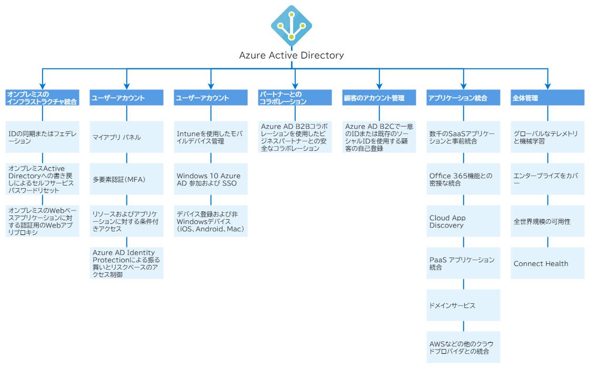
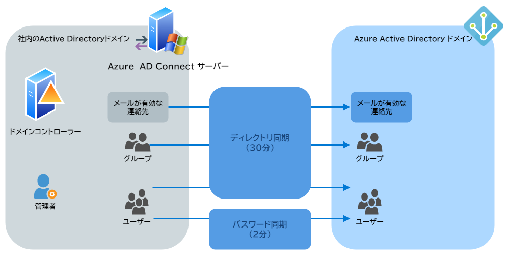
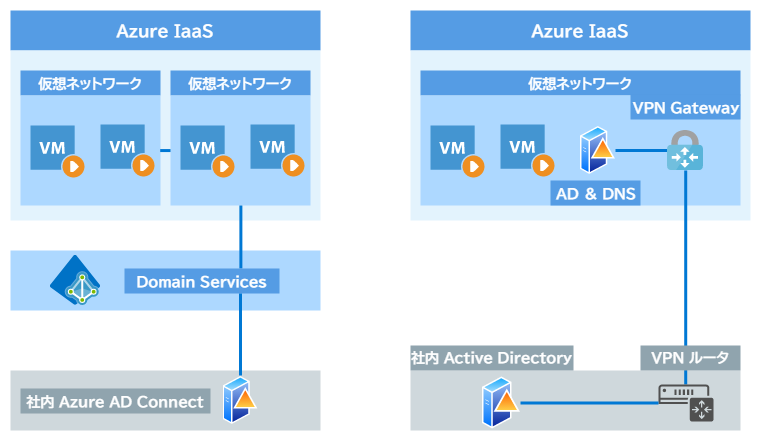
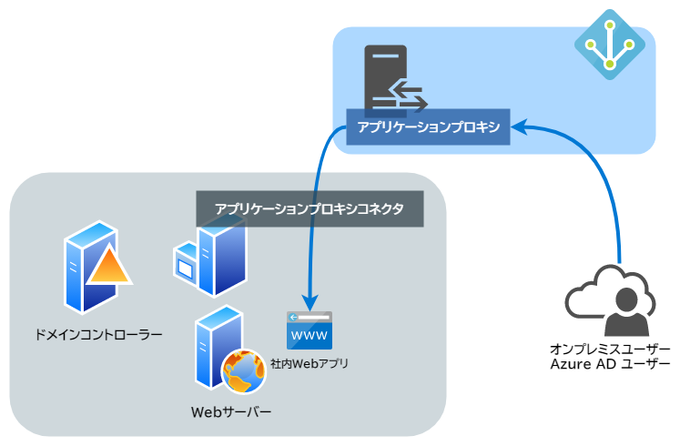

# Azure Active Directory に関するよくありそうな質問

## 目次

- [Azure Active Directory とは何ですか？](#q-about)
- [Azure AD を使うと何が嬉しいのですか？](#q-merit)
- [Azure AD は誰が利用するのですか？](#q-users)
- [Azure AD の用語が独特でよくわかりません…](#q-terms)
- [Azure AD にはどんな機能があるんですか？](#q-features)
- [従来のオンプレミスの Active Directory とは違うのですか？](#q-onpremise-ad)
- [Active Directory のドメインコントローラーは Azure AD では使用できないのですか？](#q-ad-ds)
- [AWS の IAM と同じですか？](#q-iam)
- [VPN との違いはなんですか？](#q-vpn)
- [シングルサインオンができるという理解でいいですか？](#q-sso)
- [条件付きアクセスはどのようなことができるのですか？](#q-conditional-access)
- [多要素認証には何が利用できますか？](#q-mfa)
- [Priviledged Identity Management とは何ですか？](#q-pim)
- [Linux でも Azure AD の認証はできますか？](#q-linux)
- [Azure AD のライセンスについて、それぞれの違いを教えて下さい](#q-licenses)
- [パスワード以外にも認証方法はありますか？](#q-user-auth)
- [認証と認可の違いがわかりません…](#q-about-auth)
- [すでに社内に Active Directory ドメインがあり、Azure AD と二重管理したくないです。まとめて管理する方法はありますか？](#q-ad-connect)
- [Azure AD Connect の同期は Azure AD への単方向の通信なのですか？](#q-connect-sync-direction)
- [社内の Active Directory を段階的に Azure AD に移行する場合、どのような接続方法がありますか？](#q-ds-workloads)
- [Azure　AD から社内の Web アプリケーションにアクセスすることはできるのですか？](#q-application-proxy)
- [ユーザーごとに違うエディションを割り振ることができますか？](#q-edition-for-each)
- [Azure Active Directory がダウンして、可用性が損なわれることはありますか？](#q-availability)

## <a id="q-about">Azure Active Directory とは何ですか？</a>

Azure Active Directory(Azure AD)は、クラウドベースの ID およびアクセス管理サービスであり、次のリソースへのサインインとアクセスを支援します。

- Microsoft Office 365、Azure Portal、その他の SaaS アプリケーションなど、外部リソース
- 企業ネットワークとイントラネット上のアプリや、自分の組織で開発したクラウドアプリなどの内部リソース

## <a id="q-merit">Azure AD を使うと何が嬉しいのですか？</a>

既存のネットワーク上に乱立しているであろう、いくつものユーザーアカウント管理を Azure AD に統合することによって、利便性とセキュリティの向上が見込まれます。

具体的には、次のような機能を一元的に提供します。

- ユーザーの管理
- デバイスの管理
- アプリケーションの管理
- 他の SaaS アプリケーションとの統合
- 各デバイスのセキュリティルールの適用
- 不審なユーザーからのサインインブロック

Azure AD の主要な機能については以下の図のようになります。

## <a id="q-users">Azure AD は誰が利用するのですか？</a>

Azure AD は次の利用者を想定しています。

| 利用者                                                              | 説明                                                                                                                                                                                                                                                                                      |
|:--------------------------------------------------------------------|:------------------------------------------------------------------------------------------------------------------------------------------------------------------------------------------------------------------------------------------------------------------------------------------|
| IT 管理者                                                           | Azure AD を使用して自社のアプリやアプリリソースのアクセス制御をします。たとえば、重要な組織リソースへのアクセス時にマルチファクター認証を必須にすることができます。Azure AD と既存の Windows Server AD とクラウドアプリ（Office 365など）の間のユーザープロビジョニングを自動化できます。 |
| Microsoft 365、Office 365、Azure または Dynamic CRM Online の購読者 | すでに Azure AD を使用しています。                                                                                                                                                                                                                                                        |
| アプリ開発者                                                        | アプリ開発者は、アプリにシングルサインオンを追加するための標準ベースのアプローチとして Azure AD を使用できます。                                                                                                                                                                          |

## <a id="q-terms">Azure AD の用語が独特でよくわかりません…</a>

Azure AD をよく理解するために、次の用語の意味を確認して下さい。

| 用語または概念           | 説明                                                                                                                                                                                                                                                                                                                                                                                                    |
|:-------------------------|:--------------------------------------------------------------------------------------------------------------------------------------------------------------------------------------------------------------------------------------------------------------------------------------------------------------------------------------------------------------------------------------------------------|
| ID                       | 認証を受けることができるオブジェクト。ID は、ユーザー名とパスワードを持つユーザーの可能性があります。ID には秘密キーまたは証明書による認証を必要とする可能性があるアプリケーションまたはその他のサーバーも含まれます。                                                                                                                                                                                  |
| アカウント               | データが関連付けられている ID。ID なしではアカウントを持つことができません。                                                                                                                                                                                                                                                                                                                            |
| Azure AD アカウント      | Azure AD またはそれ以外の Microsoft クラウドサービス（Office 365など）を通じて作成される ID です。ID は Azure AD に補完され、組織のクラウドサービスのサブスクリプションで利用できます。このアカウントは、職場まてゃ学校のアカウントと呼ばれることもあります。（個人アカウントではないらしい）                                                                                                           |
| Azure サブスクリプション | Azure クラウドサービスの支払いに使用されます。多数のサブスクリプションを利用いただけます。サブスクリプションはクレジットカードにリンクされます。                                                                                                                                                                                                                                                        |
| Azure テナント           | Azure AD の信頼された専用インスタンスであり、組織が Microsoft Azure、Microsoft Intune、Office 365 などの Microsoft クラウドサービスのサブスクリプションにサインアップしたときに自動的に作成されます。ひとつの Azure テナントは単一の組織を表します。                                                                                                                                                    |
| シングルテナント         | 専用の環境で他のサービスにアクセスする Azure テナントは単一のテナントとみなされます。                                                                                                                                                                                                                                                                                                                   |
| マルチテナント           | 複数の組織の共用環境で他のサービスにアクセスする Azure テナントは、マルチテナントとみなされます。                                                                                                                                                                                                                                                                                                       |
| Azure AD ディレクトリ    | Azure の各テナントには、信頼された専用の Azure AD ディレクトリが用意されます。Azure AD ディレクトリはテナントのユーザー、ユーザーグループおよびアプリを含み、テナントリソースに対して ID およびアクセス管理機能を実行するために使用されます。                                                                                                                                                           |
| カスタムドメイン         | 新しい Azure AD ディレクトリには、必ず `domainname.onmicrosoft.com` という初期ドメイン名がつけられます。その初期の名前に加えて、組織のドメイン名をリストに追加することもできます。カスタムドメイン名を追加すると、`user@****.com` などの馴染みのあるユーザー名を作成するのに役立ちます。                                                                                                                |
| アカウント管理者         | この従来のサブスクリプション管理者ロールは、概念的には課金の所有者です。このロールは Azure アカウントセンターにアクセスでき、アカウント内の全サブスクリプションの管理を可能にします。                                                                                                                                                                                                                   |
| サービス管理者           | この従来のサブスクリプション管理者ロールでは、アクセスを含め、すべての Azure リソースを管理することができます。このロールはサブスクリプションスコープで所有者ロールを割り当てられているユーザーと同等のアクセス権を持ちます。                                                                                                                                                                             |
| Owner                    | このロールは、アクセスを含め、すべての Azure リソースを管理するのに役立ちます。Azure リソースへのきめ細かなアクセス管理を提供するロールベースアクセス制御（RBAC）と呼ばれる新しい認可システムをベースに構築されています。                                                                                                                                                                               |
| Azure AD の全体管理者    | この管理者ロールは、Azure AD テナントを作成したユーザーに自動的に割り当てられます。全体管理者は、Azure AD と Azure AD にフェデレーションされたすべてのサービス（Exchange Online、SharePoint Online、Skype for Buisiness Online など）に対して、すべての管理機能を実行できます。全体管理者は複数人配置することができますが、管理者ロールをユーザーに割り当てることができるのは全体管理者にかぎられます。 |
| Microsoft アカウント     | Outlook、OneDrive、Xbox LIVE、Office 365 など、コンシューマー向けの Microsoft 製品とクラウドサービスへのアクセスを提供する個人アカウントです。                                                                                                                                                                                                                                                          |

## <a id="q-features">Azure AD にはどんな機能があるんですか？</a>

Azure AD ライセンスを選択すると、組織向けの次の機能の一部またはすべてにアクセスできるようになります。

| カテゴリ                          | 説明                                                                                                                                                                                                 |
|:----------------------------------|:-----------------------------------------------------------------------------------------------------------------------------------------------------------------------------------------------------|
| アプリケーション管理              | アプリケーションプロキシ、シングルサインオン、マイアプリポータル（別称：アクセスパネル）、SaaS アプリを使用して、クラウドおよびオンプレミスのアプリを管理します。                                    |
| 認証                              | Azure Active Directory のセルフサービスのパスワードリセット、Multi-Factor Authentication、カスタムの禁止パスワードリスト、スマートロックアウトを管理します。                                         |
| B2B                               | 自社データの管理を続けながら、ゲストユーザーと外部パートナーを管理します。                                                                                                                           |
| B2C                               | アプリの使用時にユーザーがサインアップおよびサインインする方法や自分のプロファイルを管理する方法をカスタマイズして制御します。                                                                       |
| 条件付きアクセス                  | クラウドアプリへのアクセスを管理します。                                                                                                                                                             |
| 開発者用の Azure Active Directory | すべての Microsoft ID にサインインし、Microsoft Graph、その他の Microsoft API、またはカスタム API を呼び出すトークンを取得するアプリを構築します。                                                   |
| デバイスの管理                    | クラウドまたはオンプレミスのデバイスが会社のデータにアクセスする方法を管理します。                                                                                                                   |
| ドメインサービス                  | ドメインコントローラーを使用せずにドメインに Azure 仮想マシンを参加させます。                                                                                                                        |
| エンタープライズユーザー          | グループと管理者のロールを使用して、ライセンスの割り当てとアプリへのアクエスを管理し、委任を設定します。                                                                                             |
| ハイブリッド ID                   | Azure Active Directory Connect と Connect Health を使用して、場所（ウラウドまたはオンプレミス）に関係なく、すべてのリソースに対する認証と認可のための単一のユーザー ID を提供します。                |
| Identity Governance               | 従業員、ビジネスパートナー、ベンダー、サービス、およびアプリのアクセス制御を通じて、組織の ID を管理します。アクセスレビューを実行することもできます。                                               |
| Identity Protection               | 組織の ID に影響を及ぼす潜在的な脆弱性を検出する他、疑わしいアクションに対応するようにポリシーを構成し、適切なアクションを行って解決します。                                                         |
| Azure リソースのマネージド ID     | Key Vault を含む、任意の Azure AD でサポートされている認証サービスに対して認証できる、Azure AD の自動化されたマネージド ID を Azure サービスに提供します。                                           |
| Privileged Identity Management    | 組織内でのアクセスを管理、制御、および監視します。この機能には、Azure AD と Azure のリソースへのアクセスと、その他 Microsoft のクラウドサービス（Office 365、Intune など）へのアクセスが含まれます。 |
| レポートと監視                    | 環境におけるセキュリティや使用パターンに関する分析情報を得ることができます。                                                                                                                         |

## <a id="q-onpremise-ad">従来のオンプレミスの Active Directory とは違うのですか？</a>

組織のアカウント管理という点では同じですが、使用しているプロトコルなどその他は全く別物です。

- 従来の Active Directory は Kerberos による認証と認可
- Azure AD は以下のプロトコルによる認証と認可
    - SAML
    - WS-Federation
    - OpenID Connect
    - OAuth

さらに詳しい違いについて知りたい場合は、[**Active Directory ドメインサービスと Azure AD の比較**](01-Comparison-AD-vs-Azure-AD.md)を参照して下さい。

## <a id="q-ad-ds">Active Directory のドメインコントローラーは Azure AD では使用できないのですか？</a>

Active Directory から Azure AD に段階的に移行するパスとして、Azure AD Domain Services が用意されています。

## <a id="q-iam">AWS の IAM と同じですか？</a>

AWS の IAM に該当するサービスは RBAC(Role Based Access Control)です。

## <a id="q-vpn">VPN との違いはなんですか？</a>

VPN は企業ネットワーク内のセキュリティが安全という前提に成り立っていますが、Azure AD はゼロトラストネットワーキングを前提にしています。つまり、「侵入されることを前提にしたセキュリティ」モデルです。

## <a id="q-sso">作成した Web アプリにシングルサインオンができるという理解でいいですか？</a>

はい。自社システム、作成した Web アプリ、SaaS アプリ、AWS などの他のクラウドへのシングルサインオンができます。

## <a id="q-conditional-access">条件付きアクセスはどのようなことができるのですか？</a>

一例として、以下のような条件で条件付きアクセスを設定できます。

- 特定のユーザーまたはグループか？
- 信頼された IP アドレス範囲か？違う国の IP からのアクセスではないか？
- 登録されたデバイスあるいは特定の状態であるとマークされたデバイスか？
- Azure　AD に参加しているデバイスか？
- 承認済みのクライアントアプリからのアクセスか？
- マルチファクター認証が必要か？

## <a id="q-mfa">多要素認証には何が利用できますか？</a>

- Microsoft Authenticator アプリ

    Android および iOS で利用できます。
- 認証用電話

    SMS の確認コードまたは電話による自動音声通話を行います。
- 会社電話

    自動音声通話を行います。

なお、Free エディションの MFA は **Azure 管理者のみに**設定できます。ユーザー全体で多要素認証を使用したい場合は、Premium P1 以降のエディションが必要です。

## <a id="q-pim">Priviledged Identity Management とは何ですか？</a>

重要なリソースへのアクセスや SaaS アプリケーションに対する特権操作を時間ベースおよび承認ベースのロールによって管理する機能です。これにより対象リソースにたいする過剰、不要または誤用であるアクセス許可のリスクを軽減し、さらに悪意のあるアクターによるアクセスを可能性を抑えます。

以下に、Privileged Identity Management の主な機能を示します。

- Azure AD と Azure のリソースに対する、適時の特権アクセスを提供する
- 開始日と終了日を使用した期限付きアクセス権をリソースに割り当てる
- 特権ロールをアクティブ化するために承認を要求する
- ロールをアクティブ化するためにマルチファクター認証を矯正する
- ユーザーをアクティブ化するのかを把握するために理由を使用する
- 特権ロールがアクティブ化された時に通知を受ける
- 継続してユーザーにロールが必要であることを確認するためにアクセスレビューを実施する
- 社内監査または外部監査に使用する監査履歴をダウンロードする

この機能を使用するには Azure AD Premium P2 ライセンスが必要です。

## <a id="q-linux">Linux でも Azure AD の認証はできますか？</a>

できます。デバイスの登録が必要です。

## <a id="q-licenses">Azure AD のライセンスについて、それぞれの違いを教えて下さい</a>

- Azure AD Free クラウドサービスを使用するための必要最低限の機能を提供しています。ユーザーおよびグループ管理、デバイス登録、パスワード管理、マルチファクター認証などが使用できます。ただし、ディレクトリにつき 500,000 オブジェクト、SSOを使用できるアプリは 10個に制限されます。
- Azure AD Premium P1 Free の機能に加えて、クラウドとオンプレミスの両方のリソースにアクセスするための機能を提供しています。さらに条件付きアクセス機能、動的グループ、Microsoft Identity Manager の機能を提供しています。
- Azure AD Premium P2 Premium P1 の機能に加えて、ID に関する危険なアクティビティの自動検知、制限された情報に対するアクセス権管理の機能を提供します。
- 従量課金 コンシューマー向けのサービスのための ID およびアクセス管理のための Azure AD B2C などの機能ライセンスを別途取得することができます。

価格については、次の表になります。

| プラン     |         価格 |
|:-----------|-------------:|
| Free       |         無料 |
| Premium P1 |   672 JPY/月 |
| Premium P2 | 1,008 JPY/月 |

各エディションの機能比較については、[**Azure AD エディション別の機能比較表**](03-Comparison-AD-Editions.md)を参照して下さい。

## <a id="q-user-auth">パスワード以外にも認証方法はありますか？</a>

ユーザー名およびパスワード以外にも以下の要素を組み合わせた多要素認証に対応しています。

- Microsoft Authentication によるワンタイムパスワード
- Windows 10 の　Windows Hello for Buisiness による
    - 顔認証
    - 虹彩認証
    - 指紋認証
- あらかじめ登録されているデバイスによる認証（登録されたPC、スマートフォンなど）

## <a id="q-about-auth">認証と認可の違いがわかりません…</a>

認証(Authentication)および認可(Authorization)は次の違いがあります。

- 認証はユーザー本人を確認すること
- 認可は特定のアプリケーションやフォルダなどへのアクセスを許可すること

## <a id="q-ad-connect">すでに社内に Active Directory ドメインがあり、Azure AD と二重管理したくありません。まとめて管理する方法はありますか？</a>

社内の Windows Server に Azure Active Directory Connect を導入することにより、オンプレミスと Azure 上のディレクトリ情報、ユーザーおよびパスワードを同期できます。

## <a id="q-connect-sync-direction">Azure AD Connect の同期は Azure AD への単方向の通信なのですか？</a>

基本的には単方向ですが、いくつかの例外があります。たとえば、Azure AD のパスワードがリセットされた場合は、Azure AD アカウントからオンプレミスへ「パスワードの書き戻し」が発生します。

上記は、Azure AD Connect サーバーについての説明で、その他のサービスはその限りではありません。

## <a id="q-ds-workloads">社内の Active Directory を段階的に Azure AD に移行する場合、どのような接続方法がありますか？</a>

二種類の接続方法があります。

１つは、Azure AD Connect と Azure AD Domain Services を使用する方法。２つめは VPN 接続する方法です。

使用する仮想マシンは、NTLM、Kerberos および LDAP ベースの認証を用い、管理方法についても従来の Active Directory とほぼ同様です。

Azure AD Domain Services が使用できなければ VPN による接続を選択すると良いでしょう。

## <a id="q-application-proxy">Azure　AD から社内の Web アプリケーションにアクセスすることはできるのですか？</a>

Azure AD には「アプリケーションプロキシ」というリバースプロキシ機能が提供されており、これを使用することで、オンプレミスのアプリケーションを Azure AD に公開し、VPN なしに社内の Web アプリケーションに接続することができます。

## <a id="q-edition-for-each">ユーザーごとに違うエディションを割り振ることができますか？</a>

できません。全ユーザーに対して同じエディションを適用します。

## <a id="q-availablity">Azure Active Directory がダウンして、可用性が損なわれることはありますか？</a>

クラウドサービスなので、サービスがダウンすることはあります。Azure AD の場合は 99.9% の可用性を保証しており、理論上では一年で約 9 時間ダウンすることを許容されています。

ただし、Azure AD はテナントあたり、4〜13 のデータセンターにレプリケートされた冗長性の確立と、意図的なフォールト挿入による回復性の検証を随時行っています。

さらに Azure AD が単一障害点を持たないように、すべてがアクティブ-アクティブ冗長化されており、トラフィックの増加時におけるスケールアウトなどのスケーラビリティについても注意を払っています。

したがって、大規模なアクシデントが発生しない限り、応答時間の遅延はあったとしても、Azure AD の可用性が損なわれることはほぼ無いといいてもいいでしょう。
