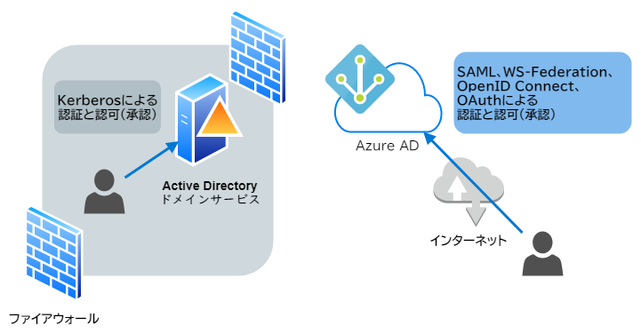
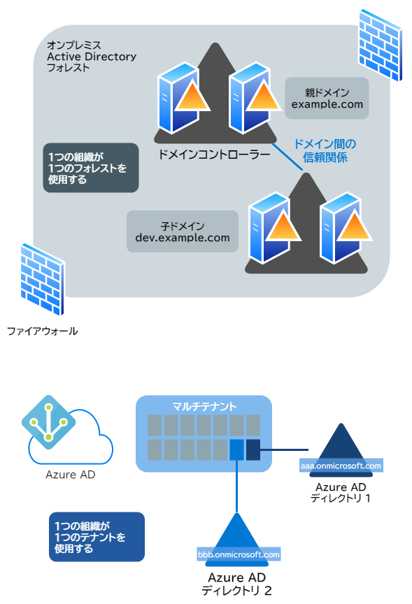
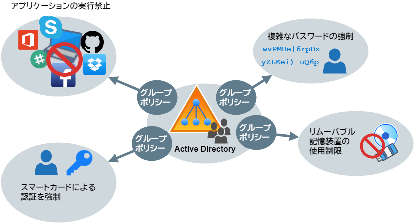
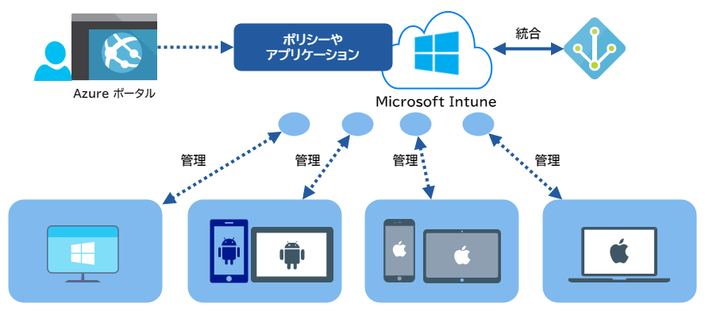

# Active Directory ドメインサービスと Azure AD の比較

## 目次

- [使用目的の違い](#usage)
- [認証と認可のプロトコルの違い](#protocol)
- [ドメイン構成の違い](#domain)
- [デバイス管理方法の違い](#device-management)
- [サーバー機能の構成方法の違い](#service-features)

## <a id="usage">使用目的の違い</a>

- 従来の Active Directory は **オンプレミス** のアカウントやリソースに対する認証基盤
- Azure AD は、**クラウド** のアカウントやリソースに対する認証基盤

## <a id="protocol">プロトコルの違い</a>

従来の Active Directory はファイアウォールに守られた社内ネットワークという前提のため Kerberos による認証と認可を使用し、ディレクトリへのアクセスには LDAP を使用します。

一方、Azure AD はインターネット環境で使用されるパブリッククラウドという前提のため、SAML、WS-Federation、OpenID Connect、OAuth など HTTPS ベースのインターネット標準プロトコルによる認証と認可を使用し、ディレクトリへのアクセスは REST ベースの Azure AD Graph API を使用します。

## <a id="domain">ドメイン構成の違い</a>

従来の Active Directory と Azure AD のドメイン構成方法は異なります。

オンプレミスの Active Directory は、ドメインコントローラーという役割の Windows Server を展開し、通常は１つの組織において１つのフォレストを、その組織の名前空間で構成します。
フォレストに格納する情報は、その組織内でのみ使用され、同一フォレスト内の複数ドメインは、自動的に信頼関係で結ばれます。

一方で、Azure AD はドメインコントローラーがありません。基本的には１つの組織が１つのテナントを使用し、その中に複数のディレクトリを作成します。
ただし、ディレクトリは独立した管理になり、ディレクトリ間の信頼関係が結ばれません。したがって、**Azure AD ディレクトリ間でのデータの共有や同期は原則的には行われません**。

また、Azure AD ディレクトリには、`***.onmicrosoft.com` の `***` の部分をインターネットのスコープでユニークな名前をつける必要があります。企業のドメイン（`example.com` など）を関連付けたい場合は、カスタムドメインを構成する必要があります。

## <a id="device-management">デバイス管理方法の違い</a>

従来の Active Directory ドメインサービスでは、グループポリシー機能を使用して、ドメインに参加したデバイスに会社のルールを適用して、デバイスをまとめて管理します。

Azure AD では、Azure AD と共に Intune を使用して、 Azure AD と Intune に登録したデバイスに会社のルールを適用して、デバイスをまとめて管理します。

## <a id="service-features">サーバー機能の構成方法の違い</a>

Active Direcotry にデータ保護や、フェデレーションなどの新たなサービスを追加したい場合は、サーバーコンポーネントを展開する必要があります。通常、これらのコンポーネントは独立したサーバーとして運用されるため、サーバーを新規に導入する必要があります。

一方で、Azure AD では Azure ポータルからこれらの機能を有効化するだけで、物理／仮想を問わずマシンを新たに導入する必要はありません。

Azure AD に追加できる拡張機能としては以下のようなものがあります。

- ユーザー認証を強化するための、多要素認証
- さまざまな SaaS アプリケーションに対するシングルサインオン
- 個人情報などのデータ保護
- 社内の Web アプリケーションに接続するための、アプリケーションプロキシ