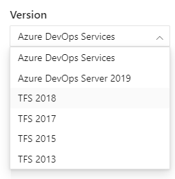

# Azure DevOps とは何ですか？

Azure DevOpsは、作業を計画し、コード開発で協力し、アプリケーションをビルドおよびデプロイするチームをサポートする開発者サービスを提供します。開発者は、Azure DevOps Servicesを使用してクラウドで、またはAzure DevOps Serverを使用してオンプレミスで作業できます。 Azure DevOps Serverは、以前はVisual Studio Team Foundation Server（TFS）と呼ばれていました。

Azure DevOpsは、WebブラウザーまたはIDEクライアントからアクセスできる統合機能を提供します。ビジネスニーズに基づいて、次のサービスを1つ以上使用できます。

- Azure Repos Azure Reposは、コードのソース管理のためにGitリポジトリまたはTeam Foundationバージョン管理（TFVC）を提供します
- Azure Piplienes Azure Pipelinesは、アプリの継続的な統合と配信をサポートするビルドおよびリリースサービスを提供します
- Azure Boards Azure Boardsは、カンバンおよびスクラムメソッドを使用して、作業、コードの欠陥、および問題の計画と追跡をサポートするアジャイルツールのスイートを提供します
- Azure Test Plans Azure Test Plansは、手動/探索的テストや継続的テストなど、アプリをテストするためのいくつかのツールを提供します
- Azure Artifacts Azure Artifactsを使用すると、チームはパブリックおよびプライベートソースからMaven、npm、およびNuGetパッケージを共有し、パッケージ共有をCI / CDパイプラインに統合できます

次のようなコラボレーションツールを使用することもできます。

- 情報、進捗、傾向を共有するための構成可能なウィジェットを備えたカスタマイズ可能なチームダッシュボード
- 情報を共有するための組み込みのWiki
- コンフィグレーション可能な通知

Azure DevOpsは、拡張機能の追加と、Campfire、Slack、Trello、UserVoiceなどの他の一般的なサービスとの統合、および独自のカスタム拡張機能の開発をサポートしています。

クラウドプラットフォームとオンプレミスプラットフォームの違いについては、Azure DevOps ServicesとAzure DevOps Serverをご覧ください。

Microsoftは、Visual Studio Team Services（VSTS）をAzure DevOps Servicesに名前変更しました。 この変更の詳細については、「Azure DevOpsの紹介」を参照してください。

Team Foundation Serverは、Azure DevOps Server 2019になりました。

## Azure DevOps Servicesを選択する

必要なときにAzure DevOps Servicesを選択します

- クイックセットアップ
- メンテナンス不要の操作
- ドメインをまたがった簡単なコラボレーション
- 弾力性のあるスケール
- 頑強なセキュリティ

Azure DevOps Servicesのデータ保護の詳細については、「データ保護の概要」をご覧ください。

また、Azure DevOps Servicesを使用すると、クラウドのビルドサーバーとデプロイサーバー、およびアプリケーションインサイトにアクセスできます。

無料で開始してサービスを簡単に試すことができます。 組織を作成して無料でサインアップしてください。 次に、コードをアップロードして共有またはソース管理します。 スクラム、カンバン、または方法の組み合わせを使用して作業の追跡を開始します。

Azure DevOpsに含まれているすべてのサービスを使用するか、既存のワークフローを補完するために必要なものだけを選択できます。

- [Azure Boards](https://azure.microsoft.com/services/devops/boards/) チーム全体で作業を計画、追跡、および議論します。
- [Azure Pipelines](https://azure.microsoft.com/services/devops/pipelines/) あらゆるプラットフォームおよびクラウドへの継続的なビルド、テスト、展開。
- [Azure Repos](https://azure.microsoft.com/services/devops/repos/) プロジェクト用にクラウドでホストされる無制限のプライベートGitリポジトリを取得します。
# Azure DevOps Serverを選択する

必要なときにオンプレミスのAzure DevOps Serverを選択します。

- データを自分のネットワーク内にとどめたい場合
- 作業追跡のカスタマイズ要件は、継承プロセスモデルよりもオンプレミスXMLプロセスモデルの方がよく満たされています。 オンプレミスモデルは、XML定義ファイルの変更をサポートしています。

Azure DevOps Serverをデプロイするときに、次のサーバーまたは統合ポイントを構成することもできます。

- ビルドサーバー ビルドサーバーは、オンプレミスビルドとクラウドホストビルドをサポートします。
- SQL Server および SQL Analysis Server SQL ServerおよびSQL Analysis Serverは、SQL Serverレポートと、キューブに基づいてExcelピボットチャートを作成する機能をサポートしています。

[Azure DevOps Server Express](https://go.microsoft.com/fwlink/?LinkId=2041269&clcid=0x409) をダウンロードして無料で始めましょう。 次に、コードをアップロードして共有またはソース管理します。 または、スクラム、カンバン、または方法の組み合わせを使用して作業の追跡を開始します。

## Visual Studio Team ServicesがAzure DevOps Servicesになりました

VSTSの主要なサービスの多くは、Azure DevOps ServicesとAzure DevOps Server 2019の両方でスタンドアロンサービスとして提供されるようになりました。Azure DevOps Servicesとして、サービスを個別に、またはまとめて取得できます。 Azure DevOpsサブスクライバーである場合、すべてのサービスに既にアクセスできます。

| VSTS 機能名 | Azure DevOps サービス名 | 詳細 |
| :--------- | :-------------------- | :----- |
| ビルド＆リリース | Azure Pipelines | あらゆる言語、プラットフォーム、クラウドで動作する継続インテグレーションと継続的デプロイ（CI / CD）。 |
| コード | Azure Repos | プロジェクト用のクラウドでホストされる無制限のプライベートGitおよびTeam Foundationバージョン管理（TFVC）リポジトリ。 |
| ワーク | Azure Boards | カンバンボード、バックログ、チームダッシュボード、およびカスタムレポートを使用した作業追跡。 |
| テスト | Azure Test Plans | オールインワンの計画的および探索的テストソリューション。 |
| パッケージ（拡張） | Azure Artifacts | パブリックおよびプライベートソースからのMaven、npm、およびNuGetパッケージフィード。 |

Azure DevOps ServicesとAzure DevOps Server 2019はどちらも、新しいナビゲーションユーザーインターフェイスを使用し、垂直サイドバーを使用して、Boards、Repos、Pipelinesなどの主要なサービスエリアに移動します。 詳細については、[Azure DevOpsのWebポータルナビゲーション](https://docs.microsoft.com/ja-jp/azure/devops/project/navigation/index?view=azure-devops) を参照してください。

引き続き `visualstudio.com` を使用してAzure DevOps Servicesにアクセスできます。新しい組織のプライマリURLとして、新しい `dev.azure.com` ドメイン名に移動しました。そのURLは `https://dev.azure.com/{your organization}/{your project}` です。プライマリとして `dev.azure.com` に基づいてURLを変更する場合、組織管理者は組織設定ページからこれを行うことができます。

## コンテンツバージョンを選択する

このコンテンツはプラットフォーム/バージョンセレクタをサポートしています。目次にある "Content versio selector" ドロップダウンを切り替えて、バージョンに固有のコンテンツにアクセスします。

