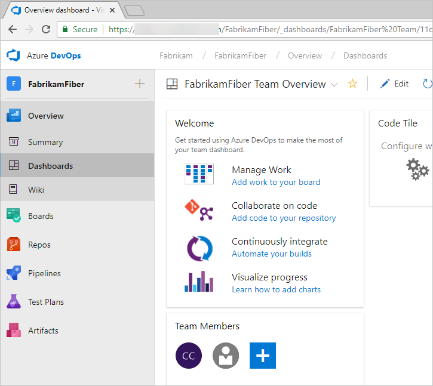
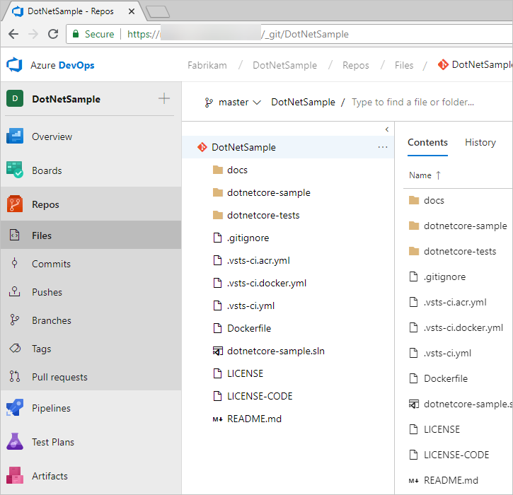
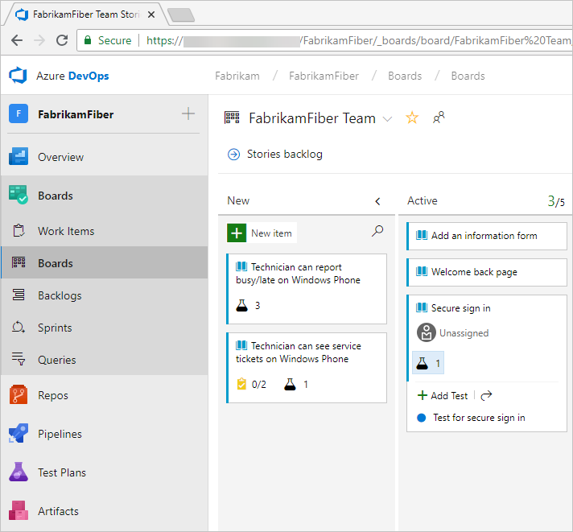
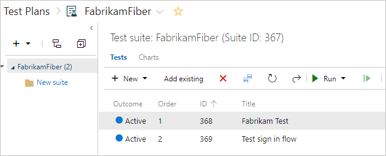
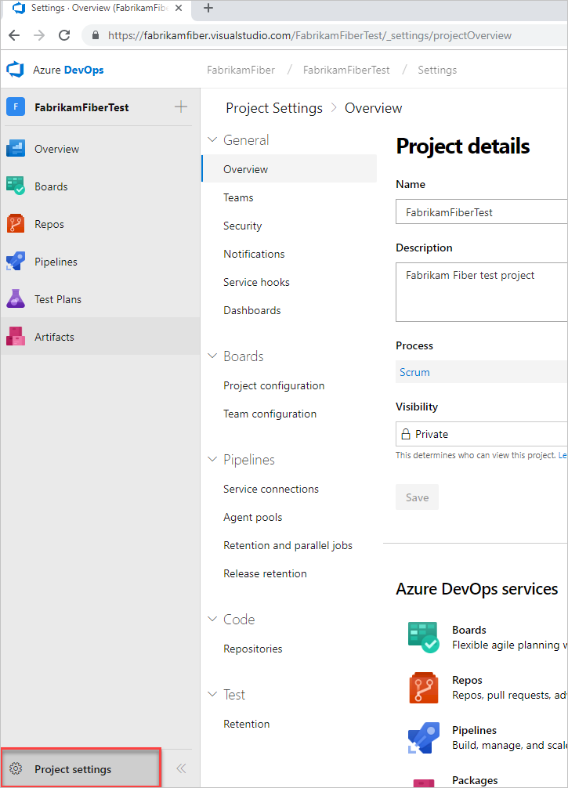

# Azure DevOpsではどのような機能とサービスを利用できますか？

Azure DevOpsを使用すると、計画と開発からテストと展開まで、ソフトウェアプロジェクトを管理するためのサービスとツールの統合セットを取得できます。 サービスは、クライアント/サーバーモデルを介して提供されます。 それらの多くは、すべての主要なブラウザーからアクセスできる使いやすいWebインターフェースを介して提供されます。 ソース管理、パイプラインの構築、作業追跡などの一部のサービスも、クライアントを介して管理できます。

次の画像に示すように、次のインターフェイスを介してWebサービスにアクセスします。

Azure サービスの多くは、小規模チーム向けに無料で提供されているか、サブスクリプションモデルまたは従量課金制モデルを通じて提供されています。
オンプレミス展開を使用してコードと作業を管理するハイブリッドアプローチを実行できます。
次に、必要に応じてクラウドビルドまたはテストサービスを購入します。

クライアントツールの詳細については、[ツール](https://docs.microsoft.com/ja-jp/azure/devops/user-guide/tools?view=azure-devops)を参照してください。

## ダッシュボード

**ダッシュボード** から、ユーザー設定可能なダッシュボードにアクセスできます。

ダッシュボードで次のタスクを実行できます。

- ダッシュボードの追加、構成、管理
- ダッシュボードに追加するウィジェットを構成する
- プロジェクトのさまざまな要素にすばやく移動する

詳細については、[ダッシュボード](https://docs.microsoft.com/ja-jp/azure/devops/report/dashboards/dashboards?view=azure-devops) を参照してください。

## ソース管理

ソースまたはバージョン管理システムにより、開発者はコードで共同作業を行い、コードベースに加えられた変更を追跡できます。 ソース管理は、複数の開発者プロジェクトにとって不可欠なツールです。

私たちのシステムは、Git（分散）またはTeam Foundation Version Control（TFVC）の2種類のソース管理をサポートしています。これは、一元化されたクライアントサーバーシステムです。 どちらのシステムでも、ファイルをチェックインし、フォルダー、ブランチ、およびリポジトリ内でファイルを整理できます。

Gitを使用すると、各開発者は、すべてのブランチおよび履歴情報を含む、ソースリポジトリの開発マシンにコピーを持っています。 各開発者は独自のローカルリポジトリで直接作業し、変更は個別のステップとしてリポジトリ間で共有されます。

開発者は各変更セットをコミットし、履歴などのバージョン管理操作を行い、ネットワークに接続せずに比較します。
ブランチは軽量です。 開発者は、コンテキストを切り替える必要がある場合、プライベートローカルブランチを作成し、あるブランチから別のブランチに切り替えて、コードベースのさまざまなバリエーション間でピボットできます。 後で、ブランチをマージ、公開、または破棄します。

注意

Azure DevOpsのGitは標準のGitです。 Visual StudioをサードパーティのGitサービスで使用できます。 Azure DevOps ServerでサードパーティのGitクライアントを使用することもできます。

TFVCを使用すると、開発者は開発マシンに各ファイルの1つのバージョンしか持っていません。 履歴データはサーバー上でのみ維持されます。 ブランチはパスベースであり、サーバー上に作成されます。

**リポジトリ** からソース管理GitベースまたはTeam Foundationバージョン管理（TFVC）リポジトリにアクセスして、ソフトウェアプロジェクトのバージョン管理をサポートします。 これらのリポジトリはプライベートです。

GitのAzure Reposから、次のタスクを実行できます。

- ファイルの確認、ダウンロード、編集、およびファイルの変更履歴の確認
- プッシュされたコミットを確認および管理する
- プルリクエストの確認、作成、承認、コメント、完了
- Gitタグを追加および管理する

詳細については、[Git](https://docs.microsoft.com/ja-jp/azure/devops/repos/git/overview?view=azure-devops)または[TFVC](https://docs.microsoft.com/ja-jp/azure/devops/repos/tfvc/overview?view=azure-devops)の概要をご覧ください。

## 作業の計画と追跡

ソフトウェア開発プロジェクトには、情報を簡単に共有し、作業、タスク、Issue、またはコードのバグのステータスを追跡する方法が必要です。 過去には、おそらく1つ以上のツールを使用していました。 たとえば、Microsoft Excel、Microsoft Project、バグ追跡システム、またはツールの組み合わせ。
現在、多くのチームがアジャイルの手法と実践を採用して、計画と開発をサポートしています。

Azure のシステムは、機能、要件、ユーザーストーリー、タスク、バグ、およびIssueを追跡するために使用するいくつかのタイプのワークアイテムを提供します。 各作業項目は、作業項目の種類と、進捗状況に応じて更新できる一連のフィールドに関連付けられています。

計画のために、主なアジャイル手法であるスクラム、カンバン、またはスクラムバンをサポートするいくつかのタイプのバックログとボードにアクセスできます。

- プロダクト・バックログ：ストーリーまたは要件の作成およびランク付けに使用されます。
- カンバン：作業の開始から進行、完了までの流れを視覚化し、管理するために使用します。
- スプリントバックログ：スプリントサイクル中に完了する作業を計画するために使用されます。スプリントサイクルは、スクラムの実装時にチームが使用する2〜4週間の定期的なリズムです。
- タスクボード：毎日のスクラム会議中に使用され、完了、残り、またはブロックされた作業を確認します。

プロジェクトマネージャーと開発者は、バックログとボードの作業項目を追跡することで情報を共有します。 有用なグラフとダッシュボードは全体像を示し、チームが進捗と傾向をモニタするのに役立ちます。

**ボード** から、アジャイルツールにアクセスして、作業の計画と追跡をサポートします。

具体的には、次のタスクを実行できます。

- 作業項目を追加および更新する
- 作業項目のクエリを定義し、それらのクエリに基づいてステータスチャートとトレンドチャートを作成する
- プロダクト・バックログを管理する
- スプリントバックログを使用してスプリントを計画する
- スプリントタスクを確認し、タスクボードからタスクを更新する
- カンバン・ボードを使用してワークフローを視覚化し、ステータスを更新する
- フィーチャの下でストーリーをグループ化し、エピックの下でフィーチャをグループ化することにより、ポートフォリオを管理します

それぞれの概要については、[バックログ、ボード、および計画](https://docs.microsoft.com/ja-jp/azure/devops/boards/backlogs/backlogs-boards-plans?view=azure-devops)を参照してください。

## 継続的インテグレーションとデプロイ

ソフトウェアの迅速で信頼性の高いリリースは、可能な限り多くのプロセスを自動化することからもたらされます。 Azure のシステムは、ビルド、テスト、およびリリースの自動化をサポートしています。

- チームメンバーがコードの変更をチェックインするたびに自動的に実行されるようにビルドを定義できます。
- ビルドパイプラインには、ビルドの実行後にテストを実行するための指示を含めることができます。
- リリースパイプラインは、ステージング環境またはプロダクション環境へのソフトウェアビルドのデプロイの管理をサポートします。

**Azure Pipelines** は、アプリケーションのビルドとデプロイをサポートする統合機能セットを提供します。

パイプラインを使用して、継続的インテグレーションと継続的デリバリを実装します。

- **ビルドの自動化**：ビルド中に実行するステップと、ビルドを開始するトリガーを定義します。
- **リリース管理**：迅速なリリースのリズムと同時リリースの管理をサポートします。開発から本番までの環境を表すリリースパイプラインを構成できます。自動化を実行して、アプリを各環境にデプロイします。 承認者を追加して、アプリが環境に正常にデプロイされたことを確認します。ビルドから手動または自動でリリースを作成します。 次に、リリースがさまざまな環境に展開されるときにリリースを追跡します。

詳細については、[任意のプラットフォームでの継続的インテグレーション](https://docs.microsoft.com/ja-jp/azure/devops/pipelines/overview?view=azure-devops)を参照してください。

## 手動および探索的テスト

テスト機能は、手動および探索的テスト、および継続テストをサポートしています。

**テスト計画** は、手動テストの作成と管理をサポートしています。

テスト機能を使用すると、次の機能にアクセスできます。

- テスト計画、テストスイート、テストケース作業項目を使用したワークフローのカスタマイズ
- 要件ベースのテストスイートを使用した、要件からテストケースおよびバグまでのエンドツーエンドのトレーサビリティ
- クエリベースのテストスイートによる条件ベースのテスト選択
- テストケースを簡単に作成するためのグリッドを備えたExcelのようなインターフェイス
- 共有ステップと共有パラメーターを使用した再利用可能なテストステップとテストデータ
- ステークホルダーとレビューするための共有可能なテスト計画、テストスイート、およびテストケース
- あらゆるプラットフォームでのブラウザベースのテスト実行
- テストアクティビティを追跡するためのリアルタイムチャート

詳細については、[テストの概要](https://docs.microsoft.com/ja-jp/azure/devops/test/index?view=azure-devops) を参照してください。

## コラボレーションサービス

以下のサービスは、前述のサービスをサポートするために機能します。

- チームダッシュボード
- プロジェクトwiki
- 作業項目フォーム内での議論
- 作業項目、コミット、プルリクエスト、およびその他の成果物のリンクによるトレーサビリティのサポート
- ユーザー、チーム、プロジェクト、または組織ごとに管理されるアラートと変更通知
- フィードバックを要求および管理する機能
- 分析サービス、分析ビュー、およびPower BIレポート

## サービスフック

サービスフックを使用すると、Azure DevOpsでホストされているプロジェクト内でイベントが発生したときに、他のサービスのタスクを完了することができます。
たとえば、ビルドが失敗したときに、チームのモバイルデバイスにプッシュ通知を送信できます。
プロジェクトのアクティビティを効率化するためのより効率的な方法として、カスタムアプリとサービスでサービスフックを使用することもできます。

次のサービスは、サービスフックのターゲットとして使用できます。 Azure DevOpsと統合する他のアプリとサービスについては、Visual Studio マーケットプレイスのAzure DevOpsタブをご覧ください。

サポートされるサービスの最新セットについては、[サービスフックと統合する](https://docs.microsoft.com/ja-jp/azure/devops/service-hooks/index?view=azure-devops)を参照してください。

## 使用量に基づくクラウドホスト型サービス

以下のサービスは、DevOps操作をサポートします。

- クラウドベースの、Microsoft がホストするビルドおよびデプロイエージェント
- ビルドとデプロイをサポートするオンプレミスのセルフホストエージェント

詳細については、[価格](https://visualstudio.microsoft.com/team-services/pricing/)をご覧ください。

## Azure クラウドホストサービス

Azureは、アプリケーションの開発と展開をサポートするクラウドホスト型サービスを提供します。 これらのサービスを単独で、またはAzure DevOpsと組み合わせて使用できます。

統合されたサービス、機能、およびバンドルスイートのディレクトリを参照するには、[Azure製品](https://azure.microsoft.com/services/)を参照してください。

Azure DevOps ServicesからAzureへの継続的デリバリについては、[Azure Webアプリまたはクラウドサービスへの自動ビルドとデプロイ](https://azure.microsoft.com/documentation/articles/cloud-services-continuous-delivery-use-vso/)を参照してください。

## 管理サービス

共同ソフトウェア開発環境の管理に関連する機能とタスクがあります。
これらのタスクのほとんどは、Webポータルで完結しています。
詳細については、[ユーザー、チーム、プロジェクト、および組織レベルの設定](https://docs.microsoft.com/ja-jp/azure/devops/organizations/settings/about-settings?view=azure-devops)についてをご覧ください。

## 関連記事

- [Azure DevOps ServicesとAzure DevOps Serverの違いを理解する](https://docs.microsoft.com/ja-jp/azure/devops/user-guide/about-azure-devops-services-tfs?view=azure-devops)
- [クライアント・サーバーツール](https://docs.microsoft.com/ja-jp/azure/devops/user-guide/tools?view=azure-devops)
- [ソフトウェア開発のロール](https://docs.microsoft.com/ja-jp/azure/devops/user-guide/roles?view=azure-devops)
- [Azure DevOps の価格](https://visualstudio.microsoft.com/team-services/pricing/)
- [Azure DevOps データ保護の概要](https://docs.microsoft.com/ja-jp/azure/devops/organizations/security/data-protection?view=azure-devops)
