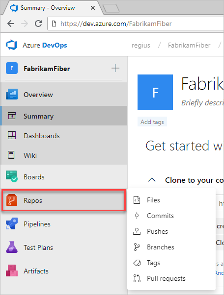
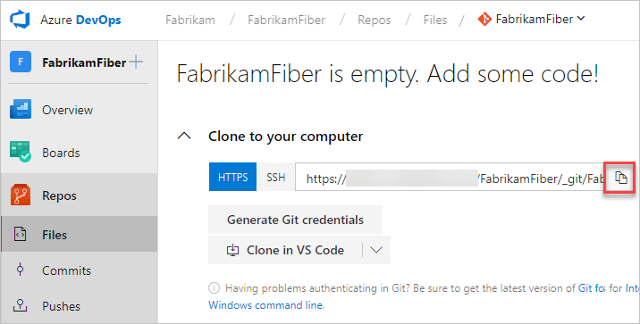
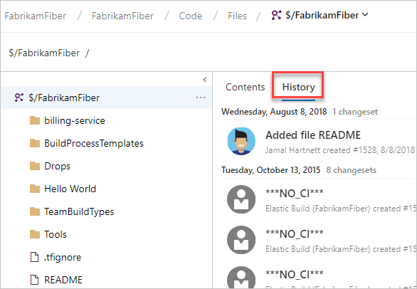

# クイックスタート: Gitを使用したコード

このクイックスタートでは、コードを他の人と共有する方法を学びます。 Azure DevOpsで新しい組織とプロジェクトを作成したら、Gitでコーディングを開始できます。

Gitリポジトリを操作するには、コンピューターに複製します。 レポジトリを複製すると、レポジトリの完全なローカルコピーが作成され、作業できるようになります。
また、クローンを作成すると、リポジトリ内のすべてのコミットとブランチがダウンロードされ、サーバー上のリポジトリとの名前付き関係が設定されます。
この関係を使用して既存のリポジトリとやり取りし、変更をプッシュおよびプルして、コードをチームと共有します。

## Git のコマンドラインツールのインストール

1. 次のGitコマンドラインツールのいずれかをインストールします。
    - Git Credential Managerを含むGit for Windowsをインストールするには、[Git Credential Managerのインストール - Windows](https://docs.microsoft.com/ja-jp/azure/devops/repos/git/set-up-credential-managers?view=azure-devops#windows)を参照してください。
    - macOSまたはLinuxにインストールするには、オープンソースのPro Gitブックの[Gitのインストール](https://git-scm.com/book/ja/v2/%E4%BD%BF%E3%81%84%E5%A7%8B%E3%82%81%E3%82%8B-Git%E3%81%AE%E3%82%A4%E3%83%B3%E3%82%B9%E3%83%88%E3%83%BC%E3%83%AB)の章をご覧ください。 macOSおよびLinuxの場合、[SSH認証](https://docs.microsoft.com/ja-jp/azure/devops/repos/git/use-ssh-keys-to-authenticate?view=azure-devops&tabs=preview-page%2Ccurrent-page)を構成することをお勧めします

## リポジトリをコンピューターに複製

1. Webブラウザーから、組織のプロジェクトを開き、**リポジトリ** を選択します。 プロジェクトがない場合は、[ここで作成してください](https://docs.microsoft.com/ja-jp/azure/devops/user-guide/sign-up-invite-teammates?view=azure-devops)。<br />
1. コードウィンドウの右上隅にある **複製(クローン)** を選択し、URLをコピーします。<br />
1. Gitコマンドウィンドウ（Git for WindowsのGit Bash）を開きます。リポジトリのコードをコンピューターに保存するフォルダーに移動し、`git clone` を実行してから、前の手順で **Clone URL** からコピーしたパスを実行します。 次の例を参照してください。<br />
    ```bash
    git clone https://contoso-ltd.visualstudio.com/MyFirstProject/_git/contoso-demo
    ```
    リポジトリからのすべてのコミットとブランチを含むコードのコピーがGitにダウンロードされます。 このコピーは、作業するための新しいフォルダーに配置されます。

    このコマンドウィンドウを開いたままにします（次の手順で使用します）。

## コードの操作

次の手順では、コンピューター上のファイルに変更を加え、ローカルで変更をコミットし、サーバーに保存されているリポジトリにコミットをプッシュします。 その後、変更を表示できます。

1. リポジトリを複製したコンピューター上のフォルダーを参照し、選択したエディターで`README.md`ファイルを開き、いくつかの変更を行います。 次に、ファイルを保存して閉じます。
1. Gitコマンドウィンドウで、次のコマンドを入力して `contoso-demo` ディレクトリに移動します。
    ```bash
    cd contoso-demo
    ```
1. Gitコマンドウィンドウで次のコマンドを入力して、変更をコミットします。
    ```bash
    git ad .
    git commit -m "Initial comit"
    ```
    `git add .`コマンドは新規または変更されたファイルをステージングし、` git commit -m`は指定されたコミットメッセージでコミットを作成します。
1. サーバー上のGitリポジトリに変更をプッシュします。 Gitコマンドウィンドウに次のコマンドを入力します。
    ```bash
    git push
    ```

## 履歴の表示

1. Webポータルに戻り、コードページから **履歴** を選択して、新しいコミットを表示します。

    
1. **ファイル** タブに切り替え、`README` ファイルを選択して変更を表示します。

## 次の手順

[継続的インテグレーションおよびデリバリをセットアップする](02-Set-up-continous-integration-and-delivery)