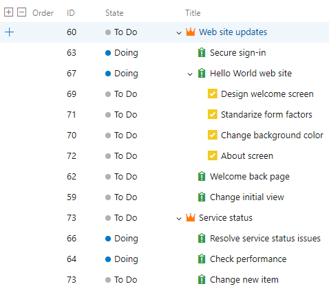
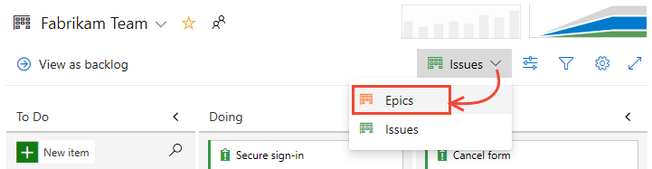

# 作業の計画と追跡

作業項目を作成して作業を追跡します。
この記事では、カンバンボードを使用して基本プロセスで問題とタスクを作成するか、アジャイルプロセスで使用するユーザーストーリーとタスクを作成する方法を説明します。

プロジェクトで選択されたプロセスに応じて、ガイダンスとして基本プロセスまたはアジャイルプロセスを選択します。

### 基本プロセスの場合

基本プロセスでは、作業を計画および追跡するために、Epic、Issues、およびタスクの3つの作業項目タイプが提供されます。 Issuesを追加して、ユーザーストーリー、バグ、またはフィーチャアイテムを追跡することから始めることをお勧めします。 それらを階層にグループ化する必要がある場合、Epicを定義できます。
作業の詳細を追跡する場合は、Issueにタスクを追加できます。

#### 作業項目の種類

#### バックログの階層

各作業項目フォーム内で、ディスカッションセクションを使用して、実行する作業の説明、プロジェクトの貢献者への作業の割り当て、ステータスの追跡、および他のユーザーとの共同作業を行うことができます。

ここでは、WebポータルからIssueと子タスクを追加し、それらの作業項目に詳細を追加する方法を示します。

### アジャイルプロセスの場合

アジャイルプロセスでは、作業を計画および追跡するために、ユーザーストーリー、タスク、バグ、機能、特にエピックなど、いくつかの作業項目タイプが提供されます。
ユーザーストーリーを追加することから始めることをお勧めします。
それらを階層にグループ化する必要がある場合は、フィーチャを定義できます。 作業の追加の詳細を追跡する場合は、ユーザーストーリーにタスクを追加できます。

#### 作業項目の種類

#### バックログの階層

各作業項目フォーム内で、ディスカッションセクションを使用して、実行する作業の説明、プロジェクトの貢献者への作業の割り当て、ステータスの追跡、および他のユーザーとの共同作業を行うことができます。

ここでは、Webポータルからユーザーストーリーと子タスクを追加し、それらの作業項目に詳細を追加する方法を示します。

## カンバンボードの開設

カンバンボードは、各プロジェクトと各チームを追加してプロビジョニングされます。
別のチームを追加することによってのみ、プロジェクトにカンバンボードを作成または追加できます。
詳細については、[チームとアジャイルツールについて](https://docs.microsoft.com/ja-jp/azure/devops/organizations/settings/about-teams-and-settings?view=azure-devops)を参照してください。

### 基本プロセスの場合

Issueカンバンボードは、Issueや子タスクをすばやく追加するための最適なツールです。 開くには、**ボード** > **ボード** を選択します。

Epics カンバンボードは、エピックとそれらのエピックの子であるIssuesをすばやく追加するための最適なツールです。
IssueボードからEpicsボードを開くには、ボードセレクターからEpicsを選択します。

### アジャイルプロセスの場合

ユーザーストーリー・カンバンボードは、ユーザーストーリーと子タスクをすばやく追加するための最適なツールです。 開くには、**ボード** > **ボード** を選択します。

フィーチャ・カンバンボードは、フィーチャとそれらのフィーチャの子であるユーザーストーリーをすばやく追加するための最適なツールです。
ユーザーストーリーボードからフィーチャボードを開くには、ボードセレクターからフィーチャを選択します。

## Issuesまたはユーザーストーリーを追加する

### 基本プロセスの場合

1. **Issues** ボードから **新しいアイテム** を選択し、追跡するIssuesの追加を開始します。

    

1. `Enter` を入力すると、システムは作業項目IDをIssueに割り当てます。
    
    
1. 管理する作業を追跡するには、必要な数のIssueを追加します。

### アジャイルプロセスの場合

1. ユーザーストーリーボードから **新しいアイテム** を選択し、追跡するストーリーの追加を開始します。

    
1. `Enter` と入力すると、システムはユーザーストーリーに作業項目IDを割り当てます。

    
1. 管理する作業を追跡するには、必要な数のユーザーストーリーを追加します。

## Issueまたはユーザーストーリーに詳細を追加する

Issueまたはユーザーストーリーのタイトルを選択して開きます。
1つ以上のフィールド値を変更するか、説明を追加するか、**ディスカッション** セクションでメモを作成します。
**添付ファイル**  タブを選択し、ファイルをドラッグアンドドロップして他のユーザーとファイルを共有することもできます。

### 基本プロセスの場合

たとえば、ここではIssuesをRaisa Pokrovskayaに割り当て、Raisaに言及するディスカッションノートを追加します。

注意  
プロジェクトに追加されたユーザーにのみ作業を割り当てることができます。

完了したら、**保存して閉じる** を選択します。

#### フィールドの詳細

| フィールド | 説明 |
| :------- | :----------- |
| Title | 255文字以下の説明を入力してください。 いつでもタイトルを変更できます。 |
| Assigned to | 作業項目を、作業の実行を担当するチームメンバーに割り当てます。 作業しているコンテキストに応じて、ドロップダウンメニューにはプロジェクトのチームメンバーまたは貢献者のみがリストされます。 |
| State | ワークアイテムが作成されると、ステータスはデフォルトでワークフローの最初の状態になります。 作業が進行するにつれて、現在の状態を反映するように更新します。 |
| Reason | 最初にデフォルトを使用します。 必要に応じて状態を変更したら更新してください。 各状態はデフォルトの理由に関連付けられています。 |
| Area | 製品またはチームに関連付けられたエリアパスを選択するか、計画会議中に割り当てられるまで空白のままにします。 エリアのドロップダウンリストを変更するには、[エリアパスの定義とチームへの割り当て](https://docs.microsoft.com/ja-jp/azure/devops/organizations/settings/set-area-paths?view=azure-devops)を参照してください。 |
| Iteration | 作業を完了するスプリントまたは反復を選択するか、空白のままにして、後で計画会議中に割り当てます。 反復のドロップダウンリストを変更するには、[反復パス（スプリント）を定義し、チームの反復を構成する](https://docs.microsoft.com/ja-jp/azure/devops/organizations/settings/set-iteration-paths-sprints?view=azure-devops)を参照してください。 |
| Description | 十分な詳細を提供して、範囲を共有して理解し、推定作業をサポートします。 ユーザー、彼らが達成したいこと、そしてその理由に焦点を合わせます。 製品の開発方法を説明しないでください。 チームがタスクとテストケースを記述してアイテムを実装できるように、十分な詳細を提供してください。 |
| Priority | ビジネスに関連する問題またはタスクの主観的な評価。 次の値を指定できます。 <ol><li>製品は、作業項目の正常な解決なしには出荷できません。できるだけ早く対処する必要があります。</li><li>作業項目の解決が成功しないと製品を出荷できませんが、すぐに対処する必要はありません。</li><li>作業項目の解決は、リソース、時間、およびリスクに基づいてオプションです。</li><li>作業項目の解決は不要です。</li> |
| Effort | Issueを完了するために必要な作業量の相対的な見積もりを提供します。  ほとんどのアジャイルメソッドでは、作業の相対的なサイズに基づいてバックログアイテムの推定値を設定することをお勧めします。このような方法には、2のべき乗（1、2、4、8）およびフィボナッチ数列（1、2、3、5、8など）が含まれます。 チームが好む数値の測定単位を使用します。 Effortに設定した推定値は、速度(velocity)の計算とスプリントの予測(forecast)に使用されます。 |

## アジャイルプロセスの場合

たとえば、ここではストーリーをRaisa Pokrovskayaに割り当て、Raisaに言及するディスカッションノートを追加します。

注意  
プロジェクトに追加されたユーザーにのみ作業を割り当てることができます。

完了したら、保存して閉じるを選択します。

### フィールドの詳細

| フィールド | 説明 |
| :------- | :------ |
| Title  | 255文字以下の説明を入力してください。 いつでもタイトルを変更できます。 |
| Assigned To | 作業項目を、作業の実行を担当するチームメンバーに割り当てます。 作業しているコンテキストに応じて、ドロップダウンメニューにはプロジェクトのチームメンバーまたは貢献者のみがリストされます。 |
| State | 作業項目が作成されると、状態はデフォルトでワークフローの最初の状態になります。 作業が進行するにつれて、現在の状態を反映するように更新します。 |
| Reason | 最初にデフォルトを使用します。 必要に応じて状態を変更したら更新してください。 各状態はデフォルトの理由に関連付けられています。 |
| Area | 製品またはチームに関連付けられたエリアパスを選択するか、計画会議中に割り当てられるまで空白のままにします。 エリアのドロップダウンリストを変更するには、[エリアパスの定義とチームへの割り当て](https://docs.microsoft.com/ja-jp/azure/devops/organizations/settings/set-area-paths?view=azure-devops)を参照してください。 |
| Iteration | 作業を完了するスプリントまたは反復を選択するか、空白のままにして、後で計画会議中に割り当てます。 反復のドロップダウンリストを変更するには、[反復パス（スプリント）を定義し、チームの反復を構成する](https://docs.microsoft.com/ja-jp/azure/devops/organizations/settings/set-iteration-paths-sprints?view=azure-devops)を参照してください。 |
| Description | 十分な詳細を提供して、範囲を共有して理解し、推定作業をサポートします。 ユーザー、彼らが達成したいこと、そしてその理由に焦点を合わせます。 製品の開発方法を説明しないでください。 チームがタスクとテストケースを記述してアイテムを実装できるように、十分な詳細を提供してください。 |
| Acceptance Criteria | ユーザーストーリーを閉じる前に満たすべき基準を提供します。 作業を開始する前に、顧客の受け入れ基準をできるだけ明確に説明してください。 受け入れ基準を定義するためのチームと顧客間の会話は、チームが顧客の期待を確実に理解するのに役立ちます。 受け入れ基準は受け入れテストの基礎として使用できるため、アイテムが十分に完成したかどうかをより効果的に評価できます。 |
| Priority | ビジネスに関連する問題またはタスクの主観的な評価。 次の値を指定できます。 <ol><li>製品は、作業項目の正常な解決なしには出荷できません。できるだけ早く対処する必要があります。</li><li>作業項目の解決が成功しないと製品を出荷できませんが、すぐに対処する必要はありません。</li><li>作業項目の解決は、リソース、時間、およびリスクに基づいてオプションです。</li><li>作業項目の解決は不要です。</li> |
| Value Area | エピック、フィーチャ、要件、またはバックログアイテムによって対処される顧客価値の領域。 値は次のとおりです。<ol><li>アーキテクチャ：ソリューションを提供するビジネスフィーチャを実装するための技術サービス</li><li>ビジネス：ビジネスをサポートするために顧客価値を直接提供する顧客またはステークホルダーのニーズを満たすサービス（デフォルト）</li> |
| Story Points | Issueを完了するために必要な作業量の相対的な見積もりを提供します。  ほとんどのアジャイルメソッドでは、作業の相対的なサイズに基づいてバックログアイテムの推定値を設定することをお勧めします。 このような方法には、2のべき乗（1、2、4、8）およびフィボナッチ数列（1、2、3、5、8など）が含まれます。 チームが好む数値の測定単位を使用します。  設定した推定値は、速度(velocity)の計算とスプリントの予測(forecast)に使用されます。 |

## ステータスの更新

### 基本プロセスの場合

作業が開始されたら、Issueを **作業** 列から **作業中** 列にドラッグします。 完了したら、**完了** 列に移動します。

必要に応じて列を追加または名前を変更できます。[ボードのカスタマイズ](https://docs.microsoft.com/ja-jp/azure/devops/boards/get-started/customize-boards?view=azure-devops)を参照してください。

### アジャイルプロセスの場合

作業が開始したら、ユーザーストーリーカードを **バックログ** 列から **アクティブ** 列にドラッグします。 作業のレビューの準備ができたら、**解決済み** 列に移動します。 確認して受け入れたら、**クローズ** 列に移動します。

必要に応じて列を追加または名前を変更できます。[ボードのカスタマイズ](https://docs.microsoft.com/ja-jp/azure/devops/boards/get-started/customize-boards?view=azure-devops)を参照してください。

## タスクの追加

タスクチェックリストは、問題の完了をサポートするために重要な作業要素を追跡するための迅速かつ簡単な方法を提供します。

1. タスクの追加を開始するには、Issueのアクションアイコン(を選択し、プラスアイコン() **タスクの追加** オプションを選択します。

    

    タスクのタイトルを入力し、完了したら`Enter`を入力します。

    
2. 追加するタスクが多数ある場合は、タスクのタイトルを入力し続けて`Enter`キーを押します。

    

3. タスクに完了のマークを付けたり、タスクのチェックリストを展開したり折りたたんだり、タスクの順序を変更したり、親を変更したりできます。
    - **タスクを完了としてマークする**
        タスクを完了としてマークするには、タスクのチェックボックスをオンにします。 タスクの状態が **完了** に変わります。 

        
    - **タスクの並べ替えと親の再設定**
        タスクを並べ替えるには、チェックリスト内でドラッグします。 タスクの親を変更するには、ボード上の別の課題にドラッグします。 

        
    - **チェックリストを展開または折りたたむ**
        タスクのチェックリストを展開または折りたたむには、タスクの注釈を選択するだけです。 

        

### アジャイルプロセスの場合

タスクチェックリストは、ユーザーストーリーの完成をサポートするために重要な作業要素をすばやく簡単に追跡する方法を提供します。 さらに、個々のタスクを異なるチームメンバーに割り当てることができます。

1. タスクの追加を開始するには、ストーリーのアクションアイコン()を選択し、プラスアイコン() **タスクの追加** オプションを選択します。 

     

    タスクのタイトルを入力し、完了したら **Enter** を入力します。
1. 追加するタスクが多数ある場合は、タスクのタイトルを入力し続けて**Enter** キーを押します。 

    
1. タスクに完了のマークを付けたり、タスクのチェックリストを展開したり折りたたんだり、タスクの順序を変更したり、親を変更したりできます。
    - **タスクを完了としてマークする**
        タスクを完了としてマークするには、タスクのチェックボックスをオンにします。 タスクの状態が **完了** に変わります。 

        
    - **タスクの並べ替えと親の再設定**
        タスクを並べ替えるには、チェックリスト内でドラッグします。 タスクの親を変更するには、ボード上の別のIssueにドラッグします。 

        
    - **チェックリストを展開または折りたたむ**
        タスクのチェックリストを展開または折りたたむには、タスクの注釈を選択するだけです。 

        

## タスクに詳細を追加する

タスクについて追加したい詳細がある場合は、タイトルを選択して開きます。 1つ以上のフィールド値を変更するか、説明を追加するか、**ディスカッション** セクションでメモを作成します。 完了したら、**保存して閉じる** を選択します。

### 基本プロセスの場合

ここで、タスクをJamalに割り当てます。

#### フィールドの詳細

Issueに対して定義できるフィールドに加えて、タスクの以下のフィールドを指定して、キャパシティと時間の追跡をサポートできます。

| フィールド | 説明 |
| :------- | :------ |
| Activity | タスクの実行に必要なアクティビティのタイプ。このフィールドの使用方法の詳細については、[キャパシティ計画](https://docs.microsoft.com/ja-jp/azure/devops/boards/sprints/set-capacity?view=azure-devops)を参照してください。 許可される値は次のとおりです。<ul><li>デプロイメント</li><li>設計</li><li>開発</li><li>ドキュメント</li><li>要求</li><li>テスト</li> |
| Remaing Work | タスクを完了するために残っている作業量。 作業を時間単位または日単位で指定できます。 タスクボードは、残りの作業との関係で時間に対して常に「h」を表示しますが、このフィールドに固有の時間単位はありません。  残りの作業は、スプリントのバーンダウンを計算するためによく使用されます。 |

### アジャイルプロセスの場合

ここで、タスクをChristie Churchに割り当てます。

#### フィールドの詳細

ユーザーストーリー用に定義できるフィールドに加えて、タスクの以下のフィールドを指定して、キャパシティと時間の追跡をサポートできます。

| フィールド | 説明 |
| :------- | :------- |
| Activity | タスクの実行に必要なアクティビティのタイプ。このフィールドの使用方法の詳細については、[キャパシティ計画](https://docs.microsoft.com/ja-jp/azure/devops/boards/sprints/set-capacity?view=azure-devops)を参照してください。 許可される値は次のとおりです。<ul><li>デプロイメント</li><li>設計</li><li>開発</li><li>ドキュメント</li><li>要求</li><li>テスト</li> |
| オリジナルの見積もり | タスクを完了するために必要な推定作業量。 通常、このフィールドは割り当てられても変更されません。  作業を時間単位または日単位で指定できます。 このフィールドに関連付けられた固有の時間単位はありません。 |
| Completed Work | タスクの実装に費やされた作業量。 |
| Remaing Work | タスクを完了するために残っている作業量。 作業が進むにつれて、このフィールドを更新します。 [キャパシティチャート](https://docs.microsoft.com/ja-jp/azure/devops/boards/sprints/set-capacity?view=azure-devops)、[スプリントバーンダウンチャート](https://docs.microsoft.com/ja-jp/azure/devops/report/dashboards/configure-sprint-burndown?view=azure-devops)の計算に使用されます。タスクをサブタスクに分割する場合は、サブタスクのみに時間を指定します。 チームが選択した任意の測定単位で作業を指定できます。 |

## ディスカッションセクションでコメントをキャプチャする

ディスカッションセクションを使用して、実行中の作業についてのコメントを追加および確認します。

書式設定可能な各テキストボックス内でカーソルをクリックすると、リッチテキストエディターのツールバーがテキスト入力領域の下に表示されます。

### 特定の誰か、グループ、作業項目、またはプルリクエストに言及する（`@`、`#`、または) を選択するか、アイコンを選択して、**削除** を選択します。

コメントを更新した後、**更新** を選択します。 コメントを削除するには、削除することを確認する必要があります。

### コメントにリアクションを追加する

任意のコメントに1つ以上のリアクションを追加できます。 コメントの右上隅にあるスマイリーアイコンを選択するか、既存のリアクションの横にあるコメントの下部にあるアイコンから選択します。
リアクションを削除するには、コメントの下部にあるリアクションをクリックします。 以下は、リアクションの追加の経験の例と、コメントに対するリアクションの表示を示しています。

### 次は？

[ボードのカスタマイズ](https://docs.microsoft.com/ja-jp/azure/devops/boards/get-started/customize-boards?view=azure-devops)

