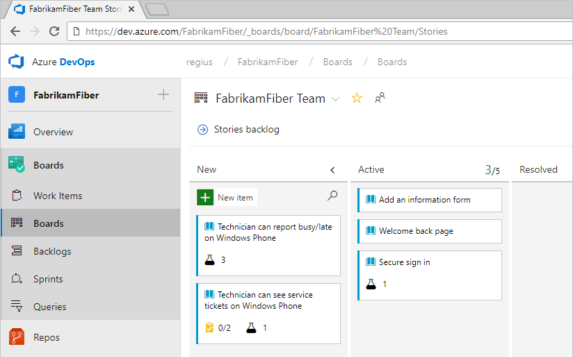
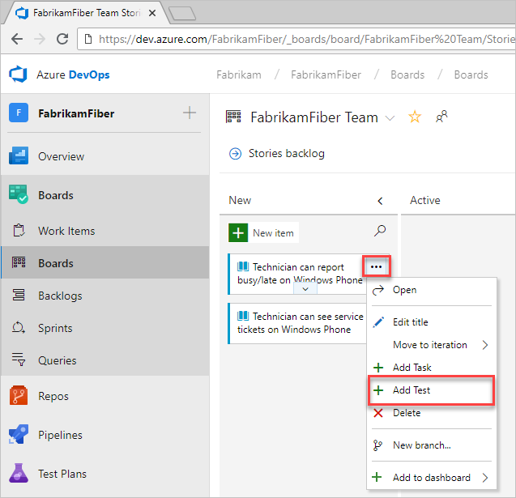
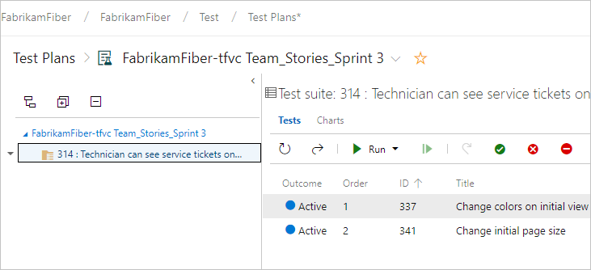
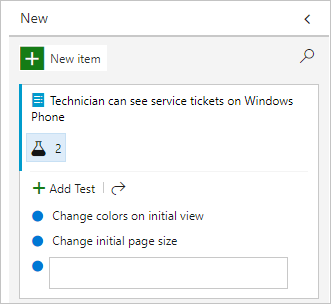
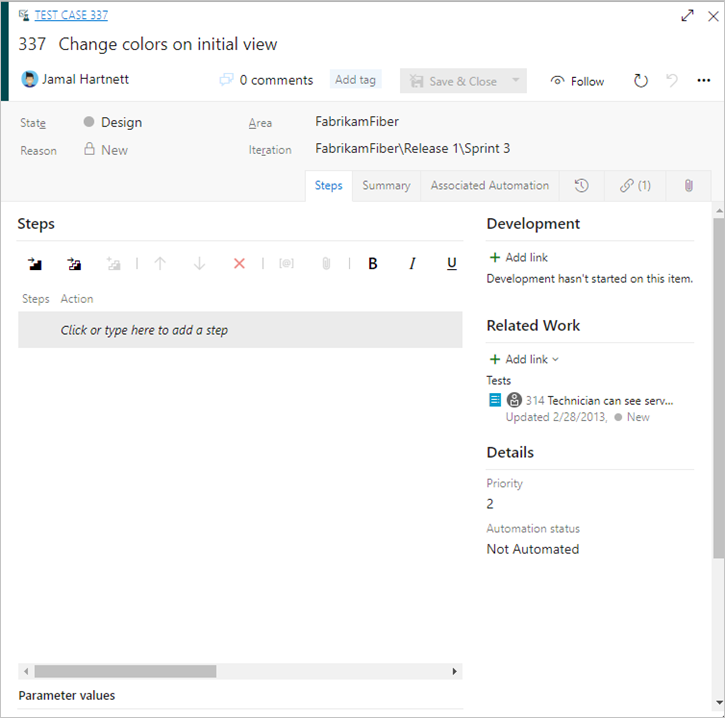
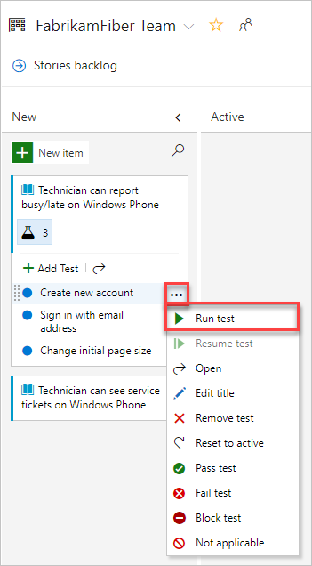
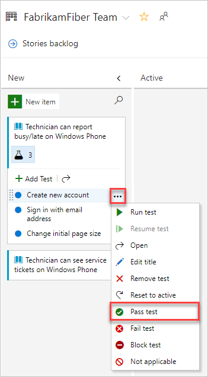
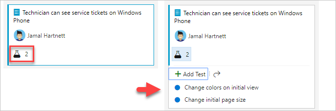

# クイックスタート：インラインテストの追加、実行、更新

このクイックスタートでは、Azure DevOpsでインラインテストを追加、実行、更新、展開、折りたたみする方法を学習します。

手動テストを開始する簡単な方法は、テストするユーザーストーリーまたはバグにテストを追加することです。 カンバンボードから、インラインテスト、またはバックログアイテムの手動テストのセットをすばやく定義できます。
これらのテストを実行して、ステータスを更新することもできます。 カンバンボードを初めて使用する場合は、[カンバンクイックスタート](https://docs.microsoft.com/ja-jp/azure/devops/boards/boards/kanban-quickstart?view=azure-devops)を参照してください。

カンバンボードから作成したテストは、ユーザーストーリーまたはバックログアイテムに自動的にリンクされます。

## カンバンボードを開く

1. Webブラウザーから、組織のプロジェクトを開き、Azure Boardsを選択します。プロジェクトがない場合は、[ここ](https://docs.microsoft.com/ja-jp/azure/devops/user-guide/sign-up-invite-teammates?view=azure-devops)で作成してください。 チームメンバーとして追加されていない場合は、[今すぐ招待](https://docs.microsoft.com/ja-jp/azure/devops/user-guide/sign-up-invite-teammates?view=azure-devops#invite-others)してください。 
    
    URL は次のパターンに従います : `https://dev.azure.com/fabrikamfiber/_boards/board` 

    目的のチームまたはプロジェクトが表示されない場合は、Azure DevOpsアイコン()を選択して、[すべてのプロジェクトとチームを参照](https://docs.microsoft.com/ja-jp/azure/devops/project/navigation/work-across-projects?view=azure-devops)します。
1. ボードを選択して、カンバンボードを開きます。 

    

## テストの追加

1. テストを追加するには、作業項目のメニューを開きます。 

    
     
    インラインテストの追加は、テストスイートへのテストケースの追加と同じです。 デフォルトのテスト計画とテストスイートが自動的に作成され、その下に手動テストケースがグループ化されます。
     
    たとえば、次のユーザーストーリー用のテストスイートが作成され、そのスイートにインラインテストが追加されます。 ユーザーストーリー314が強調表示されます。 ID 337および341で定義された2つの手動テストがあります。
     
    
1. 追加するテストが多数ある場合は、各タイトルを入力して `Enter` を選択します。
     
    
     
    テストケースに詳細を追加するには、テストケースを開きます。 タイトルを選択するか、インライン項目をダブル選択するか、コンテキストメニューを開いて **開く** を選択します。
     
    

テストの定義方法の詳細については、[手動テストの作成](https://docs.microsoft.com/ja-jp/azure/devops/test/create-test-cases?view=azure-devops)を参照してください。

テストを実行する前に、詳細を追加する必要があります。

## テストの実行

インラインテストのアクションメニューから **テストの実行** を選択して、テストを実行します。

Microsoft Test Runnerは新しいブラウザーインスタンスで起動します。 テストの実行方法については、[手動テストの実行](https://docs.microsoft.com/ja-jp/azure/devops/test/run-manual-tests?view=azure-devops)を参照してください。

## テストのステータスを更新

アクションメニューからテストのステータスを更新できます。

テストのステータスを更新すると、[テスト結果を追跡](https://docs.microsoft.com/ja-jp/azure/devops/test/track-test-status?view=azure-devops)できます。

## インラインテストの展開または折りたたみ

カンバンボードを最初に開くと、チェックリストとテストの展開されていないビューが表示されます。

折りたたまれた一連のテストを展開するには、インラインテストの概要を選択します。 同じサマリーを選択して、展開されたリストを折りたたみます。

## 次の手順

- [テストケース管理の詳細](https://docs.microsoft.com/ja-jp/azure/devops/test/create-test-cases?view=azure-devops)
- [カンバンのクイックスタート](https://docs.microsoft.com/ja-jp/azure/devops/boards/boards/kanban-quickstart?view=azure-devops)

ユーザーストーリーのWebベースの探索的テストを開始するには、探索的テストをインストールする必要があります。 詳細については、[Webアプリをブラウザーで探索テストする方法](https://docs.microsoft.com/ja-jp/azure/devops/test/perform-exploratory-tests?view=azure-devops)を参照してください。