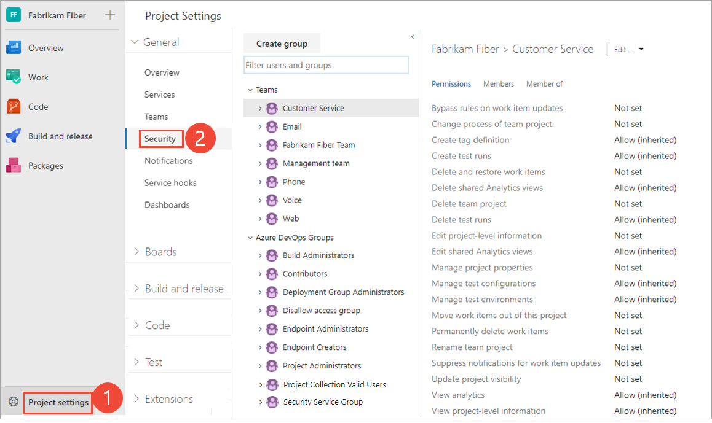
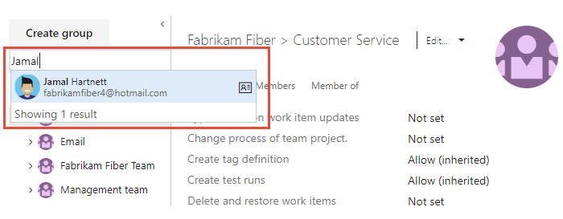
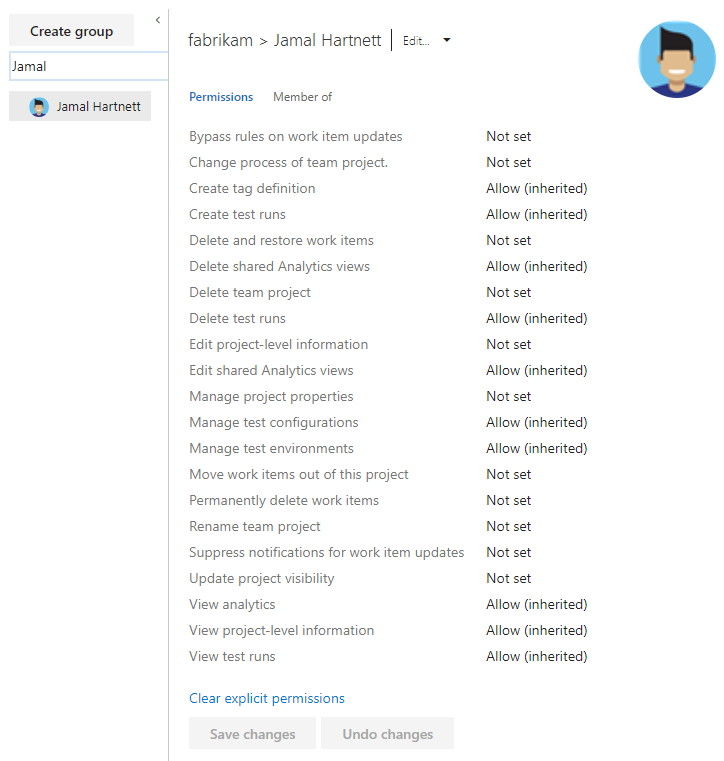
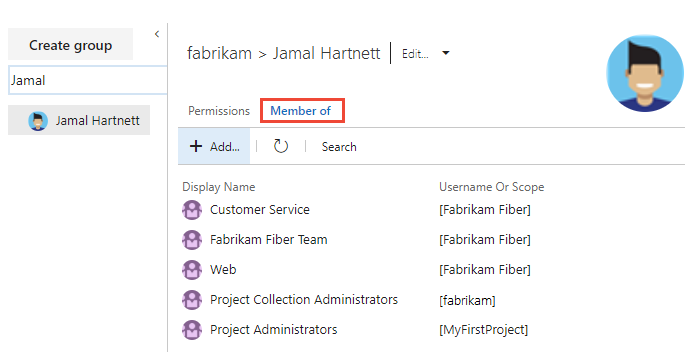
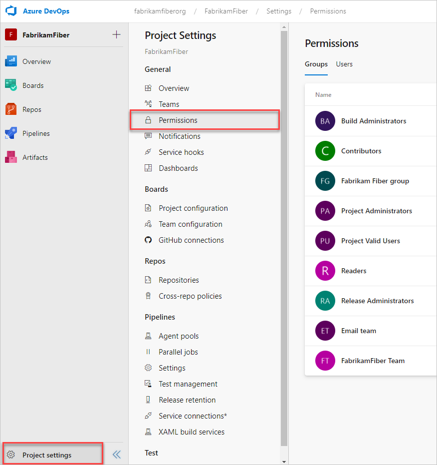
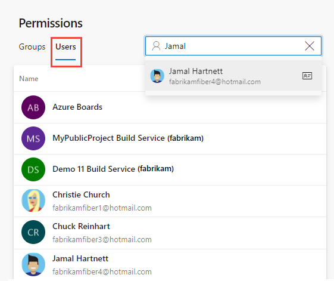
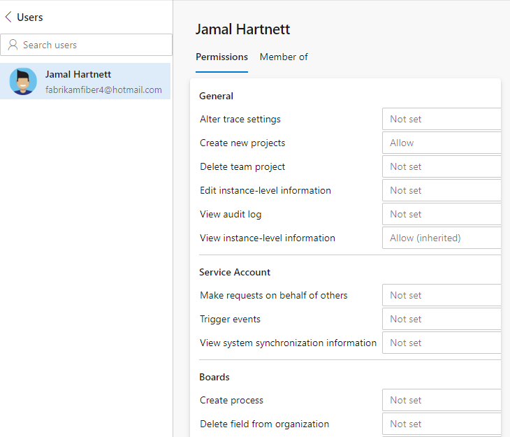
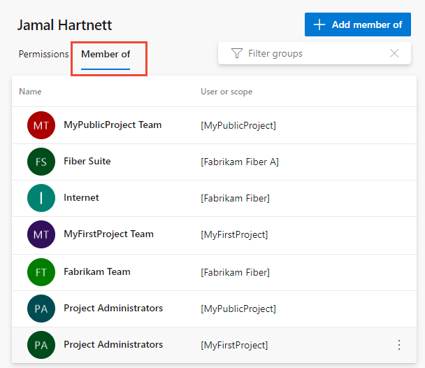
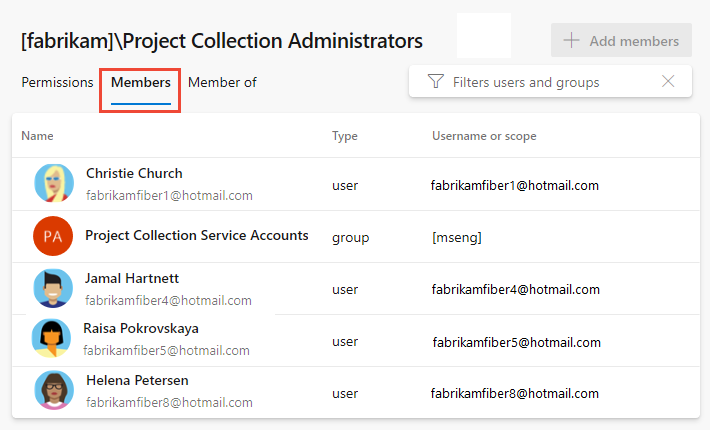

# 自分または他のユーザーの権限を表示する

このクイックスタートでは、アクセス許可またはAzure DevOpsの他のユーザーに設定されているアクセス許可を表示する方法を学びます。 機能にアクセスする権限がない場合は、適切なリソースから要求することができます。

権限は、[許可、グループについて](https://docs.microsoft.com/ja-jp/azure/devops/organizations/security/about-permissions?view=azure-devops)で説明されているように、コレクション、プロジェクト、およびオブジェクトレベルで設定されます。
したがって、所有している権限を表示するには、オブジェクト、プロジェクト、またはコレクションレベルで権限を開く必要があります。

## 事前条件

- 接続するプロジェクトが必要です。 プロジェクトがまだない場合は、[作成](https://docs.microsoft.com/ja-jp/azure/devops/organizations/projects/create-project?view=azure-devops)します。
- 権限を表示するには、プロジェクトの有効なユーザーグループまたはプロジェクトコレクションの有効なユーザーグループのメンバーである必要があります。

注意  
この記事では、プロジェクトレベルまたはコレクションレベルでユーザーに割り当てられた権限を表示する方法を示します。 ただし、オブジェクトのセキュリティダイアログから作業する場合の手順は似ています。

## プロジェクトレベルの権限を表示する

注意  
プロジェクトの権限設定ページの新しいユーザーインターフェイスを有効にするには、[プレビュー機能を有効にする](https://docs.microsoft.com/ja-jp/azure/devops/project/navigation/preview-features?view=azure-devops)をご覧ください。

### 現状の場合

1. **プロジェクトの設定**、**セキュリティ** の順に選択します。
     
    
1. **ユーザーとグループのフィルター** ボックスに名前を入力し始めます。 システムは、入力した文字で始まる名前を自動的に表示します。
      
    
1. 好きな名前を選択してください。 設定したプロジェクトレベルの権限は、所属するグループまたはアカウントに設定された権限に基づいています。
     
    
1. **メンバー** を選択して、ユーザーが属するセキュリティグループを確認します。
     
    

## プレビュー版の場合

1. **プロジェクトの設定** を選択し、**権限** を選択します。
     
    
1. **ユーザー** を選択します。 リストをフィルタリングするには、**検索グループまたはユーザー** ボックスに名前を入力します。
     
    
1. 好きな名前を選択してください。 そのユーザーのプロジェクトレベルの権限が表示されます。 これらの権限は、ユーザーが属するグループまたはユーザーのアカウント専用に設定された権限に基づいています。
     
    
1. **メンバー** を選択して、ユーザーが属するセキュリティグループとチームを確認します。
     
    ここで、Jamal Hartnettは複数のチームと、複数のプロジェクトのProject Collection Administratorsグループに属していることがわかります。
     
    

## 組織またはコレクションレベルの権限を表示する

組織またはプロジェクトコレクションの管理設定を開きます。

注意  

**組織のアクセス許可の設定ページv2** の新しいユーザーインターフェイスを有効にするには、[プレビュー機能を有効にする](https://docs.microsoft.com/ja-jp/azure/devops/project/navigation/preview-features?view=azure-devops)を参照してください。 プレビューページには、現在のページにはないグループ設定ページがあります。

1. Azure DevOpsロゴ()を選択して、プロジェクトを開きます。 次に、組織設定を選択します。
     
    
1. **権限**、**プロジェクトコレクション管理者**グループ、**メンバー**の順に選択します。
     
    
1. プロジェクトレベルの権限の表示については、前述の手順のステップ2〜4に従ってください。

## オブジェクトレベルの権限を表示する

多くのオブジェクトのセキュリティまたは権限を定義できます。 オブジェクトのコンテキストメニューからアクセスします。

Webポータルから、アクセス許可を設定するオブジェクトの **セキュリティ**ダイアログを開きます。 具体的な手順については、次の記事を参照してください。

| 項目 | タスク |
| :---- | :---- |
| Wiki およびダッシュボードの権限 | <ul><li>[README & Wiki](https://docs.microsoft.com/ja-jp/azure/devops/project/wiki/manage-readme-wiki-permissions?view=azure-devops)</li><li>[Dashboards](https://docs.microsoft.com/ja-jp/azure/devops/report/dashboards/dashboard-permissions?view=azure-devops)</li></ul> |
| Azure Repos、Azure Piplines/DevOps(コード、ビルド、テスト、リリース)の権限 | <ul><li>[Git ブランチ](https://docs.microsoft.com/ja-jp/azure/devops/repos/git/branch-permissions?view=azure-devops)</li><li>[Git リポジトリ](https://docs.microsoft.com/ja-jp/azure/devops/organizations/security/set-git-tfvc-repository-permissions?view=azure-devops)</li><li>[TFVC](https://docs.microsoft.com/ja-jp/azure/devops/organizations/security/set-git-tfvc-repository-permissions?view=azure-devops)</li><li>[ビルド](https://docs.microsoft.com/ja-jp/azure/devops/pipelines/policies/set-permissions?view=azure-devops)</li><li>[リリースパイプラインのセキュリティ](https://docs.microsoft.com/ja-jp/azure/devops/pipelines/policies/set-permissions?view=azure-devops)</li><li>[承認と承認者](https://docs.microsoft.com/ja-jp/azure/devops/pipelines/release/approvals/index?view=azure-devops)</li></ul> |
| Azure ボード/作業追跡の権限 | <ul><li>[エリアとイテレーションパス](https://docs.microsoft.com/ja-jp/azure/devops/organizations/security/set-permissions-access-work-tracking?view=azure-devops)</li><li>[作業項目クエリとフォルダ](https://docs.microsoft.com/ja-jp/azure/devops/boards/queries/set-query-permissions?view=azure-devops)</li><li>[計画の権限](https://docs.microsoft.com/ja-jp/azure/devops/organizations/security/set-permissions-access-work-tracking?view=azure-devops#plan-permissions)</li></ul> |

## 次の手順

- [組織の所有者またはプロジェクト管理者を検索する](https://docs.microsoft.com/ja-jp/azure/devops/organizations/security/lookup-organization-owner-admin?view=azure-devops)