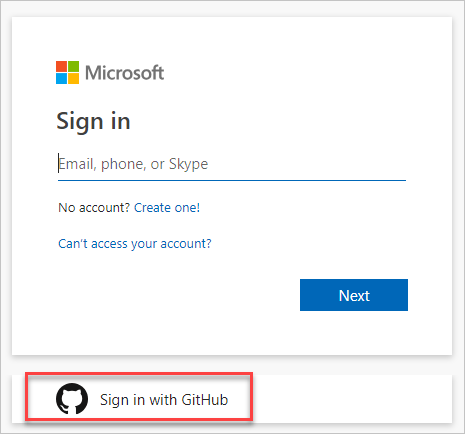
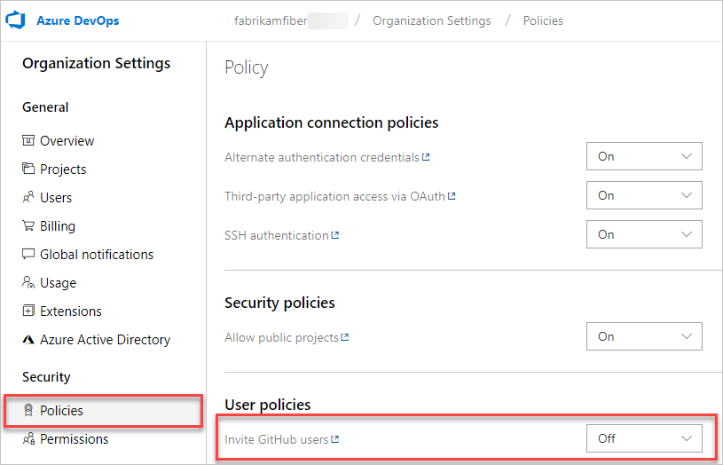
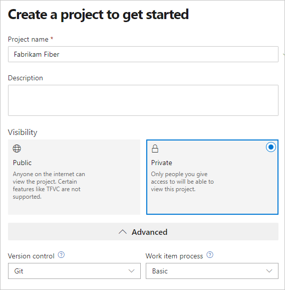
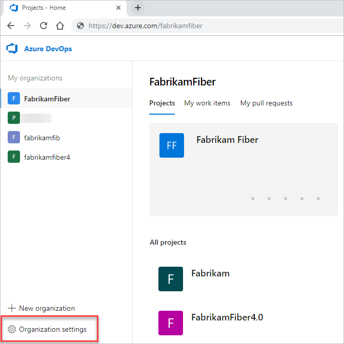
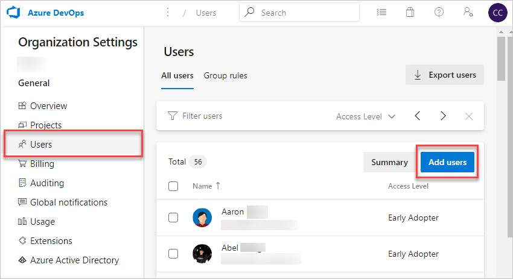

# クイックスタート：Azure DevOpsへのサインアップ、サインイン

このクイックスタートでは、Azure DevOpsに無料でサインアップする方法、MicrosoftアカウントまたはGitHubアカウントでサインインする方法、組織を作成する方法、プロジェクトを作成する方法、チームメイトを招待する方法を学びます。

Azure DevOpsにサインアップして、無料の無制限のプライベートGitリポジトリでコードをアップロードおよび共有します。

次に、Eclipse、Xcode、Visual Studio、IntelliJ、Android Studioなどのお気に入りの開発ツールに接続して、いつでもどこでもアプリを操作します。

## 個人のMicrosoftアカウントでサインアップする

1. [Azure DevOps](https://azure.microsoft.com/services/devops/)のサインアップリンクを選択します。
1. Microsoftアカウントのメールアドレス、電話番号、またはSkype IDを入力します。 Visual Studioサブスクライバーであり、Azure DevOpsを特典として取得している場合は、サブスクリプションに関連付けられているMicrosoftアカウントを使用してください。 **次へ** を選択します。
1. パスワードを入力し、**サインイン** を選択します。
1. Azure DevOpsを開始するには、**続行** を選択します。

組織は、サインインに使用したアカウントに基づいて作成されます。いつでも組織にサインインできます（`https://dev.azure.com/{yourorganization}`）。

組織の名前を変更して削除したり、組織の場所を変更したりできます。 詳細については、次の記事を参照してください。

- [組織の名前を変更する](https://docs.microsoft.com/en-us/azure/devops/organizations/accounts/rename-organization)
- [組織の場所を変更する](https://docs.microsoft.com/en-us/azure/devops/organizations/accounts/change-organization-location)

既存のMicrosoftアカウントでサインインした場合、次のステップは[プロジェクトの作成](https://docs.microsoft.com/en-us/azure/devops/user-guide/sign-up-invite-teammates#CreateProject)です。
新しく作成したMicrosoftアカウントでサインインした場合、プロジェクトは自動的に作成され、アカウント名に基づいて名前が付けられます。 プロジェクトの管理の詳細については、[プロジェクトの管理](https://docs.microsoft.com/en-us/azure/devops/organizations/projects/about-projects)を参照してください。

## GitHubアカウントでサインアップする

重要

GitHubのメールアドレスがAzure DevOpsのAzure ADが支援する組織に関連付けられている場合、GitHubアカウントではサインインできず、Azure ADアカウントでサインインする必要があります。

1. [Azure DevOps](https://azure.microsoft.com/services/devops/)のサインアップリンクを選択し、**GitHubで無料で開始する** をクリックします。 既にAzure DevOps組織に所属している場合は、**Azure DevOpsにサインイン** を選択します。
1. **GitHubでサインイン** を選択します。
    

    すでにセッション中のアカウントがある場合は、**別のアカウントを使用する** を選択します。 GitHubサインインに移動し、GitHubユーザー名またはメールアドレスを入力できます。
1. GitHubアカウントの資格情報を入力し、**サインイン** を選択します。
1. **Authorize Microsoft Corporation** を選択します。
1. Azure DevOpsを開始するには、**続行** を選択します。

組織は、サインインに使用したアカウントに基づいて作成されます。いつでも組織にサインインできます（`https://dev.azure.com/{yourorganization}`）。

組織の名前を変更して削除したり、組織の場所を変更したりできます。 詳細については、[組織の管理](https://docs.microsoft.com/en-us/azure/devops/organizations/accounts/organization-management)をご覧ください。

### <a id="invite-github-users">GitHubへの招待を有効にする</a>

GitHubユーザー名で新しいAzure DevOps組織を作成すると、デフォルトで **GitHubユーザーの招待** ユーザーポリシーがオンになります。 既存の組織の場合、管理者は **組織の設定** > **ポリシー** タブでこの機能を有効にできます。

設定を変更したら、Azure DevOpsからサインアウトし、新しいブラウザーセッションから、GitHub資格情報を使用して組織 `dev.azure.com/{organizationName}` または `organizationName.visualstudio.com` にサインインします。
これでGitHubユーザーとして認識され、GitHubへの招待エクスペリエンスを利用できます。

GitHub認証の詳細については、[よくある質問](https://docs.microsoft.com/ja-jp/azure/devops/organizations/security/faq-github-authentication?view=azure-devops)をご覧ください。

## プロジェクトの作成

新しく作成されたMicrosoftアカウント（MSA）でAzure DevOpsにサインアップした場合、プロジェクトは自動的に作成され、サインインに基づいて名前が付けられます。

既存のMSAまたはGitHub IDを使用してAzure DevOpsにサインアップした場合、プロジェクトを作成するように自動的に求められます。
パブリックプロジェクトまたはプライベートプロジェクトを作成できます。 パブリックプロジェクトの詳細については、[パブリックプロジェクトとは](https://docs.microsoft.com/en-us/azure/devops/organizations/public/about-public-projects)を参照してください。

1. プロジェクト名、説明、可視性の選択、初期ソース管理タイプ、作業項目プロセスなどの情報を提供されたフォームに入力します。

    

    [プロジェクトに適切なバージョン管理を選択する](https://docs.microsoft.com/en-us/azure/devops/repos/tfvc/comparison-git-tfvc)および[プロセスを選択する](https://docs.microsoft.com/en-us/azure/devops/boards/work-items/guidance/choose-process)のガイダンスを参照して下さい。
1. プロジェクトが完了すると、Welcome ページが表示されます。

## チームメンバーの招待

組織にメールアドレスまたはGitHubユーザー名を追加して、チームメンバーに組織へのアクセスを許可します。
GitHubユーザーの招待については、**組織の設定** > **ポリシー** タブで[GitHubユーザーを招待する](#invite-github-users)ポリシーが有効になっていることを確認してください。

1. 組織（`https://dev.azure.com/{yourorganization}`）にサインインします。
1. **組織の設定**()を選択します。
    
1. **ユーザー** > **新しいユーザーを追加** を選択します。
    
1. 次の情報を入力します。
    - **ユーザー**: ユーザーの電子メールアドレス（Microsoftアカウント）または[GitHubユーザー名](https://docs.microsoft.com/ja-jp/azure/devops/user-guide/sign-up-invite-teammates?view=azure-devops#enable-github-invitations)を入力します。セミコロン（`;`）で区切って複数のメールアドレスを追加できます。 承認されると、メールアドレスが赤で表示されます。
    - **アクセスレベル**: コードベースに貢献するユーザーのアクセスレベルは **基本** のままにします。 詳細については、[アクセスレベル](https://docs.microsoft.com/en-us/azure/devops/organizations/security/access-levels)についてをご覧ください。
    - **プロジェクトに追加**: 追加するプロジェクトを選択します。
    - **DevOps グループ**: プロジェクトに貢献するユーザーのデフォルトのセキュリティグループである **プロジェクト貢献者** のままにします。 詳細については、[デフォルトの権限とアクセスの割り当て](https://docs.microsoft.com/en-us/azure/devops/organizations/security/permissions-access)を参照してください。

    

    注意

    [Azure Active Directory（Azure AD）](https://docs.microsoft.com/ja-jp/azure/active-directory/fundamentals/active-directory-whatis)を使用してユーザーを認証し、組織のアクセスを制御する場合を除き、[個人のMicrosoftアカウント](https://account.microsoft.com/account)の電子メールアドレスとGitHubアカウントのIDを追加します。
    

1. 完了したら、**追加** を選択して招待を完了します。

ユーザーと組織アクセスの管理の詳細については、[Azure DevOpsの組織ユーザーの追加](https://docs.microsoft.com/ja-jp/azure/devops/organizations/accounts/add-organization-users?view=azure-devops)を参照してください。

## 次の手順

- [Gitリポジトリにコードを追加する](../02-quickstart-for-users/01-Code-with-Git)
- [作業を計画し追跡する](../02-quickstart-for-users/03-Plan-and-track-work)