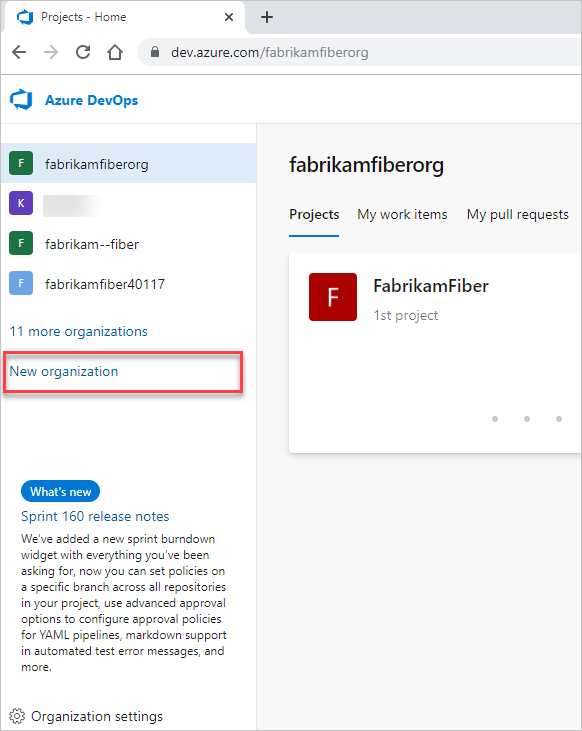

# クイックスタート：組織またはプロジェクトコレクションを作成する

このクイックスタートでは、組織の作成方法を学びます。 組織は、関連プロジェクトのグループを接続するために使用され、企業の規模拡大を支援します。 個人のMicrosoftアカウント、GitHubアカウント、または職場または学校のアカウントを使用できます。 職場または学校のアカウントを使用して、組織をAzure Active Directory（Azure AD）に自動的に接続します。

## 事前条件

1. [組織構造を計画する](https://docs.microsoft.com/ja-jp/azure/devops/user-guide/plan-your-azure-devops-org-structure?view=azure-devops)方法を読んで理解します。
1. 組織でMicrosoftアカウントのみを使用する場合は、次の手順を実行します。

    Azure ADがなければ、組織のアクセスを制御する責任はお客様にあります。 そして、すべてのユーザーはMicrosoftアカウントでサインインする必要があります。 [他の違いは何ですか？](https://docs.microsoft.com/ja-jp/azure/devops/organizations/accounts/faq-create-organization?view=azure-devops#SignInOrganizationDifferences)

    - Microsoftアカウントを持っていない場合は、Azure DevOpsにサインアップするときに作成できます。
    - Azure ADを使用して組織のユーザーを認証する必要がない場合は、Microsoftアカウントを使用します。 すべてのユーザーは、Microsoftアカウントで組織にサインインする必要があります。
1. ユーザーを認証し、Azure ADを介して組織のアクセスを制御する場合は、次の手順を実行します。
    - Azure ADで管理されている職場または学校のアカウントが必要です。 AzureまたはOffice 365を使用している場合は、既に持っている可能性があります。 そうでない場合は、[組織としてAzureにサインアップする方法](https://docs.microsoft.com/ja-jp/azure/active-directory/fundamentals/sign-up-organization)をご覧ください。
    - 既存のオンプレミスIDを使用するには、[Azure AD Connectを使用してオンプレミスディレクトリをAzure ADと統合する](https://docs.microsoft.com/ja-jp/azure/active-directory/hybrid/whatis-hybrid-identity)をご覧ください。
    - 組織にアクセスするには、すべてのユーザーがそのディレクトリのメンバーである必要があります。 他の組織のユーザーを追加するには、[Azure AD B2Bコラボレーション機能](https://docs.microsoft.com/ja-jp/azure/active-directory/active-directory-b2b-what-is-azure-ad-b2b)を使用します。

## 組織の作成

1. [Azure DevOps](https://go.microsoft.com/fwlink/?LinkId=307137) にサインインします。
1. **新しい組織** を選択します。
    
1. 情報を確認し、**続行** を選択します。

    おめでとうございます、あなたは組織のオーナーになりました！

    `https://dev.azure.com/{yourorganization}` からいつでも組織にサインインしてください。

## 次の手順

- [プロジェクトの作成](https://docs.microsoft.com/ja-jp/azure/devops/organizations/projects/create-project?view=azure-devops)

