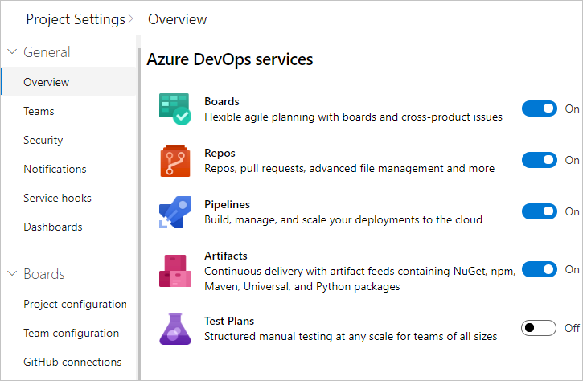
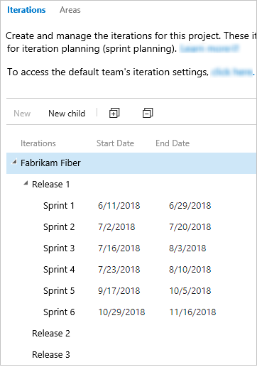
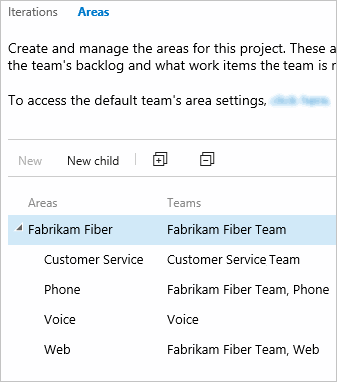
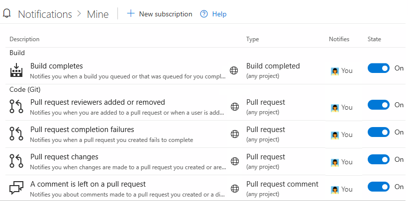
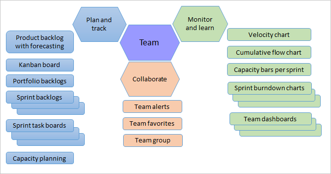

# プロジェクトの管理

ほとんどのAzure DevOpsサービスを使用して、サービスの使用を開始し、必要に応じてリソースを構成できます。 事前の作業は必要ありません。 ほとんどの設定はデフォルトを定義します。

とはいえ、組織の所有者またはプロジェクト管理者として、スムーズな運用エクスペリエンスを確保するためにプロジェクトを作成したら、いくつかのタスクを実行できます。
大規模な組織を所有している場合、複数のチームまたはソフトウェア開発アプリをサポートするプロジェクトを構築するための追加タスクを検討する必要があります。

## ユーザーをプロジェクトに追加する

最初のタスクは、組織またはグループのすべてのメンバーが組織およびプロジェクトに確実に追加されるようにすることです。
小さなグループの場合、[Microsoftアカウント](https://account.microsoft.com/account)を使用してユーザーを組織およびプロジェクトに追加するとうまくいきます。

大企業では、Azure Active Directoryを使用してアクセス許可とユーザーアクセスを管理することを検討してください。 詳細については、次の記事を参照してください。

- [Azure DevOps Servicesの組織ユーザーを追加する](https://docs.microsoft.com/ja-jp/azure/devops/organizations/accounts/add-organization-users?view=azure-devops)
- [Azure Active Directoryを介してユーザーアクセスを管理する](https://docs.microsoft.com/ja-jp/azure/devops/organizations/accounts/access-with-azure-ad?view=azure-devops)

[プロジェクトコレクション管理者](https://docs.microsoft.com/ja-jp/azure/devops/organizations/security/set-project-collection-level-permissions?view=azure-devops)グループへの利害関係者以上のアクセス権を持つユーザーを追加することにより、ユーザーを組織に追加するタスクを委任できます。

## アクセス許可を付与または制限する

機能へのアクセスは、アクセスレベルの割り当て、アクセス許可、およびセキュリティグループによって制御されます。 プロジェクトに設定されたデフォルトをすばやく理解するには、[デフォルトのアクセス許可とアクセス](https://docs.microsoft.com/ja-jp/azure/devops/organizations/security/permissions-access?view=azure-devops)を参照してください。

特定のタスクを他のタスクに委任することに決めた場合は、それらを組み込みまたはカスタムセキュリティグループに追加するか、特定のロールに追加します。 詳細については、次の記事をご覧ください。

- [選択した機能およびフィーチャへのアクセスを許可または制限する](https://docs.microsoft.com/ja-jp/azure/devops/organizations/security/restrict-access?view=azure-devops)
- [プロジェクトレベルまたはプロジェクトコレクションレベルで権限を設定する](https://docs.microsoft.com/ja-jp/azure/devops/organizations/security/set-project-collection-level-permissions?view=azure-devops)

アクセス許可とセキュリティの詳細については、次の記事を参照してください。

- [セキュリティとアイデンティティについて](https://docs.microsoft.com/ja-jp/azure/devops/organizations/security/about-security-identity?view=azure-devops)
- [権限とグループについて](https://docs.microsoft.com/ja-jp/azure/devops/organizations/security/about-permissions?view=azure-devops)
- [セキュリティロールについて](https://docs.microsoft.com/ja-jp/azure/devops/organizations/security/about-security-roles?view=azure-devops)
- [アクセスレベルについて](https://docs.microsoft.com/ja-jp/azure/devops/organizations/security/access-levels?view=azure-devops)

## プロジェクトのビジョンを共有し、コラボレーションをサポート

各プロジェクトには概要ページがあり、READMEファイルまたはプロジェクトWikiをポイントすることで情報を共有できます。
プロジェクトを初めて使用し、確立されたプロセスと手順を共有するユーザーを対象にするには、[プロジェクトの概要ページをセットアップする](https://docs.microsoft.com/ja-jp/azure/devops/organizations/projects/project-vision-status?view=azure-devops)か、[Wikiをプロビジョニング](https://docs.microsoft.com/ja-jp/azure/devops/project/wiki/wiki-create-repo?view=azure-devops)することをお勧めします。

## ユーザーインターフェイスから未使用のサービスを削除する

Webポータルのユーザーインターフェイスを簡素化するために、選択したサービスを無効にすることができます。 たとえば、バグを記録するためだけにプロジェクトを使用する場合、ボードを除くすべてのサービスを削除できます。

この例は、**テスト計画** が無効になっていることを示しています。

## コード、テスト、およびその他のポリシーを設定する

チーム間のコラボレーションをサポートし、プロジェクトを保護し、不要になったファイルを自動的に削除するために設定できるポリシーがいくつかあります。 ポリシーを設定するには、次の記事を確認してください。

- [組織のアプリケーションアクセスポリシーを変更する](https://docs.microsoft.com/ja-jp/azure/devops/organizations/accounts/change-application-access-policies?view=azure-devops)
- [ブランチポリシーを管理する](https://docs.microsoft.com/ja-jp/azure/devops/repos/git/branch-policies?view=azure-devops)
- [Team Foundationバージョン管理（TFVC）チェックインポリシーを追加する](https://docs.microsoft.com/ja-jp/azure/devops/repos/tfvc/add-check-policies?view=azure-devops)
- [パイプライン保持ポリシーのビルドとリリースを設定する](https://docs.microsoft.com/ja-jp/azure/devops/pipelines/policies/retention?view=azure-devops)
- [テスト保持ポリシーを設定する](https://docs.microsoft.com/ja-jp/azure/devops/test/how-long-to-keep-test-results?view=azure-devops)

## 作業追跡用の領域とイテレーションパスを定義する

複数の製品またはフィーチャ領域をサポートする場合、[領域パス](https://docs.microsoft.com/ja-jp/azure/devops/organizations/settings/set-area-paths?view=azure-devops)を設定することにより、フィーチャ領域ごとに作業項目を割り当てることができます。
作業項目をスプリントとも呼ばれる特定の時間間隔に割り当てるには、[イテレーションパス](https://docs.microsoft.com/ja-jp/azure/devops/organizations/settings/set-iteration-paths-sprints?view=azure-devops)を構成する必要があります。
スクラムツール（スプリントバックログ、タスクボード、チームキャパシティ）を使用するには、いくつかのスプリントを構成する必要があります。 概要については、[領域とイテレーションパス](https://docs.microsoft.com/ja-jp/azure/devops/organizations/settings/about-areas-iterations?view=azure-devops)についてを参照してください。

### イテレーション

### 領域

## 作業追跡プロセスをカスタマイズする

あなたとあなたのチームは、プロジェクトを作成した直後にすべての作業追跡ツールの使用を開始できます。
しかし、多くの場合、1人以上のユーザーが1つ以上のビジネスニーズに合わせてエクスペリエンスをカスタマイズしたいと考えています。
ユーザーインターフェイスを使用してプロセスを簡単にカスタマイズできますが、更新を管理し、リクエストを評価する方法を確立できます。

注意  
デフォルトでは、ステークホルダー以上のアクセス権が付与されたユーザーには、作業追跡エクスペリエンスのカスタマイズに使用されるプロセスを作成、編集、および管理する権限が付与されます。
これらのタスクを実行できるユーザーをロックダウンする場合は、組織レベルでアクセス許可を **拒否** に設定します。

詳細については、次の記事を参照してください。

- [プロセスのカスタマイズと継承されたプロセスについて](https://docs.microsoft.com/ja-jp/azure/devops/organizations/settings/work/inheritance-process-model?view=azure-devops)
- [プロジェクトをカスタマイズする](https://docs.microsoft.com/ja-jp/azure/devops/organizations/settings/work/customize-process?view=azure-devops)
- [プロセスを追加および管理する](https://docs.microsoft.com/ja-jp/azure/devops/organizations/settings/work/manage-process?view=azure-devops)

## 通知の確認と更新

追加するプロジェクトごとに多数の通知が事前定義されています。 通知はサブスクリプションルールに基づいています。 サブスクリプションは、次の領域から発生します。

- [すぐに使用可能なサブスクリプションまたはデフォルトのサブスクリプション](https://docs.microsoft.com/ja-jp/azure/devops/notifications/oob-built-in-notifications?view=azure-devops)
- チーム管理者が管理する[チーム通知](https://docs.microsoft.com/ja-jp/azure/devops/notifications/howto-manage-team-notifications?view=azure-devops)
- プロジェクト管理者グループのメンバーが管理するプロジェクト通知。
- プロジェクトコレクション管理者グループのメンバーによって管理される[組織およびコレクションレベルの通知](https://docs.microsoft.com/ja-jp/azure/devops/notifications/howto-manage-organization-notifications?view=azure-devops)

通知が多すぎるとユーザーが思った場合、[サブスクリプションをオプトアウト](https://docs.microsoft.com/ja-jp/azure/devops/notifications/howto-manage-personal-notifications?view=azure-devops)できます。

## チームを追加して組織を拡大する

組織の成長に合わせてチームを追加することをお勧めします。 各チームは、カスタマイズ可能な[独自のアジャイルツールセットにアクセス](https://docs.microsoft.com/ja-jp/azure/devops/organizations/settings/about-teams-and-settings?view=azure-devops)できます。

詳細については、次の記事を参照してください。

- [プロジェクトと組織のスケーリングについて](https://docs.microsoft.com/ja-jp/azure/devops/organizations/projects/about-projects?view=azure-devops)
- [チームを追加し、1つのデフォルトチームから複数のチームに移動します](https://docs.microsoft.com/ja-jp/azure/devops/organizations/settings/add-teams?view=azure-devops)
- [チーム管理者を追加する](https://docs.microsoft.com/ja-jp/azure/devops/organizations/settings/add-team-administrator?view=azure-devops)

## 拡張機能のインストールと管理

拡張機能は、プロジェクトに新しい機能を追加するインストール可能なユニットです。 次の機能をサポートするAzure DevOpsで拡張機能を見つけることができます。

- 作業項目、スプリント、スクラムなどの計画と追跡
- フローをビルドおよびリリースします。
- コードのテストと追跡。
- チームメンバー間のコラボレーション。

たとえば、[コード検索](https://docs.microsoft.com/ja-jp/azure/devops/project/search/code-search?view=azure-devops)をサポートするには、[コード検索拡張機能](https://marketplace.visualstudio.com/items?itemName=ms.vss-code-search)をインストールします。

ユーザーに拡張機能について説明し、[拡張機能をリクエスト](https://docs.microsoft.com/ja-jp/azure/devops/marketplace/request-extensions?view=azure-devops)できることを伝えます。
拡張機能をインストールして管理するには、組織の所有者、プロジェクトコレクション管理者グループのメンバーであるか、[拡張機能のマネージャーロール](https://docs.microsoft.com/ja-jp/azure/devops/marketplace/how-to/grant-permissions?view=azure-devops)に追加されている必要があります。

## 課金の設定

すべての組織は、基本アクセスを持つ最大5人のユーザーと、利害関係者アクセスを持つ無制限のユーザーを追加できます。
さらにユーザーを追加したり、追加のサービスや拡張機能の料金を支払う必要がある場合は、[課金を設定](https://docs.microsoft.com/ja-jp/azure/devops/organizations/billing/set-up-billing-for-your-organization-vs?view=azure-devops)します。

## 次の手順

- [プロジェクトの管理](https://docs.microsoft.com/ja-jp/azure/devops/organizations/projects/index?view=azure-devops)