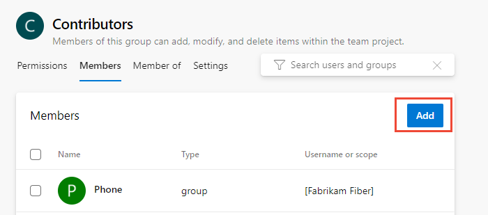
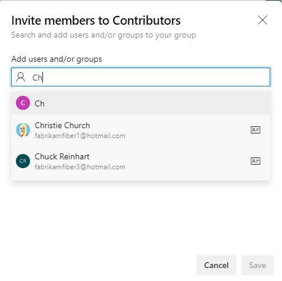

# ユーザーをプロジェクトまたはチームに追加する

このクイックスタートでは、ユーザーをプロジェクトまたは特定のチームに追加する方法を学びます。 誰でもプロジェクトにアクセスするには、デフォルトのセキュリティグループまたはカスタムグループのいずれかに追加する必要があります。 通常は、それらを貢献者グループに追加します。
デフォルトグループに割り当てられている権限の概要については、[権限とアクセス](https://docs.microsoft.com/ja-jp/azure/devops/organizations/security/permissions-access?view=azure-devops)をご覧ください。

複数のユーザーをプロジェクトに追加する最も簡単な方法は、Azure [Active Directory（Azure AD）またはActive Directory（AD）](https://docs.microsoft.com/ja-jp/azure/devops/organizations/security/setup-ad-aad?view=azure-devops)で定義されたグループを追加することです。

重要

Azure DevOpsで組織にユーザーを追加し、Azure ADを使用しない場合は、[アカウントまたはプロジェクトに「個人」Microsoftアカウントを追加](https://docs.microsoft.com/ja-jp/azure/devops/user-guide/sign-up-invite-teammates?view=azure-devops#invite-others)する必要があります。
それらを1つのプロジェクトに追加したら、この記事で説明する手順を使用して、追加のプロジェクトに追加できます。

ユーザーがプロジェクトに追加されると、表示名またはユーザー名（メールエイリアス）を参照できます。 また、[特定のチームに追加](https://docs.microsoft.com/ja-jp/azure/devops/organizations/security/add-users-team-project?toc=%2Fazure%2Fdevops%2Fget-started%2Ftoc.json&bc=%2Fazure%2Fdevops%2Fget-started%2Fbreadcrumb%2Ftoc.json&view=azure-devops&tabs=preview-page#add-team-members)することもできます。 チームを追加するには、[チームを追加する](https://docs.microsoft.com/ja-jp/azure/devops/organizations/settings/add-teams?view=azure-devops)を参照してください。

## 事前条件

- プロジェクトが必要です。 プロジェクトがまだない場合は、[作成](https://docs.microsoft.com/ja-jp/azure/devops/organizations/projects/create-project?view=azure-devops)します。
- ユーザーをプロジェクトに追加するには、[プロジェクト管理者グループのメンバーであるか、**プロジェクトレベル情報の編集**を許可に設定](https://docs.microsoft.com/ja-jp/azure/devops/organizations/security/set-project-collection-level-permissions?view=azure-devops)する必要があります。
- ユーザーをチームに追加するには、[チーム管理者として追加](https://docs.microsoft.com/ja-jp/azure/devops/organizations/settings/add-team-administrator?view=azure-devops)するか、プロジェクト管理者グループのメンバーであるか、**プロジェクトレベル情報の編集を許可に設定**する必要があります。

## プロジェクトにユーザーを追加する

Azure DevOpsに初めてユーザーを追加する場合は、[Azure DevOpsのアカウントユーザーを追加する](https://docs.microsoft.com/ja-jp/azure/devops/organizations/accounts/add-organization-users?toc=%2fazure%2fdevops%2forganizations%2fsecurity%2ftoc.json&%3bbc=%2fazure%2fdevops%2forganizations%2fsecurity%2fbreadcrumb%2ftoc.json&view=azure-devops)を参照してください。

注意

プロジェクトの権限設定ページの新しいユーザーインターフェイスを有効にするには、[プレビュー機能を有効にする](https://docs.microsoft.com/ja-jp/azure/devops/project/navigation/preview-features?view=azure-devops)をご覧ください。

### プレビューページの場合

1. Webポータルを開き、ユーザーまたはグループを追加するプロジェクトを選択します。 別のプロジェクトを選択するには、[プロジェクト、リポジトリ、チームの切り替え](https://docs.microsoft.com/ja-jp/azure/devops/project/navigation/go-to-project-repo?view=azure-devops)を参照してください。
1. **プロジェクトの設定**、**権限**の順に選択します。

    
1. **グループ** で、次のオプションのいずれかを選択します。
    - **Readers**: プロジェクトへの読み取り専用アクセスを必要とするユーザーを追加するには、を選択します。
    - **貢献者**: このプロジェクトに完全に貢献したユーザー、または利害関係者のアクセスを許可されたユーザーを追加します。
    - **プロジェクト管理者**: プロジェクトを管理する必要があるユーザーを追加します。 詳細については、[プロジェクトレベルまたはプロジェクトコレクションレベルで権限を設定する](https://docs.microsoft.com/ja-jp/azure/devops/organizations/security/set-project-collection-level-permissions?view=azure-devops)をご覧ください。

    ここでは、**貢献者** グループを選択します。

    
1. 次に、**メンバー** タブを選択します。

    デフォルトでは、デフォルトのチームグループおよびプロジェクトに追加する他のチームは、**貢献者** グループのメンバーとして含まれます。
    代わりに、新しいユーザーをチームのメンバーとして追加すると、ユーザーは自動的に**貢献者** 権限を継承します。

    

    ヒント

    ユーザーの管理は、個々のユーザーではなく[グループを使用](https://docs.microsoft.com/ja-jp/azure/devops/organizations/security/about-permissions?view=azure-devops)する方がはるかに簡単です。
    

1. **追加** を選択して、ユーザーまたはユーザーグループを追加します。

    
1. ユーザーアカウントの名前をテキストボックスに入力します。 テキストボックスに複数のIDをコンマで区切って入力できます。 システムは一致を自動的に検索します。要件を満たす一致を選択します。

    

    

    注意

    ユーザーまたはグループを初めてAzure DevOpsに追加するとき、それらを参照したり、フレンドリ名を確認したりすることはできません。 IDが追加されたら、フレンドリ名を入力するだけです。
    

    完了したら、**保存** を選択します。
1. プロジェクトの他の機能のユーザー権限をカスタマイズできます。 たとえば、[エリアとイテレーション](https://docs.microsoft.com/ja-jp/azure/devops/organizations/security/set-permissions-access-work-tracking?view=azure-devops)または[共有クエリ](https://docs.microsoft.com/ja-jp/azure/devops/boards/queries/set-query-permissions?view=azure-devops)です。

    

    注意

    ステークホルダーなど、アクセスが制限されているユーザーは、選択した機能へのアクセス許可が付与されていても、それらの機能にアクセスできません。 詳細については、[権限とアクセス](https://docs.microsoft.com/ja-jp/azure/devops/organizations/security/permissions-access?view=azure-devops)をご覧ください。
    

## チームにユーザーを追加する

キャパシティ計画、チームアラート、ダッシュボードウィジェットなどのいくつかのアジャイルツールはチームスコープです。
つまり、チームのメンバーとして追加されたユーザーアカウントを自動的に参照して、アクティビティの計画やアラートの送信をサポートします。
詳細については、[チームとアジャイルツール](https://docs.microsoft.com/ja-jp/azure/devops/organizations/settings/about-teams-and-settings?view=azure-devops)についてを参照してください。

注意

プロジェクトの権限設定ページの新しいユーザーインターフェイスを有効にするには、[プレビュー機能を有効にする](https://docs.microsoft.com/ja-jp/azure/devops/project/navigation/preview-features?view=azure-devops)をご覧ください。

### プレビュー機能の場合

1. チームのバックログまたはボードを開き、チームプロフィール()を選択します。 次に、**チーム設定** を選択します。

    ここでは、Webチームのボードを開き、そこからチームプロファイルを開きます。

    
1. チームコンテキストを切り替える必要がある場合は、パンくずリスト内のチームセレクターを使用します。

    
1. **追加** を選択します。

    
1. 追加する各アカウントのサインインアドレスまたは表示名を入力します。それらを一度に1つずつ追加するか、すべて同時に追加します。 テキストボックスに複数のIDをコンマで区切って入力できます。

    

    

    ヒント

    ユーザー名とグループ名を1つずつ入力する必要があります。 ただし、名前を入力すると、アカウントがリストに追加され、変更を保存する前に[ID]テキストボックスに別の名前を入力できます。
    

    更新を表示するには、更新()を選択する必要がある場合があります。
1. メンバーを削除するには、このページに戻り、ユーザー名を強調表示して**削除** を選択します。

    
1. アカウントをチーム管理者として追加するには、**チームプロフィール** ページにある **追加** を選択します。 詳細については、[チーム管理者](https://docs.microsoft.com/ja-jp/azure/devops/organizations/settings/add-team-administrator?view=azure-devops)を追加するをご覧ください。

## 次の手順

- [管理者を追加するか、プロジェクトまたはコレクションレベルで権限を設定します](https://docs.microsoft.com/ja-jp/azure/devops/organizations/security/set-project-collection-level-permissions?view=azure-devops)

