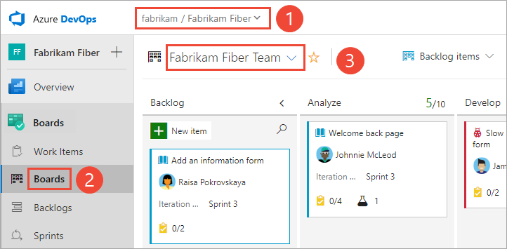

# チームツールを管理および構成する

この記事では、Azure DevOpsでチームツールを構成し、チームを管理する方法を学びます。

ほとんどのアクセス許可は、セキュリティグループによって管理されるか、オブジェクトレベルで定義されます。
チーム設定は、チーム管理者の役割によって管理されます。
チーム管理者として割り当てられたユーザーは、すべてのチームツールを構成および管理できます。 具体的には、プロジェクトにチームを追加する場合、プロジェクト管理者は[1人以上のチーム管理者を追加する](https://docs.microsoft.com/ja-jp/azure/devops/organizations/settings/add-team-administrator?view=azure-devops)必要があります。

次に、これらのチーム管理者は、次の特定のタスクの実行を検討する必要があります。

- チームメンバーを追加する
- 領域とイテレーションパスを構成する
- バックログおよびその他の一般的なチーム設定を構成する
- カンバンボードを構成する

考慮すべきオプションのタスクは次のとおりです。

- チームダッシュボードの構成と管理
- チーム通知を構成する

注意

チーム管理者に加えて、プロジェクト管理者グループとプロジェクトコレクション管理者グループのすべてのメンバーは、すべてのチームの設定を管理できます。 チームを追加するには、[チームを追加する](https://docs.microsoft.com/ja-jp/azure/devops/organizations/settings/add-teams?view=azure-devops)をご覧ください。

## チームプロファイルを開き、チームツールにアクセスする

- チーム用に定義されたアイテムにすばやくアクセスするには、チームプロファイルを開きます。チームプロファイルは、**概要** > **ダッシュボード**、**ボード** > **ボード**、**ボード** > **バックログ**、および **ボード** > **スプリント** ページから利用できます。

    

    パネルが開き、チームに定義されているすべてのアイテムが表示されます。

    
- メニューから選択することで、リストをフィルタリングして、**ダッシュボード**、**ボード**、**バックログ**、または**スプリント**のみを表示できます。

    
- チーム管理者とチームのメンバーを表示するには、メンバーを選択します。

    
- チーム構成を表示または変更するには、**チーム設定** を選択します。

    その後、次のタスクを完了できます。

    - [チームメンバー](https://docs.microsoft.com/ja-jp/azure/devops/organizations/security/add-users-team-project?view=azure-devops#add-team-members)を追加する
    - [チーム管理者](https://docs.microsoft.com/ja-jp/azure/devops/organizations/settings/add-team-administrator?view=azure-devops)を追加する
    - [チーム通知](https://docs.microsoft.com/ja-jp/azure/devops/notifications/howto-manage-team-notifications?view=azure-devops)に移動します
    - チームの[イテレーション](https://docs.microsoft.com/ja-jp/azure/devops/organizations/settings/set-iteration-paths-sprints?view=azure-devops#open-team-settings)と[エリアパス](https://docs.microsoft.com/ja-jp/azure/devops/organizations/settings/set-area-paths?view=azure-devops#open-team-settings)に移動します。
    - [チームの説明またはプロフィール写真](https://docs.microsoft.com/ja-jp/azure/devops/organizations/settings/manage-teams?toc=%2Fazure%2Fdevops%2Fget-started%2Ftoc.json&bc=%2Fazure%2Fdevops%2Fget-started%2Fbreadcrumb%2Ftoc.json&view=azure-devops#team-description)を更新します。

## ユーザーをチームに追加する

キャパシティ計画、チームアラート、ダッシュボードウィジェットなどのいくつかのツールはチームスコープです。
これらのツールは、チームのメンバーであるユーザーを自動的に参照して、アクティビティの計画やアラートの送信をサポートします。

ユーザーをチームに追加するには、[プロジェクトまたは特定のチームにユーザーを追加する](https://docs.microsoft.com/ja-jp/azure/devops/organizations/security/add-users-team-project?view=azure-devops)をご覧ください。

チームのすべてのメンバーは、チームアーティファクトをお気に入りに追加し、ワークアイテムテンプレートを定義できます。 詳細については、以下を参照してください。

- [個人またはチームのお気に入りを設定する](https://docs.microsoft.com/ja-jp/azure/devops/project/navigation/set-favorites?view=azure-devops)
- [テンプレートを使用して、作業項目を追加および更新します](https://docs.microsoft.com/ja-jp/azure/devops/boards/backlogs/work-item-template?view=azure-devops)

チームメンバーが必要なすべての機能にアクセスできない場合は、[それらの機能に必要な権限](https://docs.microsoft.com/ja-jp/azure/devops/organizations/security/set-permissions-access-work-tracking?view=azure-devops)があることを確認してください。

## チームエリアとイテレーションを構成する

多くのアジャイルツールは、チーム用に構成された領域とイテレーションパスに依存しています。 チームエリアとイテレーションの構成の詳細については、[チームとアジャイルツールについて](https://docs.microsoft.com/ja-jp/azure/devops/organizations/settings/about-teams-and-settings?view=azure-devops)を参照してください。

プロジェクト管理者がプロジェクトの[エリアパス](https://docs.microsoft.com/ja-jp/azure/devops/organizations/settings/set-area-paths?view=azure-devops)と[イテレーションパス](https://docs.microsoft.com/ja-jp/azure/devops/organizations/settings/set-iteration-paths-sprints?view=azure-devops)を追加すると、チーム管理者はチームに関連付けられたエリアパスとイテレーションパスを選択できます。
これらの設定は、チームが利用できる多くのアジャイルツールに影響します。

これらには、各チームに対して次の関連付けを行うことが含まれます。

- **チームエリアのパスを選択する** チームに関連付けられているデフォルトのエリアパスを選択できます。 これらの設定は、チームが利用できる多くのアジャイルツールに影響します。
- **チームのイテレーションパスまたはスプリントを選択する** チームに関連付けられているデフォルトのエリアパスを選択できます。 これらの設定は、チームが利用できる多くのアジャイルツールに影響します。

詳細については、[エリアパスの定義とチームへの割り当て](https://docs.microsoft.com/ja-jp/azure/devops/organizations/settings/set-area-paths?view=azure-devops)および[イテレーションパスの定義とチームイテレーションの構成](https://docs.microsoft.com/ja-jp/azure/devops/organizations/settings/set-iteration-paths-sprints?view=azure-devops)を参照してください。

## チームバックログおよびその他の一般的な設定を構成する

チーム管理者は、チームに対してアクティブなバックログレベルを選択できます。
たとえば、フィーチャチームは製品のバックログのみを表示することを選択し、管理チームはフィーチャとエピックバックログのみを表示することを選択できます。
また、管理者は、バグをユーザーストーリーや要件と同様に扱うか、タスクとして扱うかを選択できます。

チーム管理者は、チームの休業日を選択することもできます。 スプリント計画および追跡ツールは、キャパシティとスプリントのバーンダウンを計算するときに、休日を自動的に考慮します。

共通の構成ダイアログからほとんどのチーム設定を構成できます。

注意

バックログ、ボード、タスクボード、およびデリバリ計画の違いを理解するには、[バックログ、ボード、および計画](https://docs.microsoft.com/en-us/azure/devops/boards/backlogs/backlogs-boards-plans)を参照してください。
バックログまたはボードに期待または希望する作業項目が表示されない場合は、[バックログおよびボードのセットアップ](https://docs.microsoft.com/en-us/azure/devops/boards/backlogs/set-up-your-backlog)を参照してください。

1. （1）適切なプロジェクトを選択したことを確認し、（2）ボード>ボードを選択してから、（3）チームセレクタメニューから正しいチームを選択します。

    
1. チームセレクターを使用して、構成するチームバックログまたはボードを選択してください。詳細については、[パンくずリストとセレクターを使用してアーティファクトをナビゲートして開く](https://docs.microsoft.com/ja-jp/azure/devops/project/navigation/use-breadcrumbs-selectors?view=azure-devops)を参照してください。
1. ボード選択メニューから製品またはポートフォリオのバックログを選択します。

    
1. 歯車のアイコン()を選択してボードを構成し、一般的なチーム設定を設定します。

    
1. **カード**、**ボード**、**チャート**、および**一般**のいずれかのセクションの下にあるタブを選択して、カードまたはボード、累積フローチャート、またはその他のチーム設定を構成します。

    

各構成オプションの詳細については、次の記事のいずれかを参照してください。

| エリア | 設定作業 |
| :------ | :------ |
| カード | <ul><li>[フィールドの追加](https://docs.microsoft.com/ja-jp/azure/devops/boards/boards/customize-cards?view=azure-devops)</li><li>[スタイルの定義](https://docs.microsoft.com/ja-jp/azure/devops/boards/boards/customize-cards?view=azure-devops#style-rule)</li><li>[タグカラーの追加](https://docs.microsoft.com/ja-jp/azure/devops/boards/boards/customize-cards?view=azure-devops#color-tags)</li><li>[アノテーションの有効化](https://docs.microsoft.com/ja-jp/azure/devops/boards/boards/customize-cards?view=azure-devops#annotations)</li><li>[インラインテストの設定](https://docs.microsoft.com/ja-jp/azure/devops/boards/boards/customize-cards?view=azure-devops#tests)</li></ul> |
| ボード | <ul><li>[カラムの追加](https://docs.microsoft.com/ja-jp/azure/devops/boards/boards/add-columns?view=azure-devops)</li><li>[スウィムラインの追加](https://docs.microsoft.com/ja-jp/azure/devops/boards/boards/expedite-work?view=azure-devops)</li><li>[カードの並び替え](https://docs.microsoft.com/ja-jp/azure/devops/boards/boards/reorder-cards?view=azure-devops)</li><li>[ステータスバッジの設定](https://docs.microsoft.com/ja-jp/azure/devops/boards/github/configure-status-badges?view=azure-devops)</li></ul> |
| チャート | <ul><li>[累積フローチャートを構成する](https://docs.microsoft.com/ja-jp/azure/devops/report/dashboards/cumulative-flow?view=azure-devops#configure)</li></ul> |
| 一般 | <ul><li>[バックログ](https://docs.microsoft.com/ja-jp/azure/devops/organizations/settings/select-backlog-navigation-levels?view=azure-devops)</li><li>[稼働日](https://docs.microsoft.com/ja-jp/azure/devops/organizations/settings/set-working-days?view=azure-devops)</li><li>[バグに伴う作業](https://docs.microsoft.com/ja-jp/azure/devops/organizations/settings/show-bugs-on-backlog?view=azure-devops)</li></ul> |

## カンバンボードの設定

チーム管理者は、製品およびポートフォリオのバックログに関連するチームのカンバンボードを完全にカスタマイズできます。
カンバンボードを設定するには、最初に共通設定ダイアログから列とWIP制限を定義します。
ガイダンスについては、[カンバンの基本](https://docs.microsoft.com/ja-jp/azure/devops/boards/boards/kanban-basics?view=azure-devops)を参照してください。

- [カラム](https://docs.microsoft.com/ja-jp/azure/devops/boards/boards/add-columns?view=azure-devops)
- [WIP 制限](https://docs.microsoft.com/ja-jp/azure/devops/boards/boards/wip-limits?view=azure-devops)
- [完了の定義](https://docs.microsoft.com/ja-jp/azure/devops/boards/boards/definition-of-done?view=azure-devops)

構成可能な追加要素には次のものがあります。

- [カラムの分割](https://docs.microsoft.com/ja-jp/azure/devops/boards/boards/split-columns?view=azure-devops)
- [スウィムレーン](https://docs.microsoft.com/ja-jp/azure/devops/boards/boards/expedite-work?view=azure-devops)
- [カードのフィールド、スタイル、タグの色、注釈、およびカードの並べ替え](https://docs.microsoft.com/ja-jp/azure/devops/boards/boards/customize-cards?view=azure-devops#kanban-board)

## スプリントタスクボードを構成する

カンバンボードと同様に、各スプリントタスクボードをカスタマイズして、情報が豊富な色分けされたカードやカスタマイズされた列の追加をサポートできます。
詳細については、[スプリントタスクボードのカスタマイズ](https://docs.microsoft.com/ja-jp/azure/devops/boards/sprints/customize-taskboard?view=azure-devops)を参照してください。

## チームダッシュボードを追加および管理する

デフォルトでは、すべてのチームメンバーがチームダッシュボードを追加および編集できます。 さらに、チーム管理者はチームダッシュボードの権限を管理できます。
詳細については、[ダッシュボードの追加と管理](https://docs.microsoft.com/ja-jp/azure/devops/report/dashboards/dashboard-permissions?view=azure-devops#set-permissions)を参照してください。

## チームの説明と写真を更新する

チーム設定には、チーム名、説明、およびチームプロフィール画像も含まれます。 チームの写真を追加するには、**設定** タブを開き、**画像のアップロード**を選択します。 最大ファイルサイズは2.5 MBです。

## チーム通知を管理する

チーム管理者は、作業項目、コードレビュー、ソース管理ファイル、およびビルドに変更が生じたときにチームが電子メール通知を受信できるように、アラートを追加および変更できます。
チームごとにいくつかのアラートが定義されています。 詳細については、[チームアラートの管理](https://docs.microsoft.com/ja-jp/azure/devops/notifications/howto-manage-team-notifications?view=azure-devops)を参照してください。

## 関連する記事

- [プロジェクトと組織のスケーリングについて](https://docs.microsoft.com/ja-jp/azure/devops/organizations/projects/about-projects?view=azure-devops)
- [チームおよびアジャイルツールについて](https://docs.microsoft.com/ja-jp/azure/devops/organizations/settings/about-teams-and-settings?view=azure-devops)
- [チームを追加する](https://docs.microsoft.com/ja-jp/azure/devops/organizations/settings/add-teams?view=azure-devops)
- [チーム管理者を追加する](https://docs.microsoft.com/ja-jp/azure/devops/organizations/settings/add-team-administrator?view=azure-devops)