# チュートリアル：個人またはチームのお気に入りの設定

頻繁にアクセスするビューをお気に入りに 登録します。プロジェクト、リポジトリ、ビルドパイプライン、ダッシュボード、バックログ、ボード、クエリなど、あらゆる種類のAzure DevOpsの機能とツールをお気に入りに登録できます。自分またはチームのお気に入りを設定できます。

コードベース、作業追跡作業、開発者の操作、および組織が成長するにつれて、自分と自分のチームが関心を持つビューにすばやく移動したくなるでしょう。お気に入りを設定することで、このようなことが可能になります。

チームのお気に入りは、チームのメンバーが関心のある共有リソースにすばやくアクセスするための簡単な方法です。スターアイコンを選択して、自分のアイテムをお気に入りに追加します。お気に入りに追加したアイテムは、1つ以上のディレクトリリストから簡単に表示できます。定義、ビューまたはアーティファクトのコンテキストメニューを使用して、チームのお気に入りを設定します。

このチュートリアルでは、個人用のお気に入りを表示する方法と、次のビューをお気に入りまたはお気に入り解除する方法を学習します。

- プロジェクトチーム
- ダッシュボード
- チーム・バックログ、ボード共有クエリもしくは Azure ボード・ビュー
- リポジトリ
- ビルドおよびリリース定義
- テスト・プラン

## 要件

- Webポータルからプロジェクトに接続する必要があります。プロジェクトがまだない場合は、プロジェクトを作成します。Webポータルに接続するには、[プロジェクトに接続する]() を参照してください。
- プロジェクトの共同作成者または管理者セキュリティグループのメンバである必要があります。追加するには、[プロジェクトまたはチームにユーザーを追加]() します。
- プロジェクト、バックログ、ボード、クエリ、ダッシュボード、またはパイプラインビューをお気に入りに追加するには、ステークホルダー以上のアクセス権が必要です。
- お気に入りのリポジトリまたは配信プランには、Basic以上のアクセス権が必要です。
- テストプランをお気に入りに追加するには、Basic + Test Plans のアクセス・レベルまたは同等のレベルが必要です。

異なるアクセスレベルの詳細については、[アクセスレベルについて]()を参照してください。

## 個人のお気に入りを表示する

お気に入りにしたビューにアクセスするには、受信トレイ  アイコンを選択し、「お気に入り」を選択します。

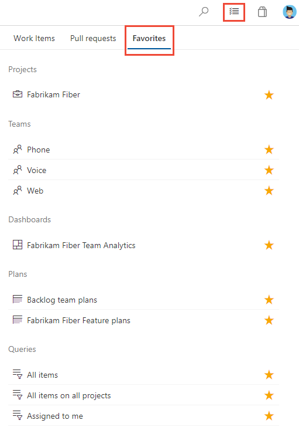

注意

サービスが無効になっている場合、そのサービスのアーティファクトまたはビューをお気に入りに追加できません。たとえば、Boardsが無効になっている場合、お気に入りのグループであるPlans、Boards、Backlogs、Analytics views、Sprints、Queries、およびすべてのAnalyticsウィジェットが無効になります。サービスを再度有効にするには、[Azure DevOpsサービスをオンまたはオフにする](https://docs.microsoft.com/ja-jp/azure/devops//organizations/settings/set-services?view=azure-devops) を参照してください。

## プロジェクトまたはチームのお気に入り

1. プロジェクトをお気に入りに追加するには、プロジェクトの「概要」ページを開き、お気に入りの  のアイコンを選択します。

    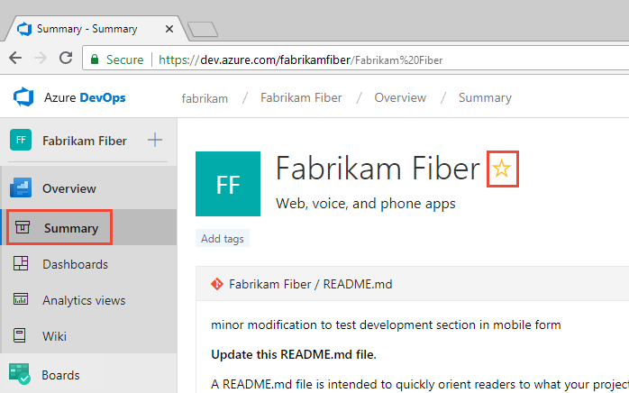

1. チーム成果物をお気に入りに追加するには、Boards > Boards または Boards > Backlogs を開きます。チーム・セレクタからお気に入りに追加するチームを選択し、スター  のアイコンを選択します。

    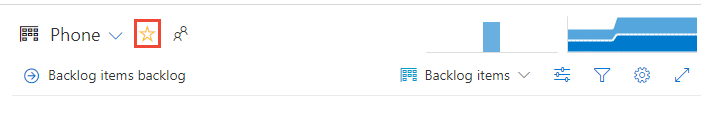

1. 他のチームアーティファクトをお気に入りに追加するには、チーム 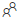 アイコンを選択し、リストされたアーティファクトの1つの横にあるスター  のアイコンを選択します。

    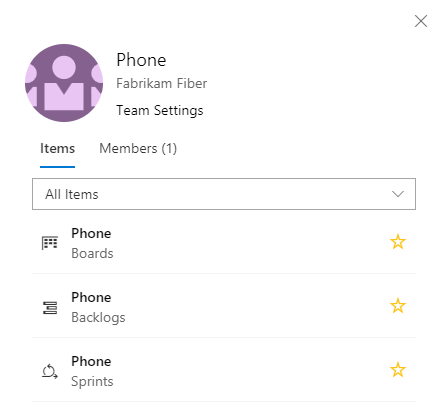

## ダッシュボードのお気に入り

1. Overview > Dashboards からセレクタを開き、Browse all dashboard オプションを選択します。

    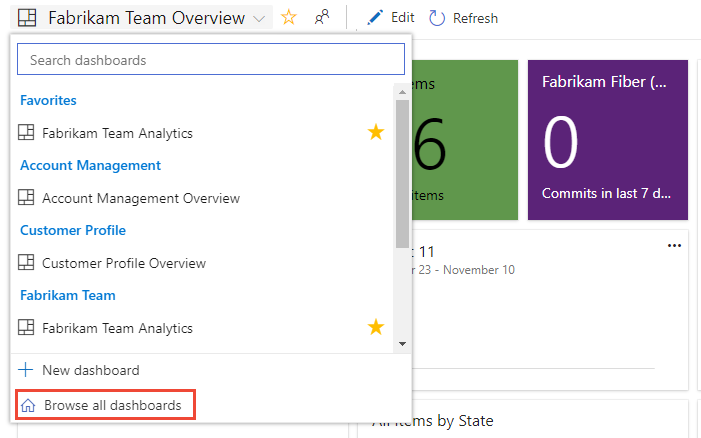

1. Mine ページには、お気に入りのダッシュボードと、所属しているチームのすべてのダッシュボードが表示されます。All ページ(次を参照)には、プロジェクトに定義されているすべてのダッシュボードがアルファベット順に表示されます。リストはチームまたはキーワードでフィルタできます。

    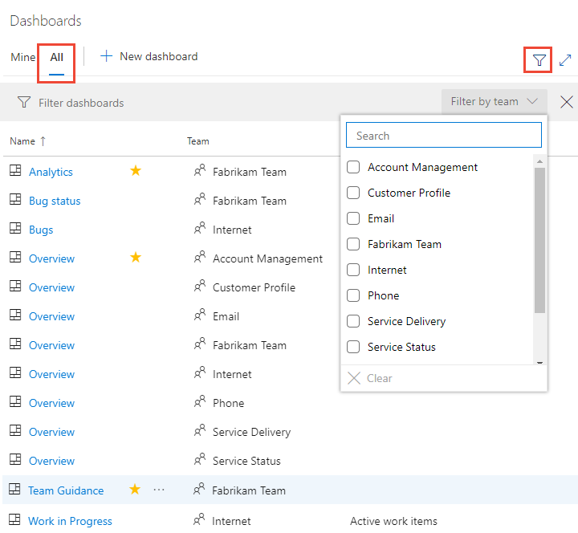

    

    ヒント  
    列ラベルを選択すると、リストの並べ替え順序を変更できます。
    

1. ダッシュボードをお気に入りに追加するには、ダッシュボードの上にカーソルを移動し、スター  のアイコンを選択します。

    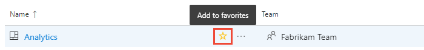

    ダッシュボードをお気に入りに追加すると、そのダッシュボードは Favorites ページに表示され、Dashboards の選択メニューの一番上に表示されます。

## チームのバックログ、カンバンボード、その他のビューをお気に入りにする

Boardsページからは,チームのためのアジャイルツールをいくつか選ぶことができます。

1.  Boards を選択し、Boards、Backlogs、または Sprints など、目的のページを選択します。 

    たとえば、(1)Work、(2)Backlogsの順に選択します。

    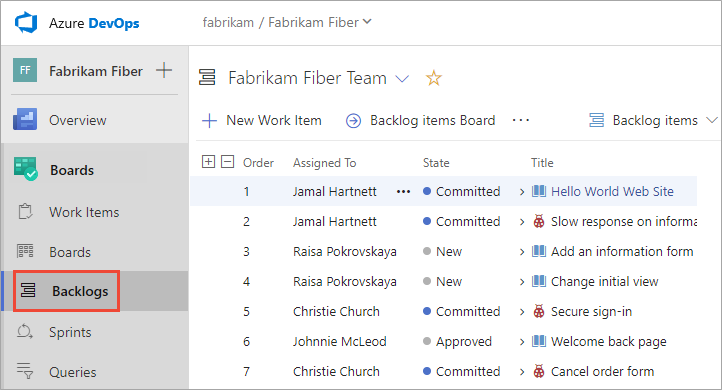

    特定のチーム・バックログを選択するには、セレクタを開いて別のチームを選択するか、ホーム  アイコン Brouwse all team backlogs オプションを選択します。または、検索ボックスにキーワードを入力して、プロジェクトのチーム・バックログのリストをフィルタできます。

    

1. チーム・バックログをお気に入りに追加するには、スター  アイコンを選択します。お気に入りに追加された成果物()は、「お気に入り」ページのチーム・バックログ・セレクタ・メニューの上部に表示されます。

## 共有クエリをお気に入りにする

Boards > Queries を開き、All ページを選択します。必要に応じてフォルダを展開し、お気に入りに追加するクエリの横にあるスター  アイコンを選択します。

または、クエリのコンテキストメニューを開き、Add to Team Favorites を選択し、チームのリストから選択します。

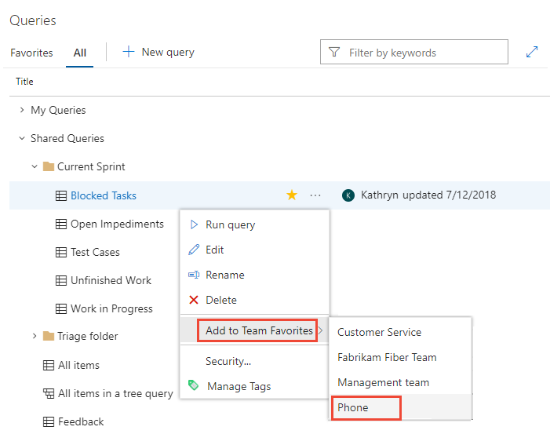

クエリを開いてスター  のアイコンを選択すると、クエリを個人用のお気に入りとして設定することもできます。

## デリバリ計画をお気に入りにする

デリバリ計画の詳細は、[チームのデリバリ計画のレビュー](https://docs.microsoft.com/ja-jp/azure/devops//boards/plans/review-team-plans?view=azure-devops) を参照してください。

デリバリ計画をお気に入りとしてマークするには、Boards > Plans ページを開き、デリバリ計画の横にあるスター  のアイコンを選択します。

## リポジトリをお気に入りにする

任意の Repo ページでリポジトリ・セレクタを開き、お気に入りにするリポジトリのスター  アイコンを選択します。

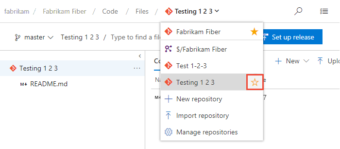

## ビルドパイプラインをお気に入りにする

Pipelines > Builds を開き、Mine または Definitions ページを選択します。お気に入りに追加するビルド定義の横にあるスターのアイコンを選択します。または、ビルド定義のコンテキストメニューを開き、Add to my favorites または Add to team favorites を選択します。

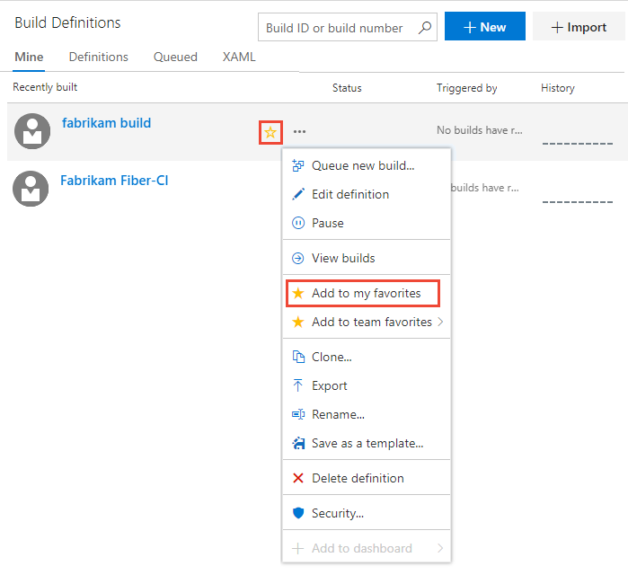

## テストプランをお気に入りに追加する

テストプランの詳細については、[テスト計画とテストスイートを作成する](https://docs.microsoft.com/ja-jp/azure/devops//test/create-a-test-plan?view=azure-devops) を参照してください。

テストプランをお気に入りとしてマークするには、Test Plans > Test Plans を開き、All test plans を表示するメニューからテストプランの横にあるスター  のアイコンを選択します。

## お気に入りに追加したビューのお気に入りを解除する

Favorites ページから成果物のお気に入りを解除できます。受信ボックス  アイコンを選択し、Favorites を選択します。現在お気に入りになっている成果物のお気に入りアイコン  を選択します。

同様に、お気に入りに追加したページから成果物のお気に入りを解除できます。

## 次は？

[ユーザーストーリー、バグ、イシューまたは他の作業手順またはプルリクエストをフォローする](https://docs.microsoft.com/ja-jp/azure/devops//boards/work-items/follow-work-items?view=azure-devops)