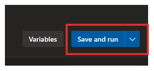

# Azure DevOps で Azure Pipelies のビルドを Linux のセルフホスト環境で実行する

本記事は Azure DevOps で自前で用意した仮想マシンでビルドする、セルフホスト・エージェントの環境を構築する方法について記述します。

Azure DevOps とは何か？あるいは何ができるか？については、他の方が詳しく書かれているので、ここでは割愛して本題のみに触れます。

# なぜセルフホストなのか？

Azure DevOps において、ビルドを行うサービスは Azure Pipelines です。デフォルトでは、Microsoft がホスト(Microsoft-hosted)する環境でビルドが行われます。しかも、それらは無料で提供されます。

では、なぜわざわざ仮想マシンの料金まで払って自前のセルフホスト環境を用意するのか？
それは、Microsoft がホストする環境では、以下のような制限があるからです。(2020/02/20 現在)

Microsoft がホストするエージェントの制限は次のとおりです。

- ソースファイルおよびビルド出力に "少なくとも" 10 GB のストレージ
- 時間制限
  - オープンソースなプロジェクト
      - 毎回最大 6 時間実行できる 10 個の並列の無料ジョブ
      - 月あたりの上限は特になし
      - 制限を引き上げる場合は、Microsoft に問い合わせる
  - クローズドソースなプロジェクト
      - 毎回最大 1 時間実行できる並列の無料ジョブ
      - 月あたり最大 30 時間
      - 上限引き上げは有料になる
  - 実行マシンは `DS2_v2' 仮想マシン
      - 2 vCPU
      - 7 GiB Memory
      - 14 GiB SSD
      - など
  - など

ただし、オープンソースなプロジェクトで使用する場合は、よほど大きなプロジェクトで無い限り、Microsoft がホストするエージェントでビルドを行えるはずです。

しかし、エンタープライズシステムでは、クローズドなソースでシステム開発が行われる事がほとんどで、毎回 1 時間の制約ではビルドおよびテストには時間が足りないことはよくあります。
このような場合には、セルフホストが現実的な選択肢となります。

さらに、**セルフホストは仮想マシンのサイズは自由に設定できる** ため、ビルドマシンに大きなサイズの仮想マシンを使用し、全体のビルドおよびテスト時間を短縮する事が可能です。

# 何をセルフホスト環境で実現したいか？

今回、実現したいことは単純です。自前でセットアップした仮想マシンにおいて、実行されるエージェントを Azure Pipelines から呼び出せるようにします。
全体像は次の図のようになります。


一連のフローは、図の番号順に実行されます。

1. 開発者はソースコードを master ブランチにプッシュする
1. Azure Repos はプッシュされたことをトリガーとして、Azure Pipelines のビルドシーケンスを起動する
1. Azure Pipelines は、仮想マシン上にセルフホストされたエージェントにビルドを依頼する
1. 仮想マシン上のエージェントは、ソースコードをビルドする
1. 仮想マシン上のエージェントは、ビルドの結果が成功または失敗にかかわらず、Azure Pipelines に結果を通知する
1. Azure Pipelines は開発者にビルドの結果をメールで通知する

# 前提条件

さて、ここからセルフホスト環境の設定を行うのですが、話を簡単にするためにいくつかの前提条件を設けます。

まず、作業を行うユーザーの権限について、以下の条件を満たしている必要があります。

1. Azure AD のユーザーおよびグループの作成権限があること
1. Azure DevOps のプロジェクト管理者のロールを持っていること
1. Ubuntu 18.04 の仮想マシンを作成する権限があること

次に、Azure リソースについても、ある程度の準備をしていることを前提とします。

1. すでに Azure DevOps 上の組織を作成していること
1. すでに Azure DevOps のプロジェクトを作成していること
1. すでに Azure Repos にビルド用のリポジトリを用意してあること
1. すでに セルフホスト用のリソースグループおよび仮想マシンのセットアップをしていること
    - Ubuntu Server 18.04 にログインできる状態であること
    - Git 2.9.0 以降のインストールを済ませていること
    - ユーザーに sudo の権限があること
    - エージェントのインストールについては必要ありません

以下は必須ではありませんが、あれば後々のために楽ができるかもしれません。

- Key Vault をリソースグループに作成し、作業するユーザーにシークレットの作成権限があること

# 作業の概観

個別の作業に入る前に、作業の一連の流れを把握しておくことは将来の自動化のために重要です。
また、作業する際に設定すること、あるいはしないことについて理解しておいた方が、作業の意味がよく理解でき、何を自動化するべきかの取捨選択および作業の分担が捗ると思います。

ここで行う作業は、次のように大きく３つに分けることができます。

1. 各 Azure リソースの設定および関連付け
1. 仮想マシンに対するエージェントのセットアップ
1. 新しいパイプラインの作成

最後の新しいパイプラインで必要な `azure-pipelines.yml` については、ビルドする対象によっては、Ops は詳細を把握できないため、Dev に記述してもらっても良いかも知れません。

## 各 Azure リソースの設定および関連付け

ここでは、主に Azure DevOps で必要なものを作成します。
作成するのは次のとおりです。

- Azure Active Directory ユーザー
- パーソナルアクセストークン
- Agent Pool

では、順を追って説明していきます。

### エージェントを実行するユーザーの作成

今回の最重要な作業は、Azure Pipelines とセルフホスト環境のエージェントを関連付けることです。
そうしないと、Azure Pipelines はどのエージェントを呼び出していいか判断がつかず、エージェントもなんのタスクを実行していいか判断のつかない状態になります。

今回は新しいユーザーを作成して、Azure Pipelines のエージェント管理者として登録します。
なお、既存のユーザーにエージェント管理者を関連付ける場合は、この手順をスキップできます。

ただし、エージェント管理者のパーソナルアクセストークンを使用する都合上、専用のユーザーを用意したほうがトークンの管理が楽になる（かも知れません）

蛇足ですが、スクリーンショットのテーマがいろいろ変わってるのは気にしないで下さい…

### Azure Active Directory ユーザーの作成

まず、Agent Queue を管理するユーザーが必要なので、以下の情報で Azure AD ユーザーを作成します。

| 設定項目   | 設定値                                |
|:-----------|:--------------------------------------|
| ユーザー名 | Azure-Pipelines-Agent-Queue-Admin-001 |
| 名前       | Azure Pipelines Queue Admin 001       |
| 名         | Admin - 001                           |
| 性         | Azure Pipelines Agent Queue           |
| パスワード | 任意のパスワード                      |
| 利用場所   | 日本                                  |

さらに、認証の連絡先情報を編集し、Azure AD 管理者あるいは管理者メーリングリストのメールアドレスを入力します。

### Azure DevOps へのユーザーの追加

Azure Active Directory で作成したユーザーを Azure DevOps に追加します。
Azure DevOps の管理権限を持ったユーザーが、Azure DevOps にサインインし、次の図の `Organization settings` をクリックし、組織の設定画面を開きます。


次に、左ペインの `Users` を選択します。


最後に、ユーザーの情報を入力して `Add` をクリックします。

| 設定項目 | 設定値 |
| :----- | :----- |
| Users | 先ほど作成した Azure AD ユーザー |
| Access level | Basic |
| Add to projects | 追加するプロジェクト名 |
| Azure DevOps Groups | Project Contributors |


### エージェント管理ユーザーのパーソナルアクセストークンの作成

先程、作成したユーザーで Azure DevOps にサインインします。
サインインした後は、プロファイルを編集して、メールアドレスを有効な値にしておきます。

サインイン後にプロジェクトを選択し、画面右上のプロファイルから `Personal access tokens` をクリックします。


次に、今の段階では何もアクセストークンは発行されていないはずなので、右ペインの `New Token` をクリックします。


画面右側に入力ダイアログが開くので、必要な情報を入力します。


以下のスコープに、権限を設定します。

| スコープ | 設定値 |
| :------- | :--------- |
| Agent Pools | Read & manage |
| Build | Read & execute |
| Packaging | Read, write, & manage |
| Release | Read, write, execute, & manage |
| Test Management | Read & write |


`Create` をクリックすると、次のようにパーソナルアクセストークンが表示されるので、コピーアイコンをクリックしてどこかに保管しておきましょう。


**Azure DevOps はこのパーソナルアクセストークンを保存しない** ことに注意して下さい。忘れても大丈夫なように、必ずどこかに保存しましょう。

ここで Tips ですが、先程のパスワードもパーソナルアクセストークンも Key Vault のシークレットとして管理することをお勧めします。
これに Key Vault の有効期限をチェックするカスタムポリシーを関連付けて監査すれば、パーソナルアクセストークンの有効期限が切れる前に、新たにパーソナルアクセストークンを発行して、常に有効なトークンを使用できるようになります。

> 実は作成時にしかパーソナルアクセストークンが必要としないのではないか…？

### Agent Pool の作成

さて、ここからが今回のポイントである Agent Pool の作成です。

プロジェクトを選択し、`Project settings` をクリックします。


左ペインの `Agent pools` をクリックします。


右ペインの右上にある `Add pool` をクリックします。


必要な情報を入力し `Create` をクリックします。今回は `Hosted Agent Pool` という名前にします。


Agent Pool が作成されたのでクリックします。


右ペインの `New Agent` をクリックします。


Agent のためのダイアログが表示されるのでので、`Linux` タブをクリックし、プラットフォームが `x64` になっていることを確認し、コピーアイコンをクリックしダウンロードリンクを保存します。


## 仮想マシンに対するエージェントのセットアップ

先程のエージェントをダウンロードする手順は次のとおりです。

1. すでに準備していた仮想マシンにログインします。
1. `myagent` というディレクトリを作成します。
1. ダウンロードリンクを使用して、エージェントをダウンロードし、圧縮ファイルを展開します。

コマンドは次のとおりです。

```bash
mkdir myagent && cd myagent
wget https://vstsagentpackage.azureedge.net/agent/2.164.8/vsts-agent-linux-x64-2.164.8.tar.gz
tar zxvf vsts-agent-linux-x64-2.164.8.tar.gz
```

次に、エージェントを構成します。

```bash
./config.sh
```

次のようなプロンプトが表示されます。

```

  ___                      ______ _            _ _
 / _ \                     | ___ (_)          | (_)
/ /_\ \_____   _ _ __ ___  | |_/ /_ _ __   ___| |_ _ __   ___  ___
|  _  |_  / | | | '__/ _ \ |  __/| | '_ \ / _ \ | | '_ \ / _ \/ __|
| | | |/ /| |_| | | |  __/ | |   | | |_) |  __/ | | | | |  __/\__ \
\_| |_/___|\__,_|_|  \___| \_|   |_| .__/ \___|_|_|_| |_|\___||___/
                                   | |
        agent v2.164.8             |_|          (commit 99c93e1)


>> 使用許諾契約書:

TFVC リポジトリからソースを構築するには、Team Explorer Everywhere の使用許諾契約書に同意する必要があります。この手順は、Git リポジトリからソースを構築する場合は必要ありません。

Team Explorer Everywhere ライセンス契約のコピーはこちらでご確認いただけます:
  /home/hayashi_toshiki/myagent/externals/tee/license.html

(Y/N) 今すぐ Team Explorer Everywhere ライセンス契約に同意しますか? を入力する (N の場合は、Enter キーを押します) >
```

入力手順は次のとおりです。

1. `Y` を入力し、`Enter` キーを押します。
1. サーバーの URL を入力します。値は `https://dev.azure.com/{組織の名前}` です。入力したら `Enter` キーを押します。
1. 認証の種類を入力します。パーソナルアクセストークンを使用するので、そのまま `Enter` キーを押します。
1. エージェント プールを入力します。`Hosted Agent Pool` と入力して、`Enter` キーを押します。
1. エージェント名を入力します。デフォルトを使用するので、そのまま `Enter` キーを押します。
1. 作業フォルダを入力します。デフォルトを使用するので、そのまま `Enter` キーを押します。


### サービスの登録

仮想マシンのエージェントが自動的に実行できるようにサービス(Daemon)として登録します。

サービスを登録するコマンドは次のとおりです。

```bash
cd ~/myagent
sudo ./svc.sh install
```

次に、コマンドを入力してサービスを起動します。

```bash
sudo ./svc.sh start
```

これで、仮想マシン上のエージェントのセットアップは完了しました。

なお、サービスの状態を取得するコマンドは次のとおりです。

```
sudo ./svc.sh status
```

## 新しいパイプラインの作成

Azure Pipelines とセルフホストのエージェントがちゃんと関連付けできているかを検証するために、新しいパイプラインを作成します。

Azure DevOps で左ペインの `Pipelines` より `Builds` をクリックします。


右ペインの `New pipeline` をクリックします。


今回は Azure Repos のリポジトリを参照するので、`Azure Repos Git` をクリックします。


次に、リポジトリを選択するページが表示されます。任意のリポジトリを選んで下さい。

次に、`azure-pipelines.yml` を新規で作るか？あるいは既存のものを使用するか？について選択します。今回は、シンプルな YAML ファイルを作成するので、`Starter pipeline` を選択します。


最後に、YAML ファイルの編集ページが現れるので、以下のように編集して下さい。

```yaml
# Starter pipeline
# Start with a minimal pipeline that you can customize to build and deploy your code.
# Add steps that build, run tests, deploy, and more:
# https://aka.ms/yaml

trigger:
- master

# ----------------------------------------------------
# ここで Agent Pool の名前を指定しているのが重要です。
# ----------------------------------------------------
pool: Hosted Agent Pool

steps:
- script: echo Hello, world!
  displayName: 'Run a one-line script'

- script: |
    echo Add other tasks to build, test, and deploy your project.
    echo See https://aka.ms/yaml
  displayName: 'Run a multi-line script'
```

`Save and run` をクリックし、YAML を保存しパイプラインを実行します。



編集した YAML ファイルのコミットメッセージを入力するダイアログが表示されます。
このまま `Save and run` をクリックします。


しばらくすると、Job が実行され、以下のようなページが表示され、Hosted Agent Pool でビルドが成功したことがわかります。


これで、セルフホスト環境のエージェントと Azure Pipelines が連携していることを確認できました。

# 最後に

今回は、セルフホスト環境でエージェントを設定し、自前のビルド環境を使用することについて説明しました。

本記事の説明を簡単にするため、以下のトピックには触れていません。

- Windows のセルフホスト環境
- `azure-pipelines.yml` の書き方
- デプロイの方法
- テストの方法
- セットアップの自動化

それらについては、また機会がありましたら記事にしたいと思います。

Azure DevOps を試してみようと思っている皆様の、ご参考になれば幸いです。
