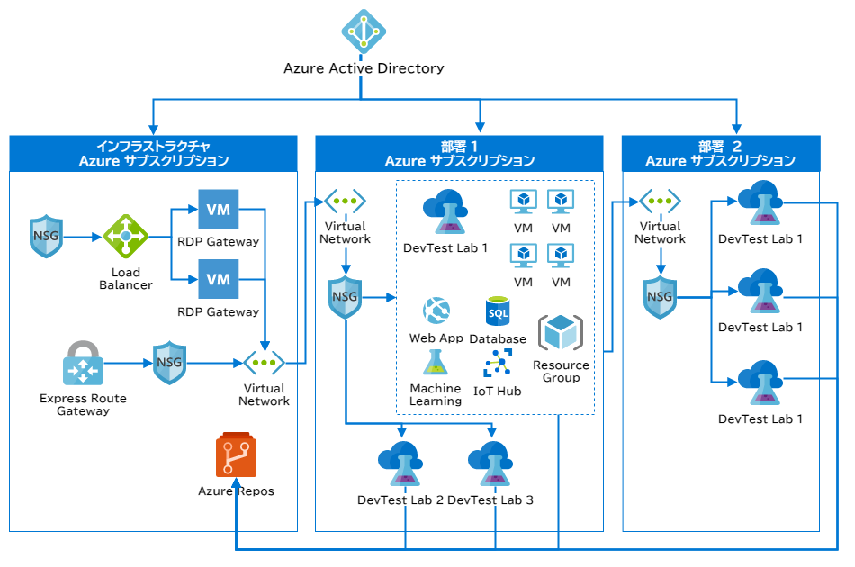

# Azure DevTest Labs に関するよくありそうな質問

## 目次

- [Azure DevTest Labs とは何ですか？](#q-about)
- [開発者が承認なしで環境を追加できると、Azure 環境全体で無法地帯になりませんか？](#q-sandbox)
- [ラボ内がサンドボックスであれば、外の環境にデプロイすることはできないのですか？](#q-deploy)
- [どういった状況で DevTest Labs が活用できますか？](#q-scene)
- [あらかじめ仮想マシンを用意するにはどうすればいいですか？](#q-custom-image)

## <a id="q-about">Azure DevTest Labs とは何ですか？</a>

主に開発やテストのために使われ、

- 承認を待つことなく、予め上限が設定された範囲で、仮想マシンと PaaS リソースが用意できます。
- Resource Manager テンプレートで望むスペックの開発マシンがすぐ用意できます。
- テスト環境やでも環境の事前プロビジョニング済み環境を作成できます。

環境を作成するのに、数時間〜数日待たされるのではなく、数分で環境を作成できます。

## <a id="q-sandbox">開発者が承認なしで環境を追加できると、Azure 環境全体で無法地帯になりませんか？</a>

全体としての環境はコントロール下にあります。その理由は次のとおりです。

- 開発者が用意できるのは、事前に全体管理者などによって構成、許可、承認された仮想マシンです。
- 用意できる他の Azure リソースも全体管理者などによって、構成および承認された Resource Manager テンプレートの一覧から選びます。
- ユーザーごとあるいはラボごとにコストを追跡でき、予算内に収めるために、ラボ内で起動された VM と PassS のリソースのコストを追跡します。
- 外部のリソースを起動しないように、ラボ内はサンドボックス環境になります。

## <a id="q-deploy">ラボ内がサンドボックスであれば、外の環境にデプロイすることはできないのですか？</a>

次の図のように Azure Repos にソースを置き、Azure Pipelines と連携することにより、CI/CD と統合することができます。

## <a id="q-scene">どういった状況で DevTest Labs が活用できますか？</a>

ユーザーが、全体の環境に影響させずに、ユーザー自身のサブスクリプション内で、すべてのインフラストラクチャと構成を自分で管理したい場合は、DevTet Labs を使うことができます。

DevTest Labs を使うユースケースの例を次に示します。

- ハッカソンや、カンファレンスでのハンズオンセッションをホストする
- ユーザーのアプリケーションで構成された VM のプールを使用してバグの調査をする。
- 各開発プロジェクトで必要とするすべてのツールを構成された仮想マシンを使用する。
- テストマシンを繰り返し作成し、最新のコードをテストする。
- スケールアウトとパフォーマンステストのために異なる構成の様々な仮想マシンと複数のテストエージェントを作成する

## <a id="q-custom-image">あらかじめ仮想マシンを用意するにはどうすればいいですか？</a>

次の二種類の方法があります。

- VHD ファイルでカスタムイメージを作成する
- コードベースのイメージファクトリを作成する

カスタムイメージは作成が簡単で配布も簡単です、しかしメンテナンスが大変です。たとえば、評価版製品が切れた場合やセキュリティの更新があれば、カスタムイメージを再作成する必要があります。

一方で、イメージファクトリはカスタムイメージと比較して、作成にある程度の慣れが必要です。ただし、メンテナンスは迅速にできます。