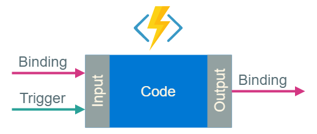

# Azure Functions に関するよくありそうな質問

## 目次

- [Azure Functions とは何ですか？](#q-about)
- [どこに関数がデプロイされるのですか？](#q-deploy)
- [各プランには制限がありますか？](#q-plan-quotas)
- [どのプランを選んでだらいいでしょうか？](#q-plan)
- [ステートフルな関数を記述したい場合はどうすればいいでしょうか？](#q-durable)
- [Azure Functions の簡単な仕組みを教えて下さい](#q-simple-structure)
- [トリガーとバインディングがサポートされているサービスは何ですか？](#q-bindings)
- [Azure Functions は Windows でのみ実行できますか？](#q-platform)
- [Azure Functions はローカルでも開発できますか？](#q-local)

## <a id="q-about">Azure Functions とは何ですか？</a>

- クラウドで小規模なコードを実行するためのサービスです。

- [どこに関数がデプロイされるのですか？](#q-deploy)

## <a id="q-deploy">どこに関数がデプロイされるのですか？</a>

プランによって異なります。

| プラン | 場所 |
| :---- | :----- |
| 従量課金 | 任意のリージョンに自動配置 |
| Premium | 任意のリージョンのインスタンス |
| App Service | 任意の App Service インスタンス |

## <a id="q-plan">どのプランを選んだらいいでしょうか？</a>

関数の使用頻度が一時間に一回などそれほど多くなく、かつリクエストを受け取ってから関数インスタンスの起動を行うため、応答時間にそれほど制限がない場合は従量課金プランを選ぶと良いでしょう。

次のような状況では Premium プランを検討するのが良いでしょう。

- 応答時間を早くするためにコールドスタートを回避したい
- 関数を継続的に、またはほぼ継続的に実行したい
- 小規模な実行回数が多く、実行料金が高いが、従量課金プランでの GB 秒の請求額が低い
- 従量課金プランで提供されるものよりも多くの CPU またはメモリが必要である
- 従量課金プランで許可されている実行時間よりも、より長いコードを実行する必要がある
- VNET/VPN 接続など、Premium プランでのみ利用できる機能が必要である

他の App Service アプリを使用しており、使用率の低い VM が存在する場合は、App Service プランを選択して、関数アプリをその App Service に割り当てると良いでしょう。

## <a id="q-plan-quotas">各プランには制限がありますか？</a>

各プランに適用される制限は、次の表になります。

| リソース | 従量課金 | Premium | App Service |
| :------ | :----- | :----- | :----------- |
| スケールアウト | イベントドリブン | イベントドリブン | 手動または自動スケール |
| 最大インスタンス数 | 200 | 20 | 10 - 20 |
| 既定のタイムアウトまでの時間(分) | 5 | 30 | 30 |
| 最大のタイムアウトまでの時間 | 10 | 無制限 | 無制限 |
| 最大送信接続数（インスタンスあたり） | アクティブ600 （合計1200） | 無制限 | 無制限 |
| 最大リクエストサイズ(MB) | 100 | 100 | 100 |
| クエリ文字列の最大長 | 4096 | 4096 | 4096 |
| リクエスト URL の最大長 | 8192 | 8192 | 8192 | 
| インスタンスあたりの ACU | 100 | 210 〜 840 | 100 〜 840 |
| 最大メモリ（インスタンスあたりの GB） | 1.5 | 3.5 〜 14 | 1.75 〜 14 |
| プランあたりの関数アプリ | 100 | 100 | 無制限 |
| App Service プラン | リージョンあたり 100 | リソースグループあたり 100 | リソースグループあたり 100 |
| ストレージ | 1GB | 250GB | 50 〜 1000GB |
| アプリケーションごとのカスタムドメイン数 | 500 | 500 | 500 |
| カスタムドメインの SSL サポート | 無制限の SNI SSL 接続が含まれる | 無制限の SNI SSL 接続と 1件の IP SSL 接続が含まれる | 無制限の SNI SSL 接続と 1件の IP SSL が含まれる |

## <a id="q-durable">ステートフルな関数を記述したい場合はどうすればいいでしょうか？</a>

Durable Functions を使用して下さい。Durable Functions で実装されるパターンについては、[Durable Functions とは](https://docs.microsoft.com/ja-jp/azure/azure-functions/durable/durable-functions-overview) を参照して下さい。

## <a id="q-simple-structure">Azure Functions の簡単な仕組みを教えて下さい</a>

Azure Functions の最も簡単な仕組みは以下のようになります。

- トリガーは Azure Functoins が起動するイベントです。(例：Queue)
- バインディングは入力と出力のデータソースです。(例：BOLB ストレージ)

## <a id="q-bindings">トリガーとバインディングがサポートされているサービスは何ですか？</a>

Azure Functions でサポートされているトリガーおよびバインディングは以下のとおりです。

| 種類    | 1.x    | 2.x    | トリガー | 入力 | 出力 |
| :----- | :----: | :----: | :----: | :----: | :---: |
| Blob Storage | ✅ | ✅ | ✅ | ✅ | ✅ |
| Cosmos DB | ✅ | ✅ | ✅ | ✅ | ✅ |
| Event Grid | ✅ | ✅ | ✅ |   |   |
| Event Hubs | ✅ | ✅ | ✅ |   | ✅ |
| HTTP と Webフック | ✅ | ✅ | ✅ |   | ✅ |
| IoT Hub | ✅ | ✅ | ✅ |   | ✅ |
| Microsoft Graph Excel テーブル |   | ✅ | ✅ |   | ✅ |
| Microsoft Graph OneDrive ファイル |   | ✅ | ✅ |   | ✅ |
| Microsoft Graph Outlook メール |   | ✅ |   |   | ✅ |
| Microsoft Graph イベント |   | ✅ | ✅ | ✅ | ✅ |
| Microsoft Graph Auth トークン |   | ✅ |   | ✅ |   |
| Mobile Apps | ✅ |   |   | ✅ |✅ |
| Notification Hubs | ✅ |  |  |  | ✅ |
| Queue Storage | ✅ | ✅ | ✅ |   | ✅ |
| SendGrid | ✅ | ✅ |  |  | ✅ |
| Service Bus | ✅ | ✅ | ✅ |  | ✅ |
| SignalR |  | ✅ |   | ✅ | ✅ |
| Table Storage | ✅ | ✅ |   | ✅ | ✅ |
| Timer  | ✅ | ✅ | ✅ |   |  |
| Twillo | ✅ | ✅ |    |  | ✅ |
 

## <a id="q-platform">Azure Functions は Windows でのみ実行できますか？</a>

Linux でも実行できます。

## <a id="q-local">Azure Functions はローカルでも開発できますか？</a>

Azure サービスに接続するローカルな環境を構築することで、ローカルで開発およびデバッグが可能です。

- Azure Functions 1.x は　Windows のみ開発可能です
- Azure Functions 2.x は Linux、MacOS および Windows で開発可能です。

環境はプログラミングする言語とツールの設定により異なります。

| 環境 | プログラミング言語 | 説明 |
| :---- | :----- | :--------- |
| Visual Studio Code | C#(クラスライブラリ) C# スクリプト(.csx) JavaScript PowerShell Python | VS Code 用の Azure Functoins 拡張および [Azure Functions Core Tools](https://www.npmjs.com/package/azure-functions-core-tools) が必要です。 |
| コマンドプロンプト ターミナル | C#(クラスライブラリ) C# スクリプト(.csx) JavaScript PowerShell Python | [Azure Functions Core Tool](https://www.npmjs.com/package/azure-functions-core-tools) が必要です。
| Visual Studio 2019 | C#(クラスライブラリ) | Azure に対して `.dll` の発行が可能 |
| Maven | Java | Core Tools を使用します。 |