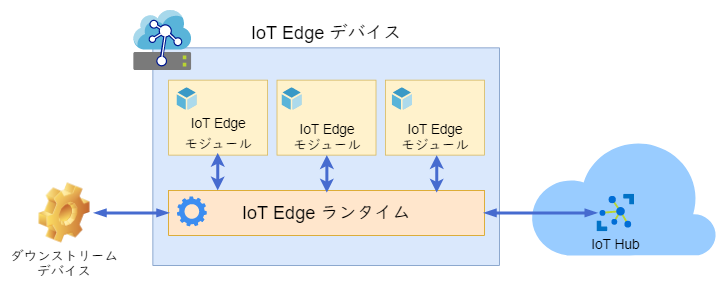

# Azure IoT Edge に関するよくあるかもしれない質問

## 目次

- [Azure IoT Edge とは何ですか？](#q-about)
- [IoT Edge モジュールとは何ですか？](#q-edge-module)
- [IoT Edge モジュールには何が入っているのですか？](#q-edge-module2)
- [IoT Edge ランタイムとは何ですか？](#q-edge-runtime)
- [ダウンストリームデバイスとは何ですか？](#q-downstream-device)
- [IoT Edge デバイスとはクラウドとのゲートウェイと違うのですか？](#q-gateway)
- [IoT Edge デバイスをゲートウェイとして使う場合、何ができるのですか？](#q-gateway2)
- [クラウドから IoT Edge デバイスに接続されているダウンストリームデバイスにメッセージを送信できますか？](#q-cloud-to-device)
- [ダウンストリームデバイスは最大何台まで接続できますか？](#q-max-devices)
- [IoT Edge デバイスでランタイムを実行できるプラットフォーム要件は？](#q-runtime-platform)
- [IoT Edge モジュールで使用する Docker イメージはどこから取得できますか？](#q-docker-image)
- [IoT Edge ランタイムと IoT Hub 間の通信はどのプロトコルを使用していますか？](#q-hub-protocol)
- [ゲートウェイの可用性は IoT Edge で担保されますか？](#q-availability)
- [IoT Edge を使用するのに料金はどの程度かかりますか？](#q-price)

## 参考

[運用環境デプロイのチェックリスト](https://docs.microsoft.com/ja-jp/azure/iot-edge/production-checklist)

## <a id="q-about">Azure IoT Edge とは何ですか？</a>

IoT Hub 等のクラウドサービスで行っていた分析やカスタムロジックをデバイス側で実行できるようにするものです。デバイス側でデータを扱うことのメリットは、通信による処理遅延の抑制とシステム全体の可用性の向上です。

Azure IoT Edge は次の三つのコンポーネントで構成されています。

- IoT Edge モジュール Azure のサービス、サードパーティのサービス、あるいは独自のコードを実行するコンテナです。
- IoT Edge ランタイム 個々の IoT Edge デバイス上で動作し、各デバイスにデプロイされたモジュールを管理します。
- クラウドベースのインターフェイス IoT Edge デバイスをリモートから監視して管理します。

## <a id="q-edge-module">IoT Edge モジュールとは何ですか？</a>

デバイス側に配置される Docker コンテナです。

各コンポーネントとの関係は次のようになっています。

## <a id="q-edge-module2">IoT Edge モジュールには何が入っているのですか？</a>

IoT Edge モジュールには以下のようなコンポーネントを入れることが可能です。

- 独自のビジネスロジック
- Azure Functions
- Azure Stream Analytics のジョブ
- Azure Machine Lerning
- Azure Blob Storage
- SQL Server
- その他、サードパーティのサービス

## <a id="q-edge-runtime">IoT Edge ランタイムとは何ですか？</a>

IoT Edge モジュールを統合し、クラウド上の IoT Hub との通信をするコンポーネントです。次のような機能を提供します。

- デバイスにワークロードをインストールし、更新する。
- デバイス上の Azure IoT Edge のセキュリティ標準を維持する
- IoT Edge モジュールの実行を絶えず監視し確保する
- モジュールの正常性をクラウドにレポートして、リモート監視を可能にする
- ダウンストリームデバイスと IoT Edge デバイス間の通信を管理する
- IoT Edge デバイス上の文字ユール感の通信を管理する
- IoT Edge デバイスとクラウド間の通信を管理する

## <a id="q-downstream-device">ダウンストリームデバイスとは何ですか？</a>

IoT Edge デバイスに接続されているエッジ側のデバイスです。IoT Hub デバイスやレガシーデバイスに対応し、IoT Edge デバイスをそれらの親デバイスとして関連付けることが可能です。

## <a id="q-gateway">IoT Edge デバイスとはクラウドとのゲートウェイと違うのですか？</a>

IoT Edge デバイスはゲートウェイ以外の用途でも使用できます。

ただし、IoT Edge モジュールでのエッジ分析を使用したい場合は、ゲートウェイとして IoT Edge デバイスを使用する必要があります。

## <a id="q-gateway2">IoT Edge デバイスをゲートウェイとして使う場合、何ができるのですか？</a>

ゲートウェイとしての IoT Edge デバイスは次のような機能を提供しています。

- クラウドやダウンストリームデバイスとの接続
- エッジ環境でのデバイス ID 管理
- プロトコル変換
- エッジでのストリームや画像の分析
- ダウンストリームデバイスをインターネット環境から隔離
- エッジ環境のセキュリティ保護
- 接続の多重化
- ネットワークトラフィックの調整
- メッセージとデバイスおよびモジュールツインのオフラインサポート

## <a id="q-cloud-to-device">クラウドから IoT Edge デバイスに接続されているダウンストリームデバイスにメッセージを送信できますか？</a>

以下の条件で送信可能です。

- IoT Edge デバイスをゲートウェイとして使用している
- 透過的なゲートウェイまたはデバイス ID 変換を行っている

ただし、ゲートウェイでプロトコル変換を行っている場合は送信できません。

## <a id="q-max-devices">ダウンストリームデバイスは最大何台まで接続できますか？</a>

IoT Edge デバイスのハードウェア性能に依存しますが、ゲートウェイとして IoT Edge デバイスを使用し、かつプロトコル変換を使用した場合においては、デバイスのキューは最大50メッセージという制限があるため、理論値の最大は50台となります。

## <a id="q-runtime-platform">IoT Edge デバイスでランタイムを実行できるプラットフォーム要件は？</a>

プラットフォームの対応レベルが2つ存在しています。それぞれ次の通りです。

- Tier 1 Microsoft がそのオペレーティングシステムで自動テストを実施しており、インストールパッケージを提供している
- Tier 2 Microsoft がそのプラットフォームでアドホックなテストを実施してるかパートナーが Azure IoT Edge を正常に実行していることを把握している。

サポートしているコンテナエンジンは Docker ではなく、Moby です。

Tier 1 のオペレーティングシステムは以下のとおりです。

| オペレーティングシステム | AMD64 | ARM32v7 | ARM64 |
| :----------------- | :---- | :------: | :----- |
| Raspbian Stretch  |   | ✅ |  |
| Ubuntu Server 16.04 | ✅ |  | パブリック プレビュー |
| Ubuntu Server 18.04 | ✅ |  | パブリック プレビュー |
| Windows 10 IoT Core Build 17763 | ✅ | | |
| Windows 10 IoT Enterprise Build 17763 | ✅ |  |  |
| Windows Server 2019 Build 17763 | ✅ |  | |
| Windows Server IoT 2019 | ✅ |  | |

Windows については、Windows コンテナーを実行します。

Tier 2 のオペレーティングシステムについては以下のとおりです。

| オペレーティングシステム | AMD64 | ARM32v7 | ARM64 |
| :---------------- | :---: | :-----: | :----: |
| CentOS 7.5 | ✅ | ✅ | ✅ |
| Debian 8 | ✅ | ✅ | ✅ |
| Debian 9 | ✅ | ✅ | ✅ |
| Debian 10 | ✅ | ✅ | ✅ |
| Mentor Embedded Linux Flex OS | ✅ | ✅ | ✅ |
| Mentor Embedded Linux Omni OS | ✅ |   | ✅ |
| RHEL 7.5 | ✅ | ✅ | ✅ |
| Ubuntu 16.04 | ✅ | ✅ | ✅ |
| Ubuntu 18.04 | ✅ | ✅ | ✅ |
| Wind River 8 | ✅ |   |   |
| Yocto | ✅ | ✅ | ✅ |
| Raspbian Buster |   | ✅ | ✅ |

また、以下の要素によりハードウェア要件が変わります。

- IoT Edge モジュールがいくつ実行されるか？
- IoT Edge モジュールが共有するレイヤーはいくつあるか？
- IoT Edge モジュールはどの言語で作成されているか？
- IoT Edge モジュールで処理されるデータはどのぐらいあるか？
- IoT Edge モジュールのための特殊なハードウェアが存在するか？
- ソリューションの望ましいパフォーマンス特性はどのようなものか？
- ハードウェアの予算はどのくらいか？

## <a id="q-docker-image">IoT Edge モジュールで使用する Docker イメージはどこから取得できますか？</a>

基本的には Docker ファイルから Docker イメージを作成しコンテナリポジトリにプッシュします。

コンテナリポジトリには [Azure Container Registry](https://docs.microsoft.com/azure/container-registry/) および [DockerHub](https://docs.docker.com/docker-hub/repos/#viewing-repository-tags) などが使用できます。

また Azure Marketplace から取得できるイメージもあります。

## <a id="q-hub-protocol">IoT Edge ランタイムと IoT Hub 間の通信はどのプロトコルを使用していますか？</a>

AMQP 1.0 および AMQP over WebSocket です。

## <a id="q-availability">ゲートウェイの可用性は IoT Edge で担保されますか？</a>

IoT Edge では特に可用性に関するサポートは提供されていません。したがって、ゲートウェイの可用性はユーザーが設計／担保する必要があります。

## <a id="q-price">IoT Edge を使用するのに料金はどの程度かかりますか？</a>

IoT Edge ランタイムには課金はされていません。

IoT Edge モジュールで以下のサービスを使用する場合、別途料金がかかります。

| IoT Edge モジュール | 料金（月額） |
| :---------------- | --------: |
| Azure Stream Analytics on IoT Edge | 112 JPY/デバイス/月 |
| Azure SQL Database | ライセンス料 |

その他のサードパーティの証明済み Edge モジュールについては [Azure Marketplace](https://azuremarketplace.microsoft.com/ja-jp/marketplace/apps/category/internet-of-things?page=1&subcategories=iot-edge-modules) を参照して下さい。