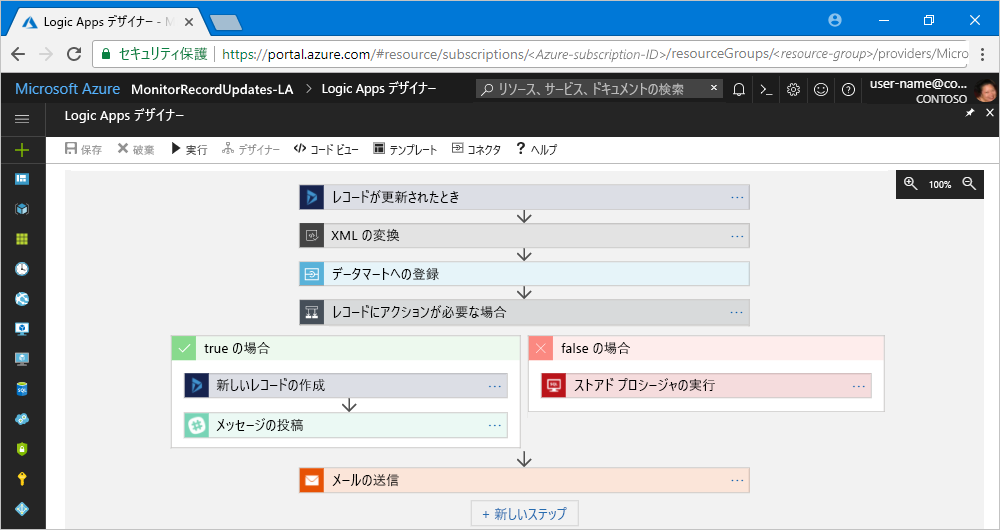

# Azure Logic Apps に関するよくありそうな質問

## 目次

- [Logic Apps とは何ですか？](#q-about)
- [コードを記述しないでどうやってシステムを統合できるのですか？](#q-about2)
- [デザインツールを使用するにはどうすればいいですか？](#q-design-tool)
- [システムの統合とはどうやってやるのですか？](#q-integration)
- [いちからワークフローを記述するのは厳しいです…](#q-template)
- [やっぱりコードを書きたいです。Logic Apps の使用をあきらめるべきですか？](#q-functions)
- [Logic Apps の課金体系について教えて下さい](#q-price)
- [同様のワークフローサービスに Microsoft Flow がありますが、何が違うのですか？](#q-flow)

## <a id="q-about">Logic Apps とは何ですか？</a>

コードの記述なしに、様々なシステムを統合できるワークフローサービスです。

- [コードを記述しないでどうやってシステムを統合できるのですか？](#q-about2)
## <a id="q-about">コードを記述しないでどうやってシステムを統合できるのですか？</a>

視覚的なデザインツールでワークフローの作成が可能です。

## <a id="q-design-tool">デザインツールを使用するにはどうすればいいですか？</a>

Web ブラウザを使って Azure Portal 上で使用するか、Visual Studio を使用します。

- [システムの統合とはどうやってやるのですか？](#q-integration)

## <a id="q-integration">システムの統合とはどうやってやるのですか？</a>

Logic Apps におけるシステムの統合で、重要な要素は以下の２つです。

- コネクタ
- トリガー
- ワークフロー

コネクタを使用して他のシステムまたはサービスと接続し、トリガーに従ってワークフローを起動し、ワークフローの中で制御フローやコネクタを使用して他のシステムまたはサービスにメッセージを送信します。

Logic Apps で用意されているコネクタの種類は数百におよび、おおよその一覧は [Azure Logic Apps のコネクタ](https://docs.microsoft.com/ja-jp/connectors/) あるいは Marketplace で参照できます。

さらに、カスタムコネクタを作成することも可能です。

- [いちからワークフローを記述するのは厳しいです…](#q-template)
## <a id="q-template">いちからワークフローを記述するのは厳しいです…</a>

よく使うワークフロー用のテンプレートが用意されています。

用意されているテンプレートのカテゴリには以下の種類があります。

| テンプレートのカテゴリ | 説明  |
| :---------------- | :------- |
| エンタープライズ クラウド テンプレート | Azure Blob Storage、Dynamics CRM、Salesforce、Box の統合用であり、ビジネスの潜在顧客の整理や、ファイルのバックアップなどに使用できます。 |
| 個人的生産性テンプレート | 毎日のアラームを設定し、重要な作業項目を To Do リストに変換し、長期間のタスクを一人のユーザーの承認手順に自動化することで、個人の生産性を向上させます。 |
| コンシューマークラウドテンプレート | Twitter、Slack、メールなどのソーシャルメディアサービスの統合用です。 |
| Enterprise Integration Pack テンプレート | VETER（検証、抽出、変換、強化、ルーティング）パイプラインの構成、AS2 経由での X12 EDI ドキュメントの受信と XML への変換、および X12、EDIFACT、AS2 メッセージの処理のためのテンプレートです。 |
| プロトコル パターン テンプレート | HTTP 経由の要求 - 応答や、FTP と SFTP の統合など、プロトコル パターンの実装用です。 |

## <a id="q-functions">やっぱりコードを書きたいです。Logic Apps の使用をあきらめるべきですか？</a>

いいえ。コードの記述が必要な場合あ、Azure Functions でコードを記述し、Logic Apps から呼び出すことが可能です。

## <a id="q-price">Logic Apps の課金体系について教えて下さい</a>

以下の２つの課金体系から選択できます。

- 従量課金
- 固定価格

### 従量課金

従量課金はワークフローの使用分に課金されるモデルです。トリガーを実行するたびに、アクションとコネクタの実行に対して課金されます。なお、従量課金モデルで実行されるワークフローはグローバルな環境で実行されます。

従量課金については実行あたりの価格になっており、東日本の価格は次の表のとおりになります。

| 種類 | 実行あたりの価格 |
| :---- | :------------ |
| アクション | 0.003136 JPY |
| 組み込みのコネクタ | 0.014560 JPY |
| エンタープライズ コネクタ | 0.112 JPY |

他に付随するデータの保持に 1GB あたり 13.44 JPY/月 の管理費がかかります。

エンタープライズコネクタとは、SAP、IBM MQ、IBM 3270 などのエンタープライズ システムにアクセスするためのコネクタです。

### 固定課金

Logic Apps を Azure 仮想ネットワーク上で実行する専用環境で実行できる **統合サービス環境（ISE）** が用意されています。統合サービス環境を使用する場合は、固定課金モデルが適用されます。

統合サービス環境の価格については、次の表の通りです。

|   | 開発者 | Premium |
| ベースユニット | 139.22 JPY/1時間　| 840 JPY/1時間 |
| スケールユニット | なし | 420 JPY/1時間 |

Premium のベースユニットには、Standard 統合アカウントを１つ含まれています。

- [同様のワークフローサービスに Microsoft Flow がありますが、何が違うのですか？](#q-flow)

## <a id="q-flow">同様のワークフローサービスに Microsoft Flow がありますが、何が違うのですか？</a>

想定される利用者が違います。Microsoft Flow は Logic Apps 上に構築されており、同じコネクタを使用します。Microsoft Flow で想定される利用者はビジネスユーザーであり、Logic Apps で想定される利用者は開発者です。

次の表は Microsoft Flow と Logic Apps の違いです。

|  | Microsoft Flow | Logic Apps |
| :------ | :---------- | :---------------- |
| ユーザー | オフィスの従業員、ビジネスユーザー、SharePoint 管理者 | インテグレーター、開発者、IT プロフェッショナル |
| シナリオ | セルフ サービス | 高度な統合（特に EDI） |
| デザイン ツール | ブラウザーとモバイル アプリ、UI | ブラウザー、Visual Studio、コード ビュー |A
| アプリケーションライフサイクル管理 | 非運用環境で設計とテストを行い、準備ができたら運用環境に昇格します。 | Azure DevOps、Azure Resource Manager におけるリソース管理、テスト、サポート、自動化、管理 |
| 管理者エクスペリエンス | Microsoft Flow 環境とデータ損失防止（DLP）ポリシーの管理、ライセンス追跡 : Microsoft Flow 管理センター | リソース グループ、接続、アクセス管理、およびログ記録の管理 : Azure Portal |
| セキュリティ | Office 365 セキュリティ/コンプライアンスの監査ログ、DLP、機密データの保存時の暗号化 | Azure によるセキュリティ保証 : Azure セキュリティ、Azure Security Center、監査ログ |
