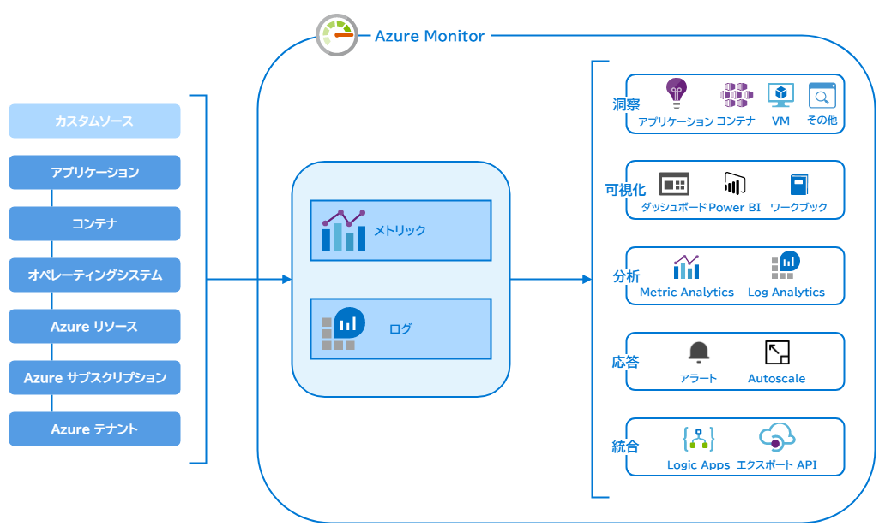

# Azure Monitor に関するよくありそうな質問

## 目次

- [Azure Monitor とは何ですか？](#q-about)
- [Azure Monitor を使うと何がうれしいのですか？](#q-about2)
- [Azure Monitor が監視する対象は何ですか？](#q-monitor-object)
- [メトリックとログは何が違うのですか？](#q-diff-metric-log)
- [Azure Monitor にメトリックとログを送るにはどうすればいいのですか？](#q-protocol)
- [メトリックとログのデータを参照するにはどうすれば良いのですか？](#q-view-data)
- [ログクエリは何で記述するのですか？](#q-log-query)
- [クエリした結果をダッシュボード以外の方法で視覚化できますか？](#q-visualize-tools)
- [個人にかかわるデータも収集されるのでしょうか？](#q-privacy)
- [メトリックとログが大量にできたのでどうにかしたいのですが…](#q-archive)
- [オンプレミスのリソースに対しても、Azure Monitor は使えるのでしょうか？](#q-on-premise)
- [外部から Azure Monitor にアクセスする場合の、Azure 側のエンドポイントはどうなっていますか？](#q-ip-address)

## <a id="q-about">Azure Monitor とは何ですか？</a>

Azure Monitor はクラウドおよびオンプレミス環境の利用統計情報を収集、分析、可視化します。

クラウドおよびオンプレミスに対して、次のレイヤーでメトリックおよびログを送信し、利用統計情報をいくつかの目的で活用するために使用されます。

Azure Monitorには豊富な機能があり、アプリケーションに影響を与える可能性のある重要な状況を迅速に特定して対応することができます。

## <a id="q-about2">Azure Monitor を使うと何がうれしいのですか？</a>

Azure　Monitor を使用して利用統計情報を分析することにより、次のことができます。

- アプリケーションとサービスの可用性とパフォーマンスの改善
- アプリケーションに影響している問題点の発見
- アプリケーションが依存するリソースの把握
- 仮想マシンのスケール計画
- Azure Monitor Logs を利用したトラブルシューティングや詳細な診断
- アラートや自動化されたアクションによる、運用レポート
- それらを利用した状況の視覚化

## <a id="q-monitor-object">Azure Monitor が監視する対象は何ですか？</a>

Azure に固有のアプリケーション階層

| レベル                   | 説明                                                                                                                            | 収集方法                                                                                                                                                                                                                                                   |
|:-------------------------|:--------------------------------------------------------------------------------------------------------------------------------|:-----------------------------------------------------------------------------------------------------------------------------------------------------------------------------------------------------------------------------------------------------------|
| Azure テナント           | Azure Active Directory など、テナントレベルの Azure サービスの操作に関するデータ                                                | Azure AD データをポータルで確認するか、テナントの診断設定を使用して Azure Monitor への収集を構成します。                                                                                                                                                   |
| Azure サブスクリプション | Azure サブスクリプションにおけるリソース横断的なサービス（Resource Manager、Service Health など）の正常性と管理に関連するデータ | ポータルで確認するか、ログプロファイルを使用して Azure Monitor への収集を構成します。                                                                                                                                                                      |
| Azure リソース           | 各 Azure リソースの運用とパフォーマンスに関するデータ                                                                           | 自動的に収集されたメトリックをメトリックスエクスプローラーで確認します。 Azure Monitor でログを収集するように診断設定を構成します。 各種の監視ソリューションと Insights を利用すれば、特定の種類のリソースをさらに詳しく監視することができます。 |

Azure やその他のクラウド、またはオンプレミス

| レベル                             | 説明                                                                                                                                          | 収集方法                                                                                                                                                                                                                                                                                                                            |
|:-----------------------------------|:----------------------------------------------------------------------------------------------------------------------------------------------|:------------------------------------------------------------------------------------------------------------------------------------------------------------------------------------------------------------------------------------------------------------------------------------------------------------------------------------|
| オペレーティングシステム（ゲスト） | オペレーティングシステムのコンピューティングリソースに関するデータ                                                                            | Log Analysis エージェントをインストールして Azure Monitor にクライアントデータソースを収集すると共に、Dependency Agent をインストールして Azure Monitor for VMs をサポートする依存関係を収集します。 Azure 仮想マシンについては、Azure Diagnostics 拡張機能をインストールして、ログとメトリックを Azure Monitor に収集します。 |
| アプリケーションコード             | 実際のアプリケーションとコードのパフォーマンスと機能に関するデータ（パフォーマンス トレース、アプリケーションログ、ユーザーテレメトリを含む） | Application Insights にデータを収集するためにコードをインストルメント化します。                                                                                                                                                                                                                                                     |
| カスタムソース                     | 外部サービスからのデータや、他のコンポーネントまたはデバイスからのデータ                                                                      | 任意の REST クライアントからログまたはメトリックデータを Azure Monitor に収集します。                                                                                                                                                                                                                                               |

## <a id="q-diff-metric-log">メトリックとログは何が違うのですか？</a>

次の表は、Azure Monitor のメトリックとログを比較したものです。

| 属性  | メトリック  | ログ    |
| :----- | :------ | :------ |
| メリット | 軽量であり、アラートなどのリアルタイムに近いシナリオが可能です。問題の迅速な検出に最適です。 | 豊富な分析クエリ言語を使用して分析されます。詳細な分析と根本原因の識別に最適です。 |
| データ | 数値のみ | テキストまたはデータ |
| 構造 | サンプリング時間、監視対象のリソース数値を含むプロパティの標準セット。一部のメトリックには、定義を深めるための複数のディメンションが含まれます。 | ログの種類に応じたプロパティの一意のセット。 |
| コレクション | 一定の間隔で収集されます。 | イベントによってレコードの作成が鳥がされる時に、散発的に収集される可能性があります。 |
| Azure ポータルに表示 | メトリックエクスプローラー | Log Analytics |
| 含まれるデータソース | Azure リソースから収集されたプラットフォームのメトリック。 Application Insights によって監視されるアプリケーション。 アプリケーションまたは API によってカスタムに定義される。 | アプリケーションと診断ログ。 監視ソリューション。 エージェントと VM 拡張機能。 アプリケーションの要求と例外。 Azure Security Center。 Data Collection API |

## <a id="q-protocol">Azure Monitor にメトリックとログを送るにはどうすればいいのですか？</a>

Azure monitoring API を使用します。プロトコルは HTTPS/TLS です。

## <a id="q-view-data">メトリックとログのデータを参照するにはどうすれば良いのですか？</a>

メトリックについては、メトリックエクスプローラーを使ってグラフにするか、Azure monitoring REST API でメトリックを取得します。

ログについては、Log Analytics を使用してログクエリを記述し、ログデータを対話形式で分析します。

## <a id="q-log-query">ログクエリは何で記述するのですか？</a>

[Kusto クエリ言語](https://docs.microsoft.com/ja-jp/azure/kusto/query/) を使用して記述します。

## <a id="q-visualize-tools">クエリした結果をダッシュボード以外の方法で視覚化できますか？</a>

PowerBI または Grafana にエクスポートすることができます。

- 汎用的な用途では Azure ダッシュボード
- 監視ソリューションに置いては Azure Monitor ビュー
- トラブルシューティングガイドとインシデントの事後分析では Workbook
- 長期的な KPI 傾向の分析や Azure 利用者以外に見せる場合は PowerBI
- 使い慣れた運用ダッシュボードを利用したい場合は Grafana

など、用途によって使い分けると良いでしょう。

## <a id="q-privacy">個人にかかわるデータも収集されるのでしょうか？</a>

通常のメトリックであれば個人にかかわるデータはふくまれていません。しかし、カスタムデータに個人データがある場合は、Log Analysis に送信されます。これに関する考えられるアプローチは以下のとおりです。

- 可能であれば、個人にかかわるデータの収集をしないか、収集されるデータの難読化または匿名化を行う。
- 明示的なユーザー ID を記録するのではなくユーザー名と詳細が内部 ID に関連付けられる参照データを作成し、別の場所から記録できるようにする。この場合は、ユーザーから個人情報の削除を依頼された場合に、そのユーザーに対応するルックアップテーブルの行を削除するだけで済ませるようにする。
- それらができない場合は、個人データの消去 API と 既存のクエリ API パスに関するプロセスを構築し、個人データのエクスポートと削除に対応できるようにする。

特にログデータのユーザーIDなどの情報に注意して下さい。

## <a id="q-archive">ログが大量にできたのでどうにかしたいのですが…</a>

Azure Monitor のメトリックは94日後、アクティビティログは91日後に削除されます。
長期間の保存は、Azure Storage にデータをアーカイブすることができます。
ログに関しては、最大 730 日で、90 日より長く保持されるデータについては別途追加料金が発生します。

## <a id="q-on-premise">オンプレミスのリソースに対しても、Azure Monitor は使えるのでしょうか？</a>

はい、Azureリソースから監視データを収集するだけでなく、Azure Monitorは他のクラウドやオンプレミスの仮想マシンやアプリケーションからもデータを収集できます。

## <a id="q-ip-address">外部から Azure Monitor にアクセスする場合の、Azure 側のエンドポイントはどうなっていますか？</a>

数多くのエンドポイントが用意されているので、[Application Insghts および Azure Monitor Logs によって使用される IP アドレス](https://docs.microsoft.com/ja-jp/azure/azure-monitor/app/ip-addresses) を参照して下さい。

