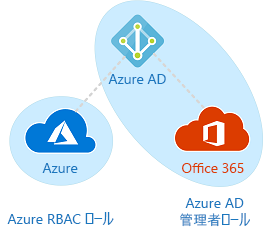

# Azure RBAC に関するよくありそうな質問

## 目次

- [Azure RBAC とは何ですか？](#q-about)
- [RBAC は何ができるのですか？](#q-about2)
- [ロールってなんですか？グループじゃないんですか？](#q-about3)
- [どういうロールがあるのですか？](#q-roles)
- [より強い権限のロールが割り当てられたときはどうなるのですか？](#q-multi-roles)
- [Azure AD のロールと Azure RBAC のロールの違いがよくわかりません…](#q-ad-rbac)

## <a id="q-about">Azure RBAC とは何ですか？</a>

Azure RDBC は Azure リソースに対するアクセスをロールにより管理する機能です。

## <a id="q-about2">RBAC は何ができるのですか？</a>

RBAC は次のようなシナリオに使用することができます。

- あるユーザーにサブスクリプション内の仮想マシンの管理を許可し、別のユーザーに仮想ネットワークの管理を許可する
- DBA グループにサブスクリプション内の SQL データベースの管理を許可する
- あるユーザーに、仮想マシン、Web サイト、サブネットなど、リソースグループ内のすべてのリソースの管理を許可する
- あるアプリケーションに、リソースグループ内のすべてのリソースへのアクセスを許可する

## <a id="q-about3">ロールって何ですか？グループじゃないんですか？</a>

グループよりも横断的な概念で、ユーザー、グループ、アプリケーションに対して割り当てるセキュリティ上の役割をロールといいます。

## <a id="q-roles">どういうロールがあるのですか？</a>

事前に定義された Azure の基本的なロールは４つあり、それぞれ次のとおりです。

| ロール | 説明　|
| :----- | :----- |
| 所有者 | 他のユーザーへアクセス件を委任する権限を含め、すべてのリソースへのフルアクセス権を持ちます。 |
| 共同作成者 | Azure リソースのすべての種類を作成および管理できますが、他のユーザーへアクセス権を付与することはできません。　|
| 閲覧者 | 既存の Azure リソースの表示のみができます。 |
| ユーザーアクセス管理者 | Azure リソースへのユーザーアクセスを管理できます。 |

残りの組み込みロールは、特定の Azure リソースに関するロールです。

また、独自に Azure リースに対するカスタムロールを作成することもできます。

- [より強い権限のロールが割り当てられたときはどうなるのですか？](#q-multi-roles)

## <a id="q-multi-roles">より強い権限のロールが割り当てられたときはどうなるのですか？</a>

強い権限のロールが優先されます。またロール自体が複数割り当てられた場合は権限は論理和となります。

## <a id="q-ad-rbac">Azure AD のロールと Azure RBAC のロールの違いがよくわかりません…</a>

Azure AD 管理者ロールは Azure Active Directory のリソースを管理し、Azure RBAC は Azure　リソースのアクセス権限を管理します。

主な相違点は次のとおりです。

| Azure RBAC ロール | Azure AD 管理者ロール |
| :--------------- | :----------------- |
| Azure のリソースへのアクセスの管理 | Azure Active Directory リソースへのアクセスを管理する |
| カスタムロールをサポートする | カスタムロールをサポートする |
| スコープを複数のレベル（管理グループ、サブスクリプション、リソースグループ、リソース）で指定できる | スコープはテナントレベルで |
| ロール情報には、Azure portal、Azure CLI、Azure PowerShell、Azure Resource Manager テンプレート、REST API でアクセスできる | ロール情報には、Azure 管理ポータル、Microsoft 365 管理センター、Microsoft Graph、AzureAD PowerShell でアクセスできる |

既定では、Azure RBAC ロールと Azure AD 管理者ロールは重なりません。

