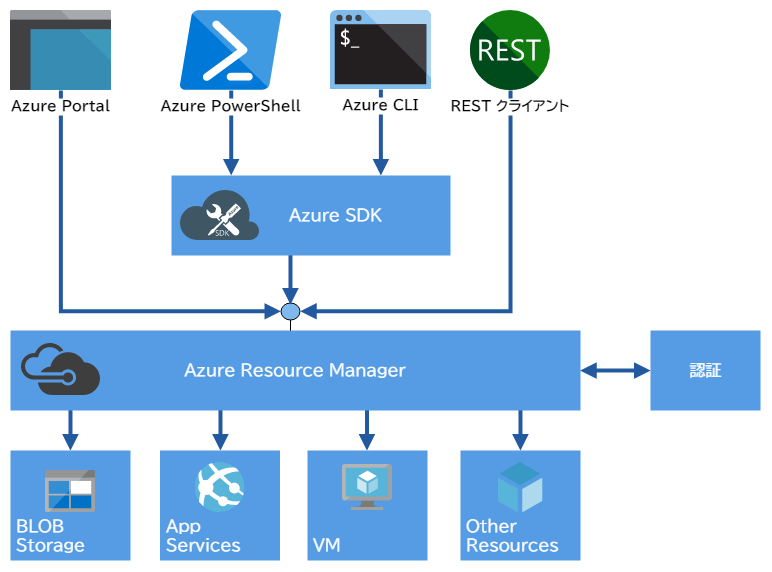

# Azure Resource Manager に関するよくありそうな質問

## 目次

- [Azure Resource Manager とは何ですか？](#q-about)
- [Azure Resource Manager を使って Azure リソースをどうやって操作するのですか？](#q-how-to-manage)
- [Azure Resource Manager の概念がよくわかりません…](#q-concept)
- [Azure ポータルで一つ一つリソースを作成するのとはどう違うのですか？](#q-merits)
- [論理的なリソースグループにリージョンを選択できるのはなぜですか？](#q-rg-region)
- [リソースグループを格納しているリージョンに障害が発生した場合は、どうなるのですか？](#q-rg-down)

## <a id="q-about">Azure Resource Manager とは何ですか？</a>

Azure Resource Manager は仮想マシン、Webアプリ、データストアなど多岐にわたる Azure リソースを作成、更新および削除できる管理レイヤーです。アクセス制御、ロック、タグなどの管理機能を使用して、デプロイ語にリソースを保護および整理します。

## <a id="q-how-to-manage">Azure Resource Manager を使って Azure リソースをどうやって操作するのですか？</a>

Azure ポータル、Azure PowerShell、Azure CLIおよび REST クライアントなどから操作が行えます。



## <a id="q-concept">Azure Resource Manager の概念がよくわかりません…</a>

Azure Resource Manager は、初めて使う利用者には、馴染みのない用語が存在します。次のとおりです。

- **リソース**
    
    Azure ポータルを通して管理できる要素。リソースの例としては、仮想マシン、ストレージアカウント、Webアプリ、データベースおよび仮想ネットワークなどがあります。
- **リソースグループ**

    Azure ソリューションの関連するリソースを保持するコンテナです。リソースグループには、グループとして管理するリソースが含まれます。

    リソースグループ内に存在するリソースはすべて同じライフサイクルが共有されます。したがって、ひとつのシステムやプロジェクトなどをリソースグループとしてまとめることが一般的です。

    またリソースグループには別リージョンのリソースを含めることができます。
- **リソースプロバイダ**

    Azure リソースを提供するサービス。一般的なリソースプロバイダの一例としては、仮想マシンリソースを提供する Microsoft.Compute があります。また、Microsoft.Storage は、もう一つの一般的なリソースプロバイダです。

    リソースプロバイダの一覧は Azure CLI で、以下のコマンドを実行することにより取得できます。

    ```bash
    $ az provider list --query "[].{Provider:namespace, Status:registrationState}" --out table
    ```
- **Resource Manager テンプレート**

    リソースグループまたはサブスクリプションにデプロイする１つまたは複数のリソースを定義する JSON ファイルです。
- **宣言的構文**

    一連のプログラミング コマンドを記述しなくても、"作成しようとしているもの" を明確に宣言することのできる構文です。 宣言型構文の例として、Resource Manager テンプレートがあります。 このファイルで、Azure にデプロイするインフラストラクチャのプロパティを定義します。

## <a id="q-merits">Azure ポータルで一つ一つリソースを作成するのとはどう違うのですか？</a>

Resource Manager を使用すると、以下の利点があります。

- スクリプトではなく宣言型のテンプレートを使用してインフラストラクチャを管理できる。
- ソリューションのリソースを個別に処理するのではなく、すべてのリソースをグループとしてデプロイ、管理、監視できる。
- ソリューションを開発のライフサイクル全体で再デプロイできるので、リソースは必ず一貫した状態に保たれる。
- 正しい順序でデプロイされるように、リソース間の依存関係を定義できる。
- ロールベースのアクセス制御（RBAC）が管理プラットフォームにネイティブ統合されるため、リソースグループのすべてのサービスにアクセス制御を適用できる。
- タグをリソースに適用し、サブスクリプションすべてのリソースを論理的に整理できる。
- 同じタグを共有するリソースグループのコストを表示することで、組織の課金をわかりやすくできる。
- Azure Pipelines と併用し、リソースに対して継続的インテグレーションを適用できる。

## <a id="q-rg-region">論理的なリソースグループにリージョンを選択できるのはなぜですか？</a>

実際にはリソースグループのメタデータの場所が必要で、コンプライアンス上の理由から、データを特定のリージョンに指定したい場合があるからです。

## <a id="q-rg-down">リソースグループを格納しているリージョンに障害が発生した場合は、どうなるのですか？</a>

リソースグループのメタデータが格納されたリージョンに障害が発生し一時的に使用できない場合は、リソースグループ内のリソースが更新できなくなります。他のリージョン内のリソースは通常通り機能しますが、それらを更新することはできません。

