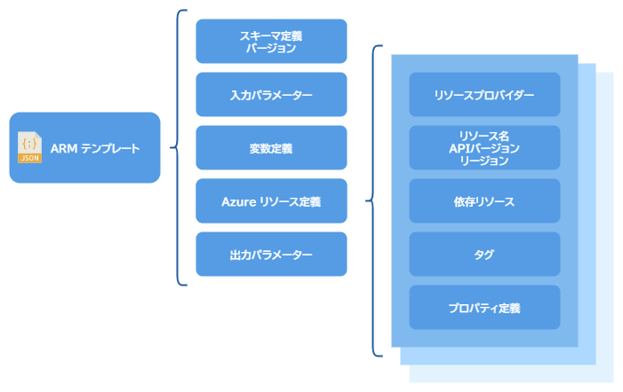
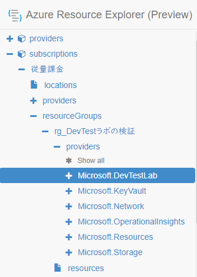

# ARM テンプレートの概要と、記述する際の便利なツールとドキュメント

本文書では、ARM テンプレートを記述する時に、調べた事および教えてもらった事を記述します。ARM テンプレートを記述する方法については、他に丁寧に説明しているサイトがあるので、ここでは ARM テンプレート自体については、軽く説明するだけにとどめます。

最後に、リンク済みテンプレートのサンプルへのリンクを貼っていますので、Quick Start からその先、どういうテンプレートを記述するか途方に暮れている向きは、参考にしていただければ幸いです。

## ARM テンプレートの構造

ARM テンプレートは JSON フォーマットで記述し、次の図のような構造を持ちます。



Microsoft Docs の [テンプレートファイルの構造](https://docs.microsoft.com/ja-jp/azure/azure-resource-manager/templates/template-syntax#template-format) にあるように、この他に `apiProfile` と `functions` が存在するのですが、今回は使用しませんでした。

この中で一番重要なアイテムは **Azure リソース定義** です。ここに Azure リソースに対する設定を記述します。

ARM テンプレートではひとつのファイルに複数のリソース定義を記述することができます。さらに、複数定義する Azure リソース同士に依存関係がある場合、ユーザーが Azure リソースの依存関係を明示します。Azure Resource Manager はその情報を元に、リソースの作成あるいは更新の順序を自動的に決定し、処理を実行します。

JSON フォーマットで記述する ARM テンプレートは次のようになります。

```json
{
  "$schema": "https://schema.management.azure.com/schemas/2015-01-01/deploymentTemplate.json#",
  "contentVersion": "",
  "apiProfile": "",
  "parameters": {  },
  "variables": {  },
  "functions": [  ],
  "resources": [  ],
  "outputs": {  }
}
```

ARM テンプレートで記述する項目は次のとおりです。

### スキーマ定義 : `$schema`

ARM テンプレートの最初に書くべき項目は **スキーマ定義** です。

### テンプレートのバージョン : `contentVersion`

値は大抵の場合 `1.0.0.0` ですが、テンプレートによっては値を変更する場合があります。

### 入力パラメーター : `parameters`

ARM テンプレートの再利用性を高めるために、任意の入力パラメーターを定義します。Azure リソースの名前や、リージョン、その他の ARM テンプレートを使い回すのに便利な情報を記述します。

### 変数 : `variables`

ARM テンプレートで、入力パラメーター以外に何度も使用する値を、変数として定義しておきます。

### リソース : `resources`

作成あるいは更新される Azure リソースの定義を記述します。先程の図にあるとおり、Azure リソースの管理を行う **リソースプロバイダー** に、リソース名、`apiVersion` などの情報を渡して、任意の Azure リソースを作成あるいは更新を行います。

**リソースプロバイダー** は Azure Resource Manager においては、非常に重要なオブジェクトで、各 Azure リソースの操作を行う主体です。また、RBAC を設定する際にも、リソースプロバイダーに対する操作を規定するので重要です。

### 出力パラメーター : `outputs`

ここで定義したパラメーターを結果として出力します。単一の ARM テンプレートでは出力を確認するだけのものですが、複数のテンプレートをまとめた [リンク済みのテンプレート](https://docs.microsoft.com/ja-jp/azure/azure-resource-manager/templates/template-tutorial-create-linked-templates) を使用する場合、あるテンプレートファイルの出力パラメーターを別のファイルの入力パラメーターとして使うことができます。


## ARM テンプレートを記述する時に役に立つツールとドキュメント

ここでは、ARM テンプレートを記述する際に使用する便利なツールと、参照すべきドキュメントについて記述します。

### ARM テンプレートのエクスポート

自力でイチから ARM テンプレートを記述するのは大変です。 楽をするために、Azure ポータルで目的となる Azure リソースを作成して、ARM テンプレートをエクスポートしたものを元にすることをお勧めします。

エクスポートしたファイルは、Azure ポータルで設定した項目が反映されるので、他のリソースグループに再利用したい ARM テンプレートのベースとして使用する事に向いています。

出力したファイルを元に、`parameters` の名前を自分の読みやすい名前に編集したり、再利用する値を `variables` で定義して、Visual Studio Code などで、ARM テンプレートを編集していきます。

その際に気を付けるべき事項については、[Azure Resource Managerテンプレートのノウハウ](https://qiita.com/tenn25/items/7921a9f1a36fcb6218d9) が詳しいです。

### Azure Resource Explorer (Preview)

わたしは最初、Azure リソースの情報を Azure CLI から `az resource show` コマンドなどで参照していたのですが、[Azure Resource Explorer](https://resources.azure.com/) が便利だと教えていただきました。まだ、Preview ですが、ARM テンプレートで設定すべき値を参照するのに便利です。



画像のように、サブスクリプションから目的のリソースグループを選択肢、対象となるリソースプロバイダを選択して詳細情報を参照することができます。

画像は左ペインですが、右ペインには詳細情報が表示され、さらに JSON、PowerShell、Ansible のリソース作成テンプレートが表示されるので、ARM テンプレート以外の方法で Azure リソースを作成する際にも参考になります。

### Microsoft 公式ドキュメント

#### リソースプロバイダー

各リソースプロバイダーがどのようなプロパティを公開しているのかについて、参考になるのは [ARM テンプレートでのリソース定義](https://docs.microsoft.com/ja-jp/azure/templates/) (現段階では英語)です。ここには、すべてのリソースプロバイダーと、対応する API バージョンおよび設定可能なプロパティの一覧があります。ここに無いプロパティは、ARM テンプレートでは設定できません。もしプロパティがなくて困るような事があれば、フィードバックにリクエストを送信しましょう。きっと、いつか実装してくれるでしょう…

#### テンプレート関数

[Azure Resource Manager テンプレートの関数](https://docs.microsoft.com/ja-jp/azure/azure-resource-manager/templates/template-functions) は、`parameters`、`variables`、`resources` および `outputs` で使用できる関数の詳細を記述しているドキュメントです。なお、**一部の関数は特定の箇所には記述できない** ので注意が必要です。

### Azure ポータルの「テンプレート」機能

まだ Preview ですが、Azure ポータルで ARM テンプレートを登録できます。この機能を使うと、リソースグループとパラメーターを指定するような簡易的な画面を用いて、ARM テンプレートを適用できるようになります。Azure CLI で何度もコマンドを打つのが面倒な向きにお勧めです。

具体的な使用方法については、[Azure ARM Templateをテンプレートに登録して、Azure Portalからデプロイする](https://qiita.com/shingo_kawahara/items/2922e7db05291d1e7c63) が詳しいです。

### Visual Studio Code の拡張機能

[Azure Resource Manager (ARM Tools)](https://marketplace.visualstudio.com/items?itemName=msazurermtools.azurerm-vscode-tools) という便利な拡張機能を使用すると、スキーマに従ってファイルの妥当性をチェックしてくれます。また使用していないパラメーターや変数などのチェックを行ってくれるので、ARM テンプレートを記述する際には必須の拡張機能です。

ただし、エクスポートした ARM テンプレートを元にする場合、この拡張機能が「スキーマのバージョンが古い」と警告が出る事がよくあります。その場合はクイック修正で新しいバージョンに変更します。修正した際に、各リソース定義の `apiVersion` を修正することを促されるので、併せて修正していきましょう。

実際に、Visual Studio Code で記述する際のノウハウは、[ARMテンプレートの新機能とノウハウ](https://qiita.com/tenn25/items/f0bb62ab62e428cde270) が詳しいです。

## サンプル

ここまで駆け足で ARM テンプレートについて記述しましたが、やはり具体的な例がある方が理解が深まるでしょう。

[GitHub のリポジトリ](https://github.com/0x6797/azure-rm-templates/tree/master/devtest_labs) に、実際に使用している ARM テンプレートの例をアップロードしています。

DevTest Labs を例に、リンク済みテンプレートを使用して、各 Azure リソース用に分割した ARM テンプレートを呼び出すようにしています。作成する Azure リソースと入力パラメーターについては `README.md` を参照して下さい。

### 少し補足

この例で重要な箇所は、リンク済みテンプレートを使用して、ファイルをモジュール化していることと、`outputs` を使用し、作成した結果の情報(ここでは、DevTest Labs の ID や名前、ストレージアカウントの名前、リソース ID など) を次のテンプレートの入力パラメーターに使用しているところです。

注意するべき点は、各 Azure リソースの依存関係を、各ファイルに記述するのではなく、リンク済みテンプレートのみに記述している箇所です。各ファイルで個別に `resourceId` などで依存関係を記述するとエラーが発生します。

