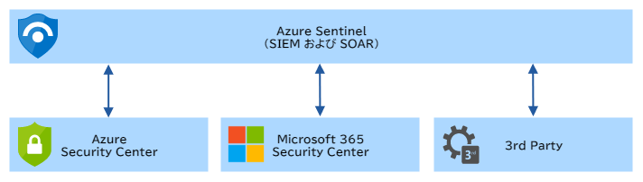

# Azure Sentinel に関するよくありそうな質問

## 目次

- [Azure Sentinel とは何ですか？](#q-about)
- [SIEM とは何ですか？](#q-siem)
- [SOAR とは何ですか？](#q-soar)
- [似たようなサービスに Azure Security Center がありますが、どう違うのですか？](#q-security-center)
- [Sentinel はどのようにして脅威を分析するのですか？](#q-analysis)
- [Sentinel が監視する対象は選択できるのでしょうか？](#q-target)
- [検出したセキュリティ脅威には、どのように対応するのでしょうか？](#q-incident)

## <a id="q-about">Azure Sentinel とは何ですか？</a>

クラウドネイティブ型のセキュリティ情報イベント管理（SIEM）およびセキュリティオーケストレーション自動応答（SOAR）ソリューションです。

## <a id="q-siem">SIEM とは何ですか？</a>

SIEM（シームと発音します）とは、Security Information and Event Management の略で、様々なデバイス、サーバーからセキュリティ情報を収集し、そこから脅威を分析し、不正を検知するとアラートで通知し、そのレポートを作成します。

SIEM は、昨今でますます巧妙化している標的型攻撃に極めて有効な手段になり得るのではないかと、大きな期待を集めています。

## <a id="q-soar">SOAR とは何ですか？</a>

SOAR (ソアーと発音します)とは、Security Orchestration Automation and Response の略で、インシデントの分析から対応までを自動化および効率化するツールです。主にインシデント対応する担当者負担を減らし、効率よくセキュリティを運用するための仕組みです。

## <a id="q-security-center">似たようなサービスに Azure Security Center がありますが、どう違うのですか？</a>

Sentinel 自体は、Security Center よりも後発のサービスですが、現在は機能の統廃合により、サービスの相関図は次のようになります。

名前がややこしいですが、Security Center ではなく Azure Sentinel が中心となって、Security Center 以外のデータソースからもデータを収集、分析、検知、報告を行います。

他の違いとしては、Security Center が Azure の IaaS および PaaS を主なスコープにしているのに対し、Sentinel はマルチクラウド、オンプレミスなどのハイブリッド環境をカバーします。

## <a id="q-analysis">Sentinel はどのようにして脅威を分析するのですか？</a>

詳細は公表されていませんが、人工知能(AI)を使用して検知するようです。

なお、Microsoft 自体は世界で二番目（一位はペンタゴン）にサイバー攻撃を受けているといっているので、学習データには事欠かないようです。

## <a id="q-target">Sentinel が監視する対象は選択できるのでしょうか？</a>

対象に接続するコネクタをアクティベートすることにより、Sentinel は監視するので、接続するコネクタを選択することにより対象を選択できます。

コネクタは、Azure に関するサービスの他、Amazon Web Services - CloudTrail や Office 365、Windows ファイアウォールや F5、Check Point および Palo Alto などのサードパーティなど豊富な種類があります。

## <a id="q-incident">検出したセキュリティ脅威には、どのように対応するのでしょうか？</a>

セキュリティプレイブックを作成し、そのプレイブックで定義した内容によって応答が自動化されます。もちろん、手動で実行することもできます。

セキュリティプレイブックは Azure Logic Apps をベースにしており、Logic Apps のすべての機能と組み込みテンプレートを利用可能です。

ひとつの例として、悪意のある IP アドレスを検出したケースを考えます。

1. Azure Sentinel により悪意のある IP アドレスが検出される。
1. 検出したというアラートを Microsoft Teams の任意のチャネルに送信する
1. チャネルを参照した管理者は、IP アドレスをブロックするか、あるいは無視するかを選択する
    - 管理者がブロックを選択した場合は、IP アドレスがファイアウォールでブロックされ、該当ユーザーが Azure AD で無効になる
    - 管理者が無視を選択した場合は、Azure Sentinel のアラートが閉じられる

